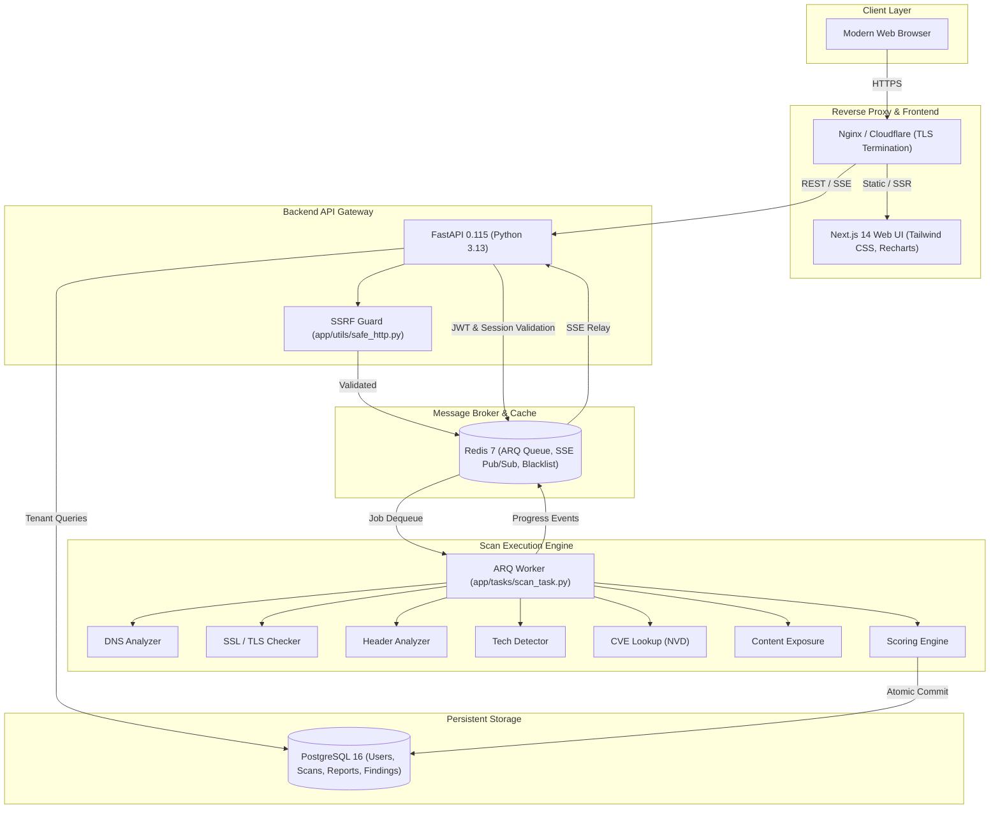

<div align="center">

# 🛡️ SentinelScan

**Controlled, Non-Destructive Hybrid Web Security Assessment Platform for vulnerability assessment, component lifecycle intelligence, real-time scan monitoring, and verified reporting.**

[](https://www.python.org/)
[](https://www.typescriptlang.org/)
[](https://fastapi.tiangolo.com/)
[](https://nextjs.org/)
[](https://www.postgresql.org/)
[](https://redis.io/)
[](https://www.docker.com/)
[](LICENSE)

</div>

---

## 📌 Why SentinelScan?

Modern organizations deploy web applications across complex, hybrid cloud environments. Traditional active vulnerability scanners often introduce operational risk through invasive fuzzing, authentication brute-forcing, or disruptive payload injection.

SentinelScan solves this by providing a **controlled, non-destructive hybrid assessment**:

- **Multi-Mode Execution**: Operates in default `passive` mode or opt-in `safe_active` / `authenticated_safe_active` modes requiring mandatory authorization consent.
- **Evidence-Backed Findings**: Identified risks include a verifiable evidence chain, eliminating ambiguity and reducing false positives.
- **OWASP Top 10:2025 Assessment Coverage**: SentinelScan provides OWASP Top 10:2025 assessment coverage across A01-A10 using passive analysis, controlled non-destructive testing, and evidence-assisted assessment. Detection and verification depth varies by category.
- **Component Lifecycle Intelligence**: Multi-signal technology detection (23 technologies fingerprinted, 10 supporting version extraction), version normalization (distro suffixes), upstream `endoflife.date` caching with local fallback, and NVD CVE correlation.
- **Controlled Discovery Crawler**: Bounded same-origin crawling (GET/HEAD only, max 20 pages, max depth 2, max 50 requests, excludes sensitive verbs, respects robots.txt).
- **Real-Time Visibility**: Server-Sent Events (SSE) stream scan progression live through stage-by-stage pipelines.
- **Verified PDF & Multi-Format Reports**: Generates Executive and Technical PDF reports and JSON exports with automatic server-side credential redaction.

---

## 🚀 Key Features

| Capability | Description |
|---|---|
| 🔍 **Multi-Mode Web Scanning** | Default non-invasive passive mode, plus opt-in safe active mode with mandatory consent validation. |
| 🛡️ **SSRF-Safe Ingestion** | Validates target hostnames against private, link-local, and cloud metadata IP ranges with per-hop redirect re-validation. |
| 🕷️ **Controlled Same-Origin Crawler** | Discovers endpoints, parameters, and forms without state-changing mutations or form submissions. |
| 🧩 **Component Intelligence Engine** | Identifies technologies, normalizes version suffixes (Ubuntu, Debian, Sury), and evaluates EOL schedules via upstream API and local DB. |
| 🔟 **OWASP Top 10 Matrix** | Implements dedicated assessment mechanisms for all 10 OWASP categories with an honest 5-state evaluation model. |
| 📋 **Security Header Audits** | Validates HSTS, CSP, X-Frame-Options, X-Content-Type-Options, Referrer-Policy, and Permissions-Policy. |
| 🔒 **TLS/SSL Evaluation** | Inspects cipher suites, certificate validity, expiration dates, SANs, and protocol versions. |
| 🌐 **DNS Hygiene Checks** | Audits SPF, DKIM, and DMARC email authentication and DNS hygiene records. |
| 💥 **NVD CVE Correlation** | Correlates discovered software versions with public CVE entries and CVSS scores. |
| ⚡ **Live Progress Streaming** | Relays background worker execution status to the frontend via ticket-authenticated SSE. |
| 🔑 **Secure Authentication** | Dual-token authentication with short-lived JWT access tokens and HttpOnly refresh cookies. |
| 📊 **Security Scoring & Grading** | Computes normalized risk scores (0–100) and letter grades (A–F) based on finding severity. |
| 📄 **Multi-Format Reporting** | Generates 16-section Executive/Technical PDF and JSON exports with sensitive data redaction. |
| 📈 **Scan History & Trends** | Tracks security posture scores and finding distributions across sequential scans. |
| 🔧 **Remediation Guidance** | Context-rich code and configuration snippets (Nginx, Apache, Express) for applicable findings. |

---

## 🏗️ System Architecture

SentinelScan separates web serving, API gateway logic, and background scan execution across an asynchronous, event-driven topology:



---

## 🔐 Security Architecture

| Threat Vector | Defensive Control Implemented in Source Code |
|---|---|
| **Server-Side Request Forgery (SSRF)** | Strict IP resolution validating against private RFC 1918 subnets, loopback, link-local, and cloud metadata services (`169.254.169.254`). |
| **Insecure Direct Object References (IDOR)** | Enforced tenant isolation in database queries (`filter(Model.user_id == current_user.id)`). |
| **Session Hijacking & XSS Theft** | Refresh tokens stored in `HttpOnly`, `SameSite=Lax`, `Secure` cookies; short-lived JWT access tokens. |
| **Token Replay / Revocation** | Redis token blacklist invalidates tokens immediately on user logout. |
| **SSE Token Leakage in URLs** | Single-use tickets (`POST /api/scans/{id}/sse-ticket`) consumed on connect, avoiding JWTs in query strings. |
| **Credential Disclosure in Exports** | Server-side regex masking replaces passwords, bearer tokens, API keys, and session cookies with `[REDACTED]`. |
| **Worker Queue Starvation** | `MAX_ACTIVE_SCANS_PER_USER = 2` concurrent scan limit and 600s task timeouts. |
| **Brute Force & Flooding** | Endpoint rate limiting via `slowapi` on authentication routes. |

For full threat analysis, see [docs/THREAT_MODEL.md](docs/THREAT_MODEL.md) and [docs/Security.md](docs/Security.md).

---

## 🎯 Detection Coverage

SentinelScan includes **27 registered detectors** across 7 security categories:

| Category | Detectors | Primary Standards & References |
|---|:---:|---|
| **Security Headers** | 11 | RFC 6797 (HSTS), W3C CSP Level 3, RFC 7034 (XFO), OWASP ASVS 14.4, Server/Powered-By headers |
| **SSL / TLS** | 6 | NIST SP 800-52r2, Mozilla TLS Guidelines, RFC 8446 (TLS 1.3) |
| **DNS Security** | 5 | RFC 7208 (SPF missing/present), RFC 7489 (DMARC missing/weak policy), RFC 4033 (DNSSEC), RFC 5321 (MX) |
| **Technology Detection** | 2 | Framework, Web Server, CMS, and JavaScript library fingerprinting with version disclosure |
| **Cookie Security** | 1 | RFC 6265, OWASP ASVS 3.4 (HttpOnly, Secure, SameSite) |
| **CVE Correlation** | 1 | NIST NVD CVE database integration with CVSS scoring |
| **Content Exposure** | 1 | Exposed `.env`, `.git/HEAD`, backup files, and soft-404 verification |

---

## 📑 Reporting & Deliverables

SentinelScan provides **server-side export deliverables** with automated sensitive data redaction:

1. **Technical PDF Assessment**: Comprehensive 16-section technical audit including raw evidence strings, HTTP headers, TLS certificate details, full CVE descriptions, CVSS vectors, and CWE/OWASP Top 10:2025 remediation steps compiled via ReportLab 4.x.
2. **Executive PDF Summary**: High-level risk posture designed for leadership, featuring the overall security grade (A–F), total score (0–100), severity distribution charts, and executive remediation priorities.
3. **Structured JSON Export**: Machine-readable JSON data stream for direct SIEM ingestion and automated security pipelines.

> **Sensitive Data Redaction**: All export formats automatically mask sensitive credentials, tokens, passwords, and authorization headers before rendering.

---

## 🔧 Actionable Remediation Guidance

SentinelScan focuses on actionable, passive intelligence: **Scan → Detect → Correlate → Recommend**. Applicable findings include concrete guidance so development and infrastructure teams can fix issues quickly:

- **Snippet-Based Configuration**: Applicable findings provide copy-ready configuration snippets for major servers and frameworks (Nginx, Apache, Express/Helmet, Caddy).
- **Structured Finding Metadata**: Applicable findings include a human-readable Problem statement, Potential Impact analysis, Sequential Fix Steps, Configuration Example, and Reference links (RFCs, OWASP, NIST).
- **Non-Invasive Architecture**: SentinelScan does not remotely connect to, modify, or execute changes on live infrastructure. Remediation patches are evaluated and applied directly by system operators.
- **Triage & Tracking**: Security teams review findings across reports, track posture improvements over repeated scans, and export technical PDF and JSON artifacts for ticketing systems.

---

## 🛠️ Installation & Setup

### Prerequisites
- **Python 3.12+** (Python 3.13 recommended)
- **Node.js 18+** (Node.js 20 LTS recommended)
- **Redis 7+**
- **PostgreSQL 16+** (or SQLite for local development)

---

### Local Development Setup

#### 1. Clone Repository
```bash
git clone https://github.com/Nandinivora18/SentinalScan.git
cd SentinalScan
```

#### 2. Backend Setup
```bash
cd backend

# Create virtual environment
python -m venv .venv

# Activate virtual environment
# Windows (PowerShell):
.venv\Scripts\Activate.ps1

# Windows (CMD):
.venv\Scripts\activate.bat

# macOS / Linux:
source .venv/bin/activate

# Install runtime and testing dependencies
pip install -r requirements.txt -r requirements-dev.txt

# Configure environment variables
cp .env.example .env
```

#### 3. Frontend Setup
```bash
cd ../frontend

# Install dependencies
npm install

# Configure environment
cp .env.local.example .env.local
```

---

## 🏃 Running SentinelScan

### Running Services Locally

```bash
# Terminal 1 — FastAPI Backend (from backend/ with active venv)
uvicorn app.main:app --reload --port 8000

# Terminal 2 — ARQ Background Worker (from backend/ with active venv)
python run_worker.py

# Terminal 3 — Next.js Frontend (from frontend/)
npm run dev
```

The web dashboard is now accessible at `http://localhost:3000` with the API documentation at `http://localhost:8000/docs`.

---

### Running via Docker Compose

#### Quick Start (Development)

```bash
# 1. Generate a SECRET_KEY (minimum 32 characters)
export SECRET_KEY="$(python -c "import secrets; print(secrets.token_urlsafe(48))")"

# 2. Start all services (PostgreSQL, Redis, Backend, Worker, Frontend)
docker compose -f docker/docker-compose.yml up --build -d
```

The stack starts with:
- **Frontend**: http://localhost:3000
- **Backend API**: http://localhost:8000
- **API Docs**: http://localhost:8000/docs
- **PostgreSQL**: localhost:5432
- **Redis**: localhost:6379

> **Note**: The nginx reverse proxy requires TLS certificates in `nginx/certs/` and is optional for local development. Omit the `nginx` service if you don't need it:
> ```bash
> docker compose -f docker/docker-compose.yml up postgres redis backend worker frontend --build -d
> ```

#### Production Deployment

```bash
# 1. Set required environment variables
export SECRET_KEY="$(python -c "import secrets; print(secrets.token_urlsafe(48))")"
export POSTGRES_USER="your_db_user"
export POSTGRES_PASSWORD="your_db_password"
export POSTGRES_DB="sentinelscan"
export REDIS_PASSWORD="your_redis_password"

# 2. Optional: NVD API key for faster CVE lookups (50 req/30s vs 5 req/30s)
export NVD_API_KEY="your-nvd-api-key"

# 3. Update nginx/nginx.conf server_name to your domain
# 4. Provision TLS certificates in nginx/certs/

# 5. Start the production stack
docker compose -f docker/docker-compose.prod.yml up --build -d
```

#### Environment Variables

| Variable | Purpose | Required | Default |
|---|---|---|---|
| `SECRET_KEY` | JWT signing key (min 32 chars) | **Yes** | — |
| `POSTGRES_USER` | Database user (prod only) | **Yes (prod)** | — |
| `POSTGRES_PASSWORD` | Database password (prod only) | **Yes (prod)** | — |
| `POSTGRES_DB` | Database name (prod only) | **Yes (prod)** | — |
| `REDIS_PASSWORD` | Redis password (prod only) | **Yes (prod)** | — |
| `ENVIRONMENT` | `development` or `production` | No | `development` |
| `DEBUG` | Debug mode (forced `false` in prod) | No | `true` |
| `REQUIRE_EMAIL_VERIFICATION` | Require email verification | No | `true` |
| `FRONTEND_URL` | Frontend URL for email links | No | `http://localhost:3000` |
| `NEXT_PUBLIC_API_URL` | Backend API URL for frontend | No | `http://localhost:8000` |
| `NVD_API_KEY` | NIST NVD API key for faster CVE lookups | No | — |
| `SMTP_HOST` | SMTP server for email | No | `smtp.gmail.com` |
| `SMTP_PORT` | SMTP port | No | `587` |
| `SMTP_USER` | SMTP username | No | — |
| `SMTP_PASSWORD` | SMTP password | No | — |
| `GOOGLE_CLIENT_ID` | Google OAuth client ID | No | — |
| `GOOGLE_CLIENT_SECRET` | Google OAuth client secret | No | — |

> **NVD_API_KEY**: Optional but recommended. Without it, CVE lookups are rate-limited to 5 requests per 30 seconds (~33s for 5 technologies). With a free key from https://nvd.nist.gov/developers/request-an-api-key, the limit increases to 50 requests per 30 seconds (~3.5s). The key must never be committed to Git or baked into Docker images.

---

## 🧪 Testing & Validation
 
SentinelScan maintains high test coverage across unit, security, false-positive regression, and integration suites (679 passing backend tests).
 
```bash
# Run the complete backend test suite (from backend/)
# Windows:
.\.venv\Scripts\python.exe -m pytest tests/ -q

# macOS / Linux:
.venv/bin/python -m pytest tests/ -q

# Run Frontend Typecheck & Production Build (from frontend/)
npm run type-check
npm run build
```

---

## 🔑 Authentication & Session Security

SentinelScan implements a hardened, defense-in-depth authentication architecture:

- **Email & Password Authentication**: Salted bcrypt password hashing with email verification flows.
- **Google OAuth 2.0 Integration**: Single Sign-On via Google OAuth with automatic verified account provisioning.
- **Dual-Token Architecture**: Short-lived JWT access tokens paired with `HttpOnly`, `SameSite=Lax`, `Secure` refresh cookies to prevent XSS-based credential theft.
- **Immediate Token Revocation**: Redis-backed token blacklist invalidates sessions immediately on user logout.
- **Rate-Limited Endpoints**: Authentication routes are throttled via `slowapi` to defend against automated brute-force and credential stuffing attacks.
- **Tenant Authorization**: Database-level tenant isolation enforces strict ownership checks across all scan and report queries.

---

## 📂 Project Structure

```
SentinelScan/
├── .github/
│   ├── workflows/             # CI & security automation workflows
│   ├── ISSUE_TEMPLATE/        # Standardized issue templates
│   └── pull_request_template.md
│
├── backend/
│   ├── app/
│   │   ├── models/            # SQLAlchemy database entities (7 active models)
│   │   ├── routers/           # FastAPI route controllers
│   │   ├── scanner/           # Modular security inspection detectors (37 detectors)
│   │   ├── tasks/             # ARQ background task orchestrators
│   │   └── utils/             # Security, SSRF (19 subnets), PDF, and SSE utilities
│   ├── tests/                 # 36-module pytest suite (679 tests)
│   ├── requirements.txt       # Runtime dependencies
│   └── requirements-dev.txt   # Testing and development dependencies
│
├── frontend/
│   ├── src/
│   │   ├── app/               # Next.js 14 App Router views (24 pages, Burgundy + Champagne theme)
│   │   ├── components/        # UI components, score rings, and charts
│   │   ├── hooks/             # React hooks (useAuth, useScan, useSSE)
│   │   └── store/             # Global client state management
│   ├── package.json
│   └── tailwind.config.js
│
├── docker/                    # Docker Compose & container configurations
├── docs/                      # Technical architecture, threat models, API specs
├── CONTRIBUTING.md            # Collaboration & PR workflow guidelines
├── SECURITY.md                # Vulnerability disclosure policy
└── LICENSE                    # MIT License
```

---

## 🗺️ Future Roadmap

- [ ] Subdomain enumeration & multi-target asset discovery (v1.1)
- [ ] Scheduled recurring scans & webhook alert notifications (v1.1)
- [ ] Multi-tenant organizations & team role-based access control (v2.0)
- [ ] Continuous passive DNS change & TLS certificate expiration monitors (v2.0)

---

## 📄 License & Security

- **Security Policy**: Please review [SECURITY.md](SECURITY.md) and [docs/THREAT_MODEL.md](docs/THREAT_MODEL.md) for vulnerability reporting guidelines.
- **Contributions**: Contributions are welcome under our [CONTRIBUTING.md](CONTRIBUTING.md) guidelines.
- **License**: This project is licensed under the [MIT License](LICENSE).
