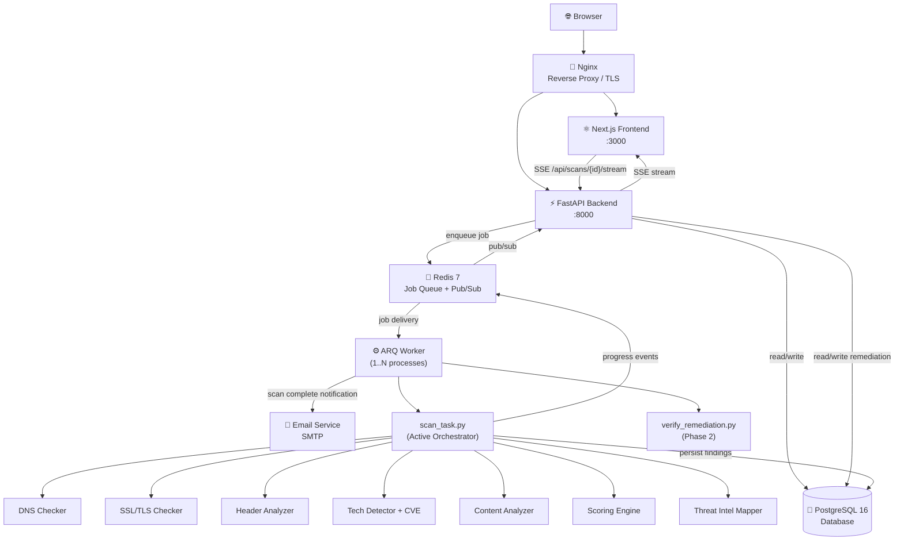
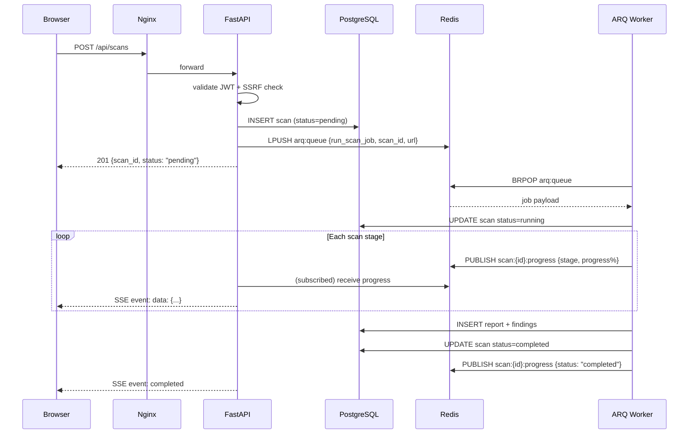
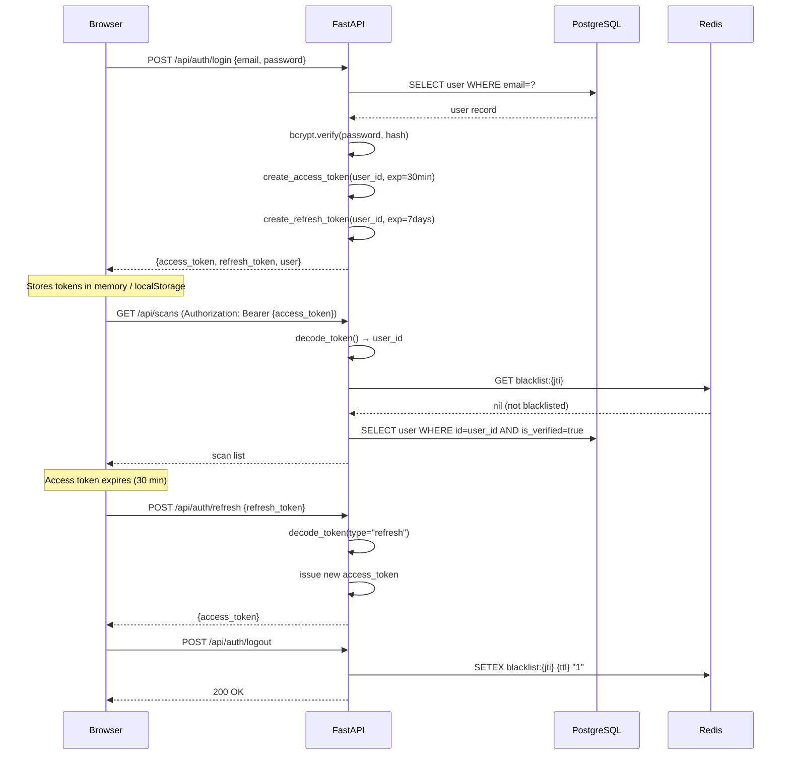
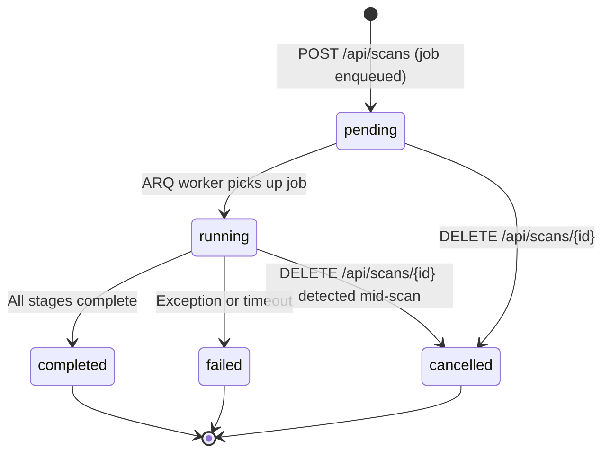
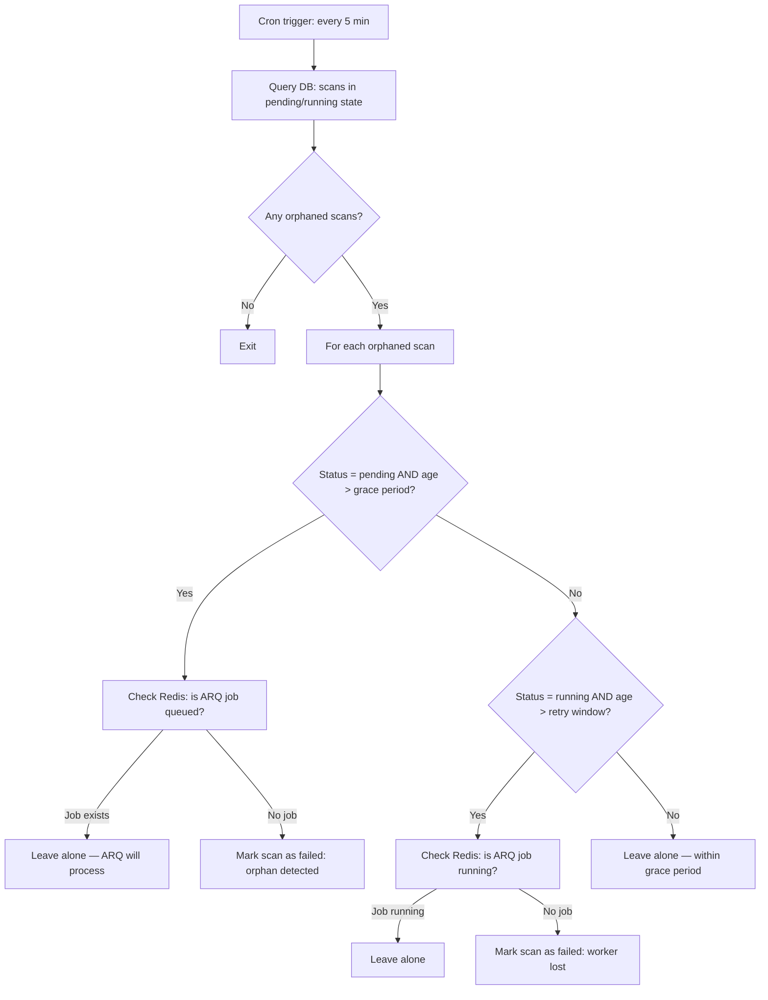
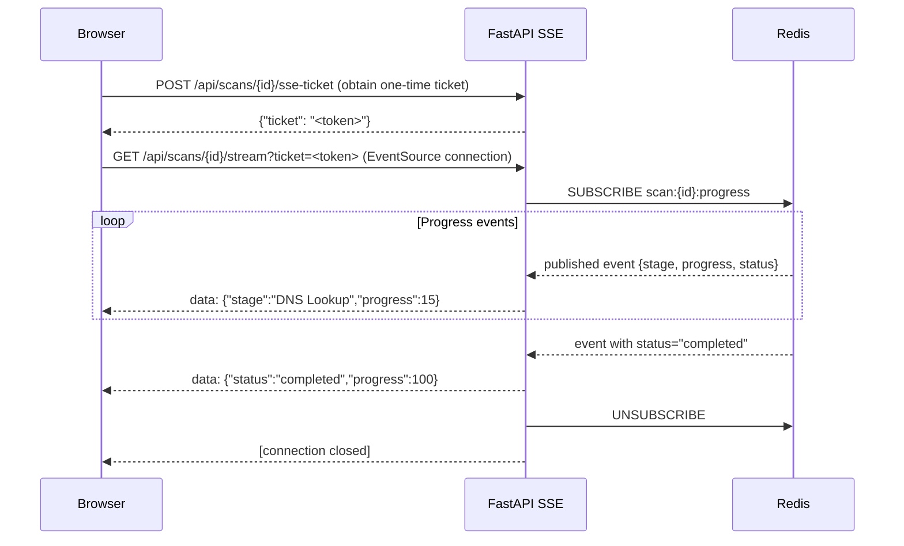
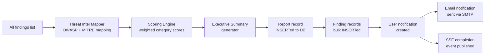
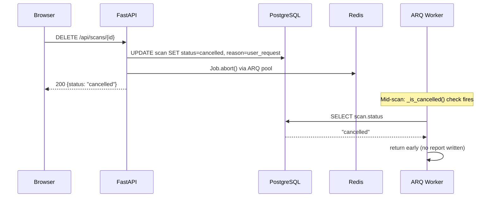
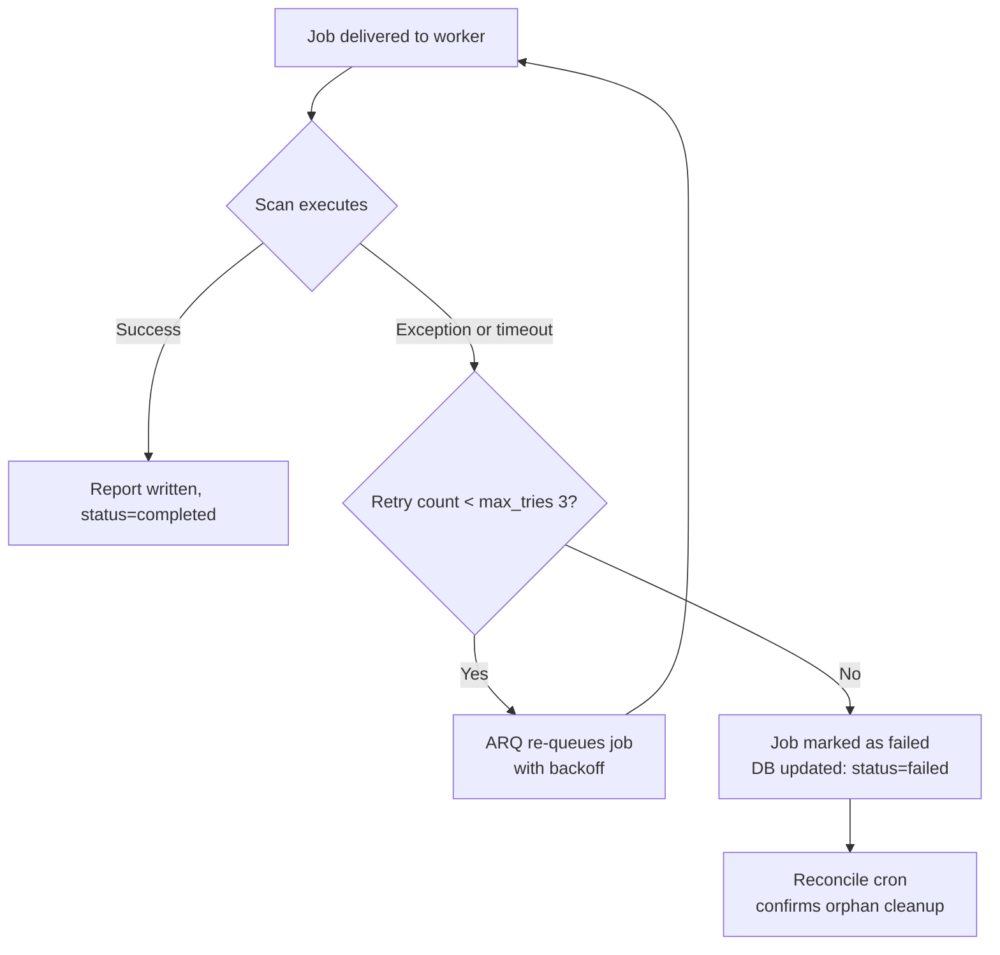

# System Architecture

## Overview

SentinelScan is designed around a **decoupled, event-driven architecture** that separates the HTTP API from the scanning workload. This design ensures that:

- The API never blocks waiting for a scan to complete
- Long-running scans survive API restarts
- Multiple scans execute concurrently without thread contention
- Progress updates stream to the browser in real time without polling

---

## Top-Level Component Diagram



---

## Component Descriptions

### Nginx (Reverse Proxy)

Nginx sits at the entry point and routes all traffic:

- **Port 80/443** — all external traffic enters here
- Routes `/api/*` to FastAPI (port 8000)
- Routes everything else to Next.js (port 3000)
- Terminates TLS in production (certificate management is manual or certbot)
- Applies connection limits and buffer settings

### Next.js Frontend (Port 3000)

The React/Next.js application serves the complete browser interface:

- **App Router** (`src/app/`) — Next.js 14 file-system routing
- **Auth pages** — login, register, forgot password, email verify
- **Dashboard** — security score, recent scans, findings summary
- **Scan page** — URL input, real-time progress via SSE
- **Report pages** — findings table, detailed analysis, PDF export
- **Analytics page** — historical trends, severity distribution

All API calls go through an Axios-based API client in `src/lib/api.ts` that automatically attaches the JWT from localStorage.

### FastAPI Backend (Port 8000)

The async REST API handles all client requests:

- **Auth router** (`/api/auth`) — registration, login, token refresh, logout
- **OAuth router** (`/api/auth/google`) — Google OAuth2 flow
- **Scans router** (`/api/scans`) — scan creation, status, SSE stream, cancellation
- **Reports router** (`/api/reports`) — report retrieval, findings, PDF generation
- **Notifications router** (`/api/notifications`) — in-app notification management
- **Admin router** (`/api/admin`) — system-level operations (admin users only)
- **Targets / Assets routers** — target management and monitored assets

**Middleware stack** (top to bottom):
1. CORS (origin whitelist)
2. GZip compression (responses > 1000 bytes)
3. Security headers (`X-Content-Type-Options`, `X-Frame-Options`, `Referrer-Policy`)
4. Rate limiter (slowapi)
5. Request handlers

### Redis 7

Redis serves two distinct purposes:

**1. ARQ Job Queue:**
- Scan jobs are serialized to a Redis list (`arq:queue` by default)
- Workers poll this list with a 0.5-second delay
- Job state, result, and retry count are stored in Redis keys
- Results kept for 1 hour after completion

**2. SSE Progress Pub/Sub:**
- The ARQ worker publishes progress events to Redis channel `scan:{scan_id}:progress`
- The FastAPI SSE endpoint subscribes to this channel and streams events to the browser
- This enables cross-process progress delivery: worker on one process, API on another

**3. Token Blacklist:**
- Revoked JWT tokens are stored in Redis with TTL = token expiry time
- Checked on every authenticated request

**4. Worker Heartbeat:**
- ARQ worker writes `arq:health:sentinelscan-worker` key every 60 seconds
- The `/api/readiness` endpoint checks this key to report worker health

### ARQ Worker

The scanner worker is a separate process that:

1. Connects to Redis and polls the `arq:queue` list
2. Picks up `run_scan_job` tasks
3. Calls `run_scan_job(ctx, scan_id, url)` from `app/tasks/scan_task.py` — the active scan orchestrator
4. Publishes progress events to Redis during the scan
5. Writes the completed report and findings to PostgreSQL
6. Runs a cron job every 5 minutes: `reconcile_orphan_scans`

**WorkerSettings:**
- `max_jobs = 5` — up to 5 concurrent scans per worker
- `max_tries = 3` — up to 3 delivery attempts per job
- `job_timeout = 600s` — entire scan must complete within 10 minutes
- `allow_abort_jobs = True` — supports Job.abort() for user-initiated cancellation

### Active Scan Orchestrator (`app/tasks/scan_task.py`)

> **Note:** `app/scanner/engine.py` does not exist (the legacy stub was removed). The active orchestrator is `app/tasks/scan_task.py`.

The scan task orchestrates all scanner modules sequentially, with cooperative cancellation checks between each stage:

```
Stage 1: DNS Lookup           (0% → 15%)
Stage 2: SSL/TLS Analysis    (15% → 35%)
Stage 3: Header Analysis     (35% → 55%)
Stage 4: Technology Detection (55% → 70%)
Stage 4b: CVE Lookup         (70% → 85%)  [only if versioned techs found]
Stage 5: Content Analysis    (85% → 92%)
Stage 5b: Threat Intel       (92%)
Stage 6: Score + Report      (92% → 100%)
```

Each stage emits progress events to Redis Pub/Sub via `app/utils/progress.py`.

### Remediation Engine (`app/remediation/`)

The remediation subsystem provides a guided remediation lifecycle with targeted verification:

- **`engine.py`** — domain normalization + enforced 13-state machine (`VALID_TRANSITIONS`; violations surface as HTTP 409)
- **`registry.py`** — maps detector IDs to remediator classes via `capability_map()`
- **`probe.py`** — routes finding detectors to focused passive probes (header/cookie/TLS/DNS)
- **`app/models/remediation.py`** — `ProjectConnection`, `RemediationRecord`, `RemediationAuditLog` models
- **`app/tasks/verify_remediation.py`** — ARQ job for "Verify Now" on-demand verification

**Authorization:** Active `ProjectConnection` with exact normalized-host match; no credentials stored.

**Contract:** Passive read-only probes only — never connects to or modifies user servers.

### PostgreSQL 16

All persistent data lives in PostgreSQL:

- **users** — accounts, roles, verification state, preferences
- **scans** — URL, status, progress, task ID, timeline
- **reports** — score, grade, risk level, tech stack, SSL info, DNS info
- **findings** — every individual vulnerability with complete OWASP/MITRE/CVSS metadata fields
- **notifications** — in-app alerts
- **sessions** — refresh token tracking
- **audit_logs** — security-relevant events
- **share_links** — public report sharing tokens
- **assets** — monitored web assets
- **asset_change_events** — asset posture tracking and delta history
- **project_connections** — authorized domains for remediation (Phase 2)
- **remediation_records** — remediation lifecycle state machine (13 states)
- **remediation_audit_logs** — remediation state transition audit trail

---

## Request Lifecycle



---

## Authentication Flow



---

## Scan Lifecycle (State Machine)



**Terminal states** (no further transitions): `completed`, `failed`, `cancelled`

---

## Worker Reconciliation Flow

Every 5 minutes, the ARQ cron job `reconcile_orphan_scans` runs:



---

## SSE (Server-Sent Events) Lifecycle



**Reconnection:** If the API restarts mid-scan, the browser EventSource automatically reconnects. On reconnect, the SSE endpoint checks the last progress event stored in Redis (`scan:{id}:last_event`) and replays it, ensuring the frontend always gets the current state.

---

## Report Generation



---

## Cancellation Flow



---

## Retry Flow


