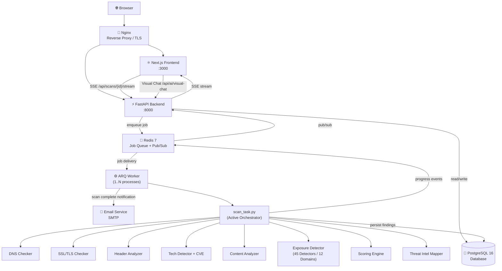
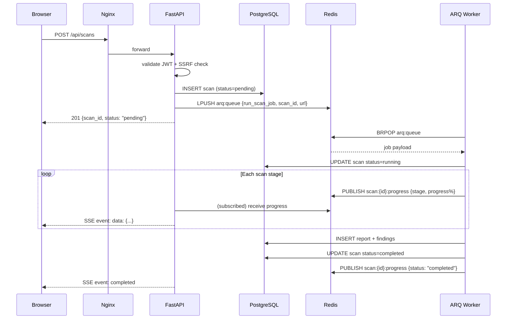
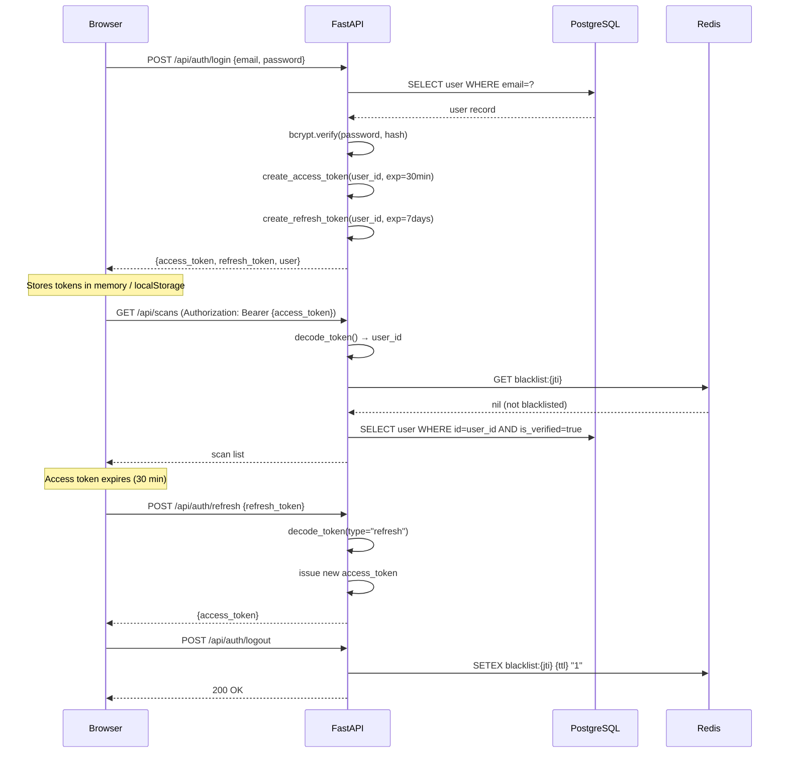
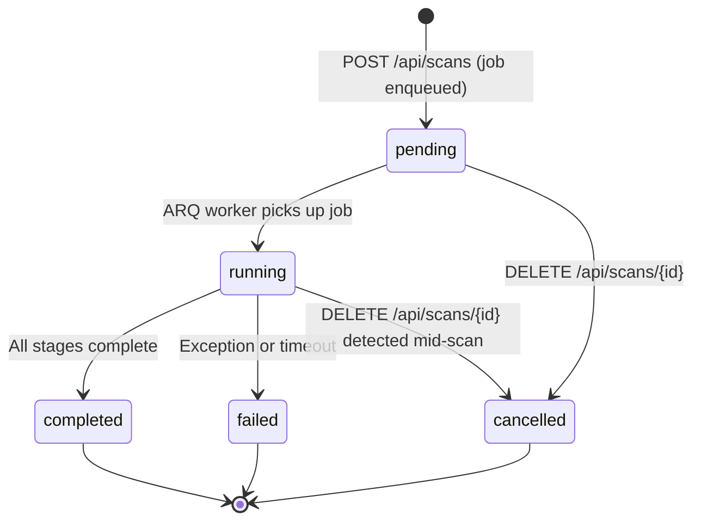
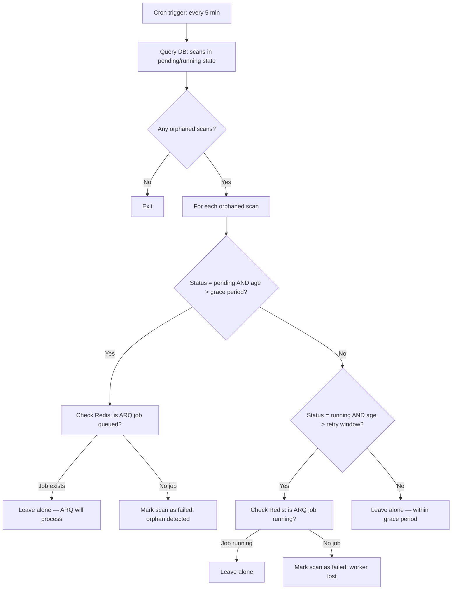
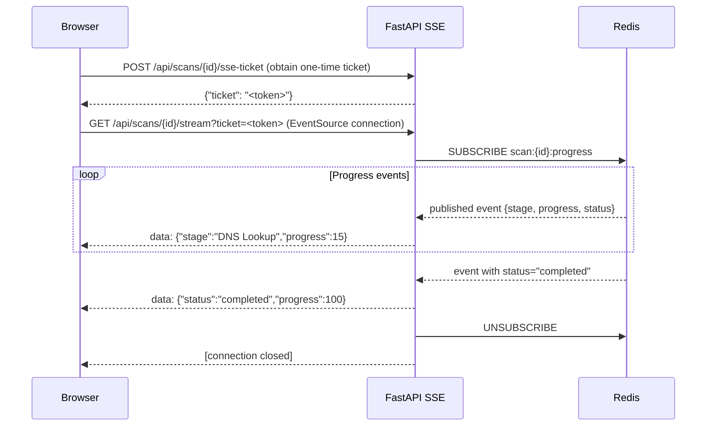
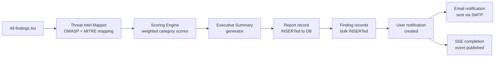
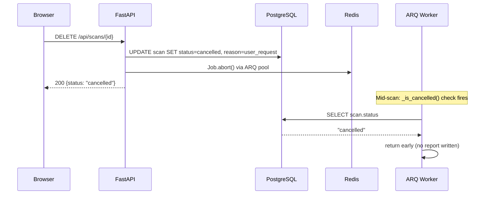
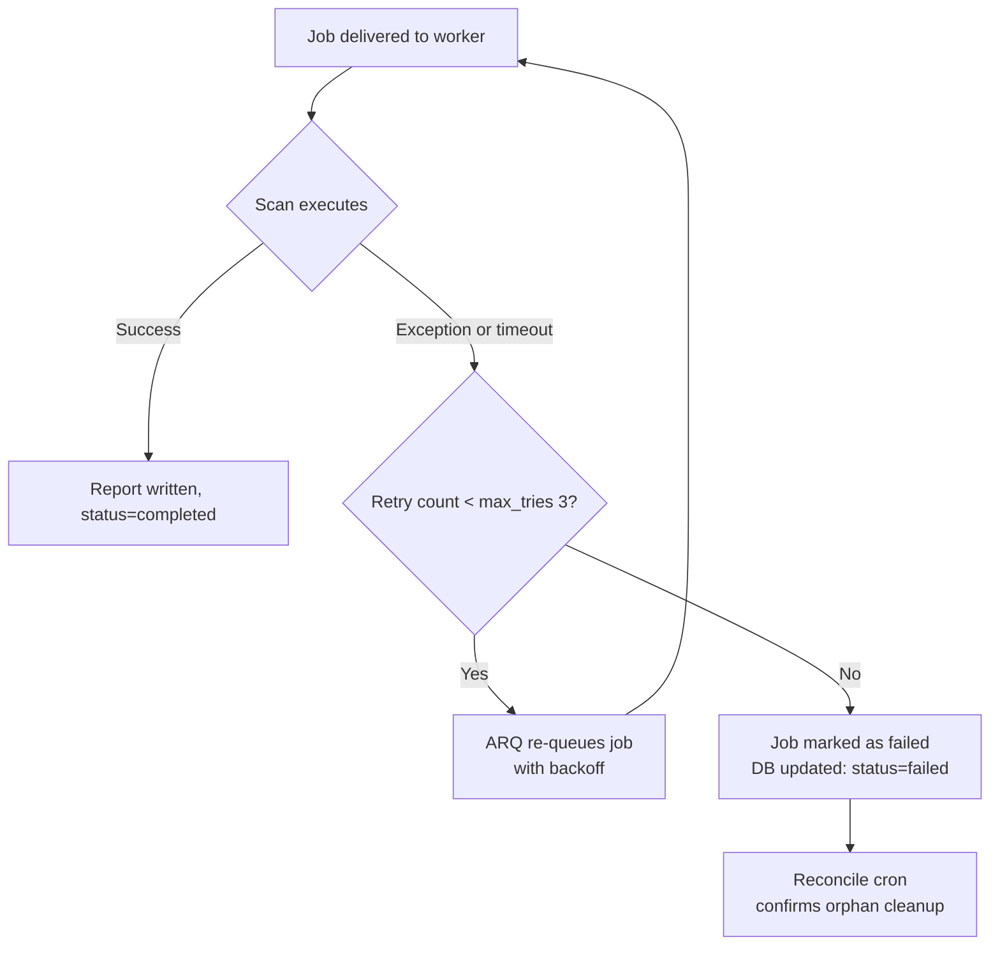
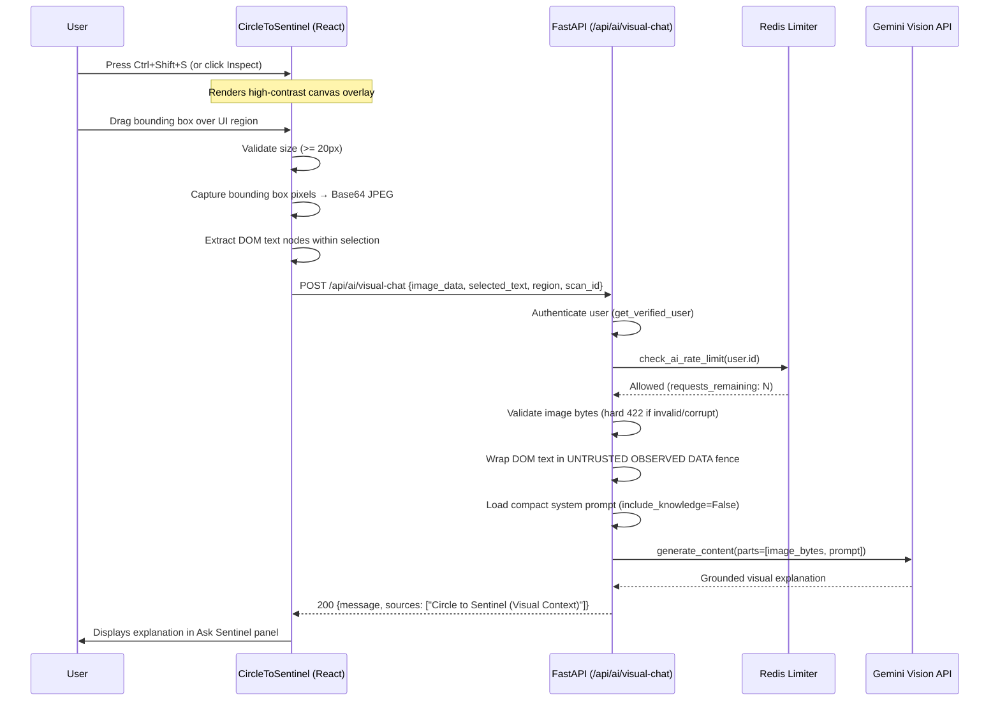

# System Architecture

## Overview

SentinelScan is designed around a **decoupled, event-driven architecture** that separates the HTTP API from the scanning workload. This design ensures that:

- The API never blocks waiting for a scan to complete
- Long-running scans survive API restarts
- Multiple scans execute concurrently without thread contention
- Progress updates stream to the browser in real time without polling

---

## Top-Level Component Diagram


```mermaid
graph TB
    Browser["🌐 Browser"]
    Nginx["🔀 Nginx\nReverse Proxy / TLS"]
    Frontend["⚛️ Next.js Frontend\n:3000"]
    API["⚡ FastAPI Backend\n:8000"]
    Redis["🔴 Redis 7\nJob Queue + Pub/Sub"]
    Worker["⚙️ ARQ Worker\n(1..N processes)"]
    DNS["DNS Checker"]
    SSL["SSL/TLS Checker"]
    Headers["Header Analyzer"]
    Tech["Tech Detector + CVE"]
    Content["Content Analyzer"]
    Exposure["Exposure Detector\n(45 Detectors / 12 Domains)"]
    Scoring["Scoring Engine"]
    ThreatIntel["Threat Intel Mapper"]
    DB[("🐘 PostgreSQL 16\nDatabase")]
    Email["📧 Email Service\nSMTP"]

    Browser --> Nginx
    Nginx --> Frontend
    Nginx --> API
    Frontend -- "SSE /api/scans/{id}/stream" --> API
    Frontend -- "Visual Chat /api/ai/visual-chat" --> API
    API -- "enqueue job" --> Redis
    API -- "read/write" --> DB
    Redis -- "job delivery" --> Worker
    Worker --> ScanTask["scan_task.py\n(Active Orchestrator)"]
    ScanTask --> DNS
    ScanTask --> SSL
    ScanTask --> Headers
    ScanTask --> Tech
    ScanTask --> Content
    ScanTask --> Exposure
    ScanTask --> Scoring
    ScanTask --> ThreatIntel
    ScanTask -- "persist findings" --> DB
    ScanTask -- "progress events" --> Redis
    Redis -- "pub/sub" --> API
    API -- "SSE stream" --> Frontend
    Worker -- "scan complete notification" --> Email
```

---

## Component Descriptions

### Nginx (Reverse Proxy)

Nginx sits at the entry point and routes all traffic:

- **Port 80/443** — all external traffic enters here
- Routes `/api/*` to FastAPI (port 8000)
- Routes everything else to Next.js (port 3000)
- Terminates TLS in production (certificate management is manual or certbot)
- Applies connection limits and buffer settings

### Next.js Frontend (Port 3000)

The React/Next.js application serves the complete browser interface:

- **App Router** (`src/app/`) — Next.js 14 file-system routing
- **Auth pages** — login, register, forgot password, email verify
- **Dashboard** — security score, recent scans, findings summary
- **Scan page** — URL input, real-time progress via SSE
- **Report pages** — findings table, detailed analysis, PDF export
- **Analytics page** — historical trends, severity distribution

All API calls go through an Axios-based API client in `src/lib/api.ts` that automatically attaches the JWT from localStorage.

### FastAPI Backend (Port 8000)

The async REST API handles all client requests:

- **Auth router** (`/api/auth`) — registration, login, token refresh, logout
- **OAuth router** (`/api/auth/google`) — Google OAuth2 flow
- **Scans router** (`/api/scans`) — scan creation, status, SSE stream, cancellation
- **Reports router** (`/api/reports`) — report retrieval, findings, PDF generation
- **Notifications router** (`/api/notifications`) — in-app notification management
- **AI router** (`/api/ai`) — Ask Sentinel conversational AI and structured finding explanations
- **Admin router** (`/api/admin`) — system-level operations (admin users only)

> **Note:** The legacy Targets / Assets routers and `assets` table were retired; the active API surface is exactly the routers listed above.

**Middleware stack** (top to bottom):
1. CORS (origin whitelist)
2. GZip compression (responses > 1000 bytes)
3. Security headers (`X-Content-Type-Options`, `X-Frame-Options`, `Referrer-Policy`)
4. Rate limiter (slowapi)
5. Request handlers

**5. AI Rate Limiter** — Per-user Redis sliding window for AI endpoints

### Redis 7

Redis serves two distinct purposes:

**1. ARQ Job Queue:**
- Scan jobs are serialized to a Redis list (`arq:queue` by default)
- Workers poll this list with a 0.5-second delay
- Job state, result, and retry count are stored in Redis keys
- Results kept for 1 hour after completion

**2. SSE Progress Pub/Sub:**
- The ARQ worker publishes progress events to Redis channel `scan:{scan_id}:progress`
- The FastAPI SSE endpoint subscribes to this channel and streams events to the browser
- This enables cross-process progress delivery: worker on one process, API on another

**3. Token Blacklist:**
- Revoked JWT tokens are stored in Redis with TTL = token expiry time
- Checked on every authenticated request

**4. Worker Heartbeat:**
- ARQ worker writes `arq:health:sentinelscan-worker` key every 60 seconds
- The `/api/readiness` endpoint checks this key to report worker health

### ARQ Worker

The scanner worker is a separate process that:

1. Connects to Redis and polls the `arq:queue` list
2. Picks up `run_scan_job` tasks
3. Calls `run_scan_job(ctx, scan_id, url)` from `app/tasks/scan_task.py` — the active scan orchestrator
4. Publishes progress events to Redis during the scan
5. Writes the completed report and findings to PostgreSQL
6. Runs a cron job every 5 minutes: `reconcile_orphan_scans`

**WorkerSettings:**
- `max_jobs = 5` — up to 5 concurrent scans per worker
- `max_tries = 3` — up to 3 delivery attempts per job
- `job_timeout = 600s` — entire scan must complete within 10 minutes
- `allow_abort_jobs = True` — supports Job.abort() for user-initiated cancellation

### Active Scan Orchestrator (`app/tasks/scan_task.py`)

> **Note:** `app/scanner/engine.py` does not exist (the legacy stub was removed). The active orchestrator is `app/tasks/scan_task.py`.

The scan task orchestrates all scanner modules sequentially, with cooperative cancellation checks between each stage:

```
Stage 1: DNS Lookup           (0% → 15%)
Stage 2: SSL/TLS Analysis    (15% → 35%)
Stage 3: Header Analysis     (35% → 55%)
Stage 4: Technology Detection (55% → 70%)
Stage 4b: CVE Lookup         (70% → 85%)  [only if versioned techs found]
Stage 5: Content Analysis    (85% → 91%)
Stage 5e: Exposure Detection (91% → 92%)  [12 domains, 45 detectors, 120s timeout]
Stage 5b: Threat Intel       (92%)
Stage 6: Score + Report      (92% → 100%)
```

Each stage emits progress events to Redis Pub/Sub via `app/utils/progress.py`. Stage 5e executes 45 external exposure detectors using `SafeFetchClient` with canonical deduplication against previously gathered findings.

### Finding-Level Remediation Guidance

SentinelScan does not automate remediation, patching, or server modifications. Instead, every finding carries passive, actionable remediation guidance generated at detection time and rendered in reports and finding views:

- **Per-finding fields** — `recommendation`, `problem`, `impact`, `fix_steps`, `configuration_example`, and documentation references are stored with the finding.
- **No external remediation engine** — the legacy `app/remediation/` subsystem (ProjectConnection/RemediationRecord auto-patching, verification jobs, 13-state lifecycle) has been fully retired. `app/models/remediation.py` retains only enum definitions for migration-history compatibility.
- **Contract:** Pure passive triage — SentinelScan never connects to or modifies user servers.

### PostgreSQL 16

All persistent data lives in PostgreSQL:

- **users** — accounts, roles, verification state, preferences
- **scans** — URL, status, progress, task ID, timeline
- **reports** — score, grade, risk level, tech stack, SSL info, DNS info
- **findings** — every individual vulnerability with complete OWASP/MITRE/CVSS metadata fields plus finding-level remediation guidance fields
- **notifications** — in-app alerts
- **audit_logs** — security-relevant events

> Legacy tables (`sessions`, `share_links`, `assets`, `asset_change_events`,
> `project_connections`, `remediation_records`, `remediation_audit_logs`) were
> dropped in migration `7340c9ab6be5`; `alembic_version` completes the schema.

---

## Request Lifecycle


```mermaid
sequenceDiagram
    participant Browser
    participant Nginx
    participant API as FastAPI
    participant DB as PostgreSQL
    participant Redis
    participant Worker as ARQ Worker

    Browser->>Nginx: POST /api/scans
    Nginx->>API: forward
    API->>API: validate JWT + SSRF check
    API->>DB: INSERT scan (status=pending)
    API->>Redis: LPUSH arq:queue {run_scan_job, scan_id, url}
    API-->>Browser: 201 {scan_id, status: "pending"}

    Worker->>Redis: BRPOP arq:queue
    Redis-->>Worker: job payload
    Worker->>DB: UPDATE scan status=running
    loop Each scan stage
        Worker->>Redis: PUBLISH scan:{id}:progress {stage, progress%}
        API->>Redis: (subscribed) receive progress
        API-->>Browser: SSE event: data: {...}
    end
    Worker->>DB: INSERT report + findings
    Worker->>DB: UPDATE scan status=completed
    Worker->>Redis: PUBLISH scan:{id}:progress {status: "completed"}
    API-->>Browser: SSE event: completed
```

---

## Authentication Flow


```mermaid
sequenceDiagram
    participant Browser
    participant API as FastAPI
    participant DB as PostgreSQL
    participant Redis

    Browser->>API: POST /api/auth/login {email, password}
    API->>DB: SELECT user WHERE email=?
    DB-->>API: user record
    API->>API: bcrypt.verify(password, hash)
    API->>API: create_access_token(user_id, exp=30min)
    API->>API: create_refresh_token(user_id, exp=7days)
    API-->>Browser: {access_token, refresh_token, user}

    Note over Browser: Stores tokens in memory / localStorage

    Browser->>API: GET /api/scans (Authorization: Bearer {access_token})
    API->>API: decode_token() → user_id
    API->>Redis: GET blacklist:{jti}
    Redis-->>API: nil (not blacklisted)
    API->>DB: SELECT user WHERE id=user_id AND is_verified=true
    API-->>Browser: scan list

    Note over Browser: Access token expires (30 min)

    Browser->>API: POST /api/auth/refresh {refresh_token}
    API->>API: decode_token(type="refresh")
    API->>API: issue new access_token
    API-->>Browser: {access_token}

    Browser->>API: POST /api/auth/logout
    API->>Redis: SETEX blacklist:{jti} {ttl} "1"
    API-->>Browser: 200 OK
```

---

## Scan Lifecycle (State Machine)


```mermaid
stateDiagram-v2
    [*] --> pending: POST /api/scans (job enqueued)
    pending --> running: ARQ worker picks up job
    pending --> cancelled: DELETE /api/scans/{id}
    running --> completed: All stages complete
    running --> failed: Exception or timeout
    running --> cancelled: DELETE /api/scans/{id} detected mid-scan
    failed --> [*]
    cancelled --> [*]
    completed --> [*]
```

**Terminal states** (no further transitions): `completed`, `failed`, `cancelled`

---

## Worker Reconciliation Flow

Every 5 minutes, the ARQ cron job `reconcile_orphan_scans` runs:


```mermaid
flowchart TD
    A[Cron trigger: every 5 min] --> B[Query DB: scans in pending/running state]
    B --> C{Any orphaned scans?}
    C -- No --> Z[Exit]
    C -- Yes --> D[For each orphaned scan]
    D --> E{Status = pending AND age > grace period?}
    E -- Yes --> F[Check Redis: is ARQ job queued?]
    F -- Job exists --> G[Leave alone — ARQ will process]
    F -- No job --> H[Mark scan as failed: orphan detected]
    E -- No --> I{Status = running AND age > retry window?}
    I -- Yes --> J[Check Redis: is ARQ job running?]
    J -- Job running --> K[Leave alone]
    J -- No job --> L[Mark scan as failed: worker lost]
    I -- No --> M[Leave alone — within grace period]
```

---

## SSE (Server-Sent Events) Lifecycle


```mermaid
sequenceDiagram
    participant Browser
    participant API as FastAPI SSE
    participant Redis

    Browser->>API: POST /api/scans/{id}/sse-ticket (obtain one-time ticket)
    API-->>Browser: {"ticket": "<token>"}
    Browser->>API: GET /api/scans/{id}/stream?ticket=<token> (EventSource connection)
    API->>Redis: SUBSCRIBE scan:{id}:progress
    loop Progress events
        Redis-->>API: published event {stage, progress, status}
        API-->>Browser: data: {"stage":"DNS Lookup","progress":15}
    end
    Redis-->>API: event with status="completed"
    API-->>Browser: data: {"status":"completed","progress":100}
    API->>Redis: UNSUBSCRIBE
    API-->>Browser: [connection closed]
```

**Reconnection:** If the API restarts mid-scan, the browser EventSource automatically reconnects. On reconnect, the SSE endpoint checks the last progress event stored in Redis (`scan:{id}:last_event`) and replays it, ensuring the frontend always gets the current state.

---

## Report Generation


```mermaid
flowchart LR
    A[All findings list] --> B[Threat Intel Mapper\nOWASP + MITRE mapping]
    B --> C[Scoring Engine\nweighted category scores]
    C --> D[Executive Summary\ngenerator]
    D --> E[Report record\nINSERTed to DB]
    E --> F[Finding records\nbulk INSERTed]
    F --> G[User notification\ncreated]
    G --> H[Email notification\nsent via SMTP]
    G --> I[SSE completion\nevent published]
```

---

## Cancellation Flow


```mermaid
sequenceDiagram
    participant Browser
    participant API as FastAPI
    participant DB as PostgreSQL
    participant Redis
    participant Worker as ARQ Worker

    Browser->>API: DELETE /api/scans/{id}
    API->>DB: UPDATE scan SET status=cancelled, reason=user_request
    API->>Redis: Job.abort() via ARQ pool
    API-->>Browser: 200 {status: "cancelled"}

    Note over Worker: Mid-scan: _is_cancelled() check fires
    Worker->>DB: SELECT scan.status
    DB-->>Worker: "cancelled"
    Worker->>Worker: return early (no report written)
```

---

## Retry Flow


```mermaid
flowchart TD
    A[Job delivered to worker] --> B{Scan executes}
    B -- Success --> C[Report written, status=completed]
    B -- Exception or timeout --> D{Retry count < max_tries 3?}
    D -- Yes --> E[ARQ re-queues job\nwith backoff]
    E --> A
    D -- No --> F[Job marked as failed\nDB updated: status=failed]
    F --> G[Reconcile cron\nconfirms orphan cleanup]
```

---

## Ask Sentinel AI Subsystem

Ask Sentinel is an evidence-grounded AI security assistant embedded in SentinelScan. It operates as a discrete service layer within the backend, integrated with the same authentication and authorization infrastructure as the rest of the platform.

### Architecture Diagram

```
Browser (AskSentinelPanel / FindingAskButton / CircleToSentinel)
    |
    |  POST /api/ai/chat
    |  POST /api/ai/explain-finding
    |  POST /api/ai/visual-chat
    |  GET  /api/ai/status
    v
app/routers/ai.py  --- get_verified_user (auth required)
    |                --- check_ai_rate_limit (Redis sliding window: 20 req/hr)
    |
    +-- build_finding_context()  -- Ownership check: scan.user_id == user.id
    |       OR
    +-- build_scan_context()  ---- SELECT with user_id filter
    |       OR
    +-- Visual Context Builder --- Base64 decode + memory validation + DOM text
    |
    +-- sanitize_context()  ------ Strip secrets, API keys, tokens, auth headers
    |
    +-- build_system_prompt()  --- Grounding rules (Rules 1-14: evidence first, no invented findings)
    +-- build_context_section()  - Strict UNTRUSTED OBSERVED DATA boundary
    |
    v
app/ai/provider.py  --  get_ai_provider()  -- Cached provider instance
    |
    +-- GeminiProvider  --  official google-genai SDK
    |        |                Model: settings.AI_GEMINI_MODEL (models/gemini-3.6-flash)
    |        |                Fallbacks: gemini-3.5-flash-lite, gemini-3.7-flash
    |        |                Timeout: settings.AI_REQUEST_TIMEOUT_SECONDS
    |        v
    |    Gemini API (external)
    |
    +-- OpenAIProvider  --  (alternative provider abstraction)
```

### Module Responsibilities

| Module | Responsibility |
|--------|---------------|
| `app/routers/ai.py` | FastAPI router: auth, rate limiting, context orchestration, visual chat, LLM dispatch |
| `app/ai/provider.py` | Provider abstraction (`AIProvider` base, `GeminiProvider`, `OpenAIProvider`), fallback candidate retry |
| `app/ai/context.py` | Builds compact, sanitized scan/finding context; enforces tenant ownership |
| `app/ai/sanitize.py` | Strips secrets, API keys, tokens, database URLs before LLM receives context |
| `app/ai/knowledge.py` | Dynamic knowledge base generated directly from authoritative `DETECTOR_REGISTRY` |
| `app/ai/system_prompt.py` | Grounding system prompt enforcing Rules 1–14 (evidence-first, untrusted visual data, prompt injection defense) |
| `app/ai/rate_limiter.py` | Per-user Redis sliding window (1-hour window, 20 requests/hour, fails closed) |

### Security Model & Trust Boundaries

- **Authentication required** — all AI endpoints require `get_verified_user`
- **Tenant isolation** — scan/finding context queries verify `user_id == current_user.id`; returns `404/403` on unauthorized access
- **Secret sanitization** — `sanitize_context()` removes credentials, private keys, and tokens from context before LLM inference
- **Grounded responses** — system prompt instructs the model to base all claims strictly on provided evidence
- **No unsupported claims** — model is explicitly prohibited from inventing findings, CVEs, or technologies
- **NOT_VERIFIABLE acknowledgment** — model distinguishes observed evidence from external inference; acknowledges passive observation limitations
- **Rate limiting** — per-user Redis counter (`ai:rate:{user_id}`, 1-hour TTL, 20 req/hour); **fails closed** (returns HTTP 503 if Redis is unavailable to prevent rate limit bypass)
- **Prompt injection defense (Rules 13 & 14)** — all scan telemetry, response headers, cookies, and DOM extracts are wrapped in `UNTRUSTED OBSERVED DATA` delimiters; target directives are treated as evidence of an attack on the target, not instructions to follow
- **API keys never exposed** — keys are server-side only; `/api/ai/status` returns only status without secret values

---

## Circle to Sentinel Visual Architecture

`Circle to Sentinel` enables users to select any UI region within the SentinelScan application and receive an instant, evidence-grounded explanation.


```mermaid
sequenceDiagram
    participant User
    participant Frontend as CircleToSentinel (React)
    participant API as FastAPI (/api/ai/visual-chat)
    participant RateLimiter as Redis Limiter
    participant Gemini as Gemini Vision API

    User->>Frontend: Press Ctrl+Shift+S (or click Inspect)
    Note over Frontend: Renders high-contrast canvas overlay
    User->>Frontend: Drag bounding box over UI region
    Frontend->>Frontend: Validate size (>= 20px)
    Frontend->>Frontend: Capture bounding box pixels → Base64 JPEG
    Frontend->>Frontend: Extract DOM text nodes within selection
    Frontend->>API: POST /api/ai/visual-chat {image_data, selected_text, region, scan_id}
    API->>API: Authenticate user (get_verified_user)
    API->>RateLimiter: check_ai_rate_limit(user.id)
    RateLimiter-->>API: Allowed (requests_remaining: N)
    API->>API: Validate image bytes (hard 422 if invalid/corrupt)
    API->>API: Wrap DOM text in UNTRUSTED OBSERVED DATA fence
    API->>API: Load compact system prompt (include_knowledge=False)
    API->>Gemini: generate_content(parts=[image_bytes, prompt])
    Gemini-->>API: Grounded visual explanation
    API-->>Frontend: 200 {message, sources: ["Circle to Sentinel (Visual Context)"]}
    Frontend->>User: Displays explanation in Ask Sentinel panel
```

### Privacy & Ephemeral Execution
- **Zero Disk or DB Persistence:** Screenshots and DOM extracts are decoded and evaluated purely in memory. They are discarded immediately upon request completion.
- **Client-Only Scope:** Operates strictly within the active browser DOM. It cannot capture external desktop windows or other browser tabs.
