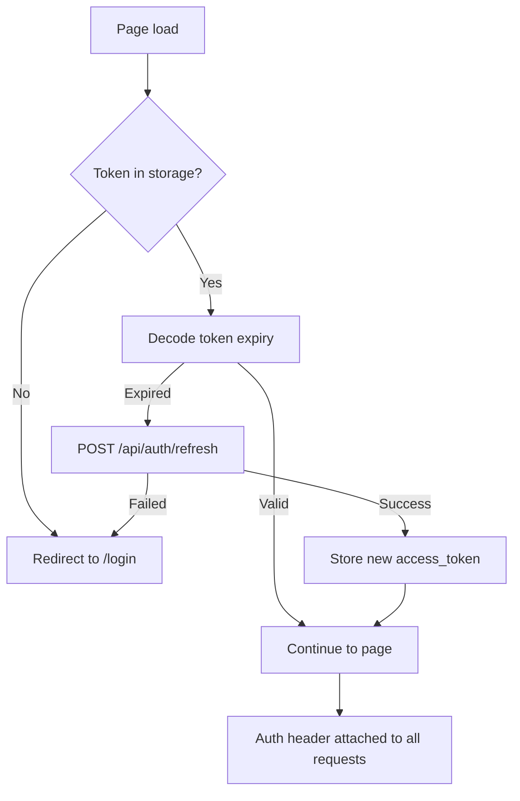

# Frontend Architecture

## Overview

The SentinelScan frontend is a **Next.js 14 application** using the App Router, TypeScript, and Tailwind CSS. It communicates with the FastAPI backend via an Axios-based API client and receives real-time scan updates via Server-Sent Events (SSE).

---

## Folder Structure

```
frontend/src/
├── app/                          # Next.js App Router (24 pages)
│   ├── layout.tsx                # Root HTML layout with dark theme & toaster
│   ├── page.tsx                  # Landing page (marketing & live simulator)
│   ├── globals.css               # Design tokens (Burgundy + Champagne) & Tailwind
│   │
│   ├── (auth)/                   # Authentication route group
│   │   ├── login/
│   │   ├── signup/
│   │   ├── forgot-password/
│   │   ├── reset-password/
│   │   └── verify-email/
│   │
│   ├── (dashboard)/              # Protected route group
│   │   ├── layout.tsx            # Dashboard shell (sidebar + header)
│   │   ├── dashboard/            # Home dashboard & posture metrics
│   │   ├── scan/                 # New scan & live progress
│   │   ├── reports/              # Report inventory
│   │   │   └── [id]/             # Report overview & tabs
│   │   │       ├── headers/      # Security headers tab
│   │   │       ├── ssl/          # SSL/TLS certificate tab
│   │   │       ├── dns/          # DNS security records tab
│   │   │       └── tech/         # Technology & CVE tab
│   │   ├── findings/             # Finding detail & remediation
│   │   │   └── [id]/             # Finding deep-dive workspace
│   │   ├── history/              # Scan history table & filters
│   │   ├── assets/               # Monitored perimeter assets
│   │   │   └── [id]/             # Asset detail & score history
│   │   ├── profile/              # User profile & sessions
│   │   ├── settings/             # Theme & notification settings
│   │   └── admin/                # Admin center & user management
│   │       └── health/           # System health & telemetry
│   │
│   ├── auth/                     # OAuth callback handler
│   │   └── callback/
│   │
│   └── share/                    # Public password-protected report share
│       └── [token]/
│
├── components/                   # Reusable React components
│   ├── dashboard/                # Dashboard widgets (SentinelDeltaWidget, RecentScans)
│   ├── layout/                   # Sidebar, DashboardHeader, Navbar
│   ├── reports/                  # Report sub-nav, share modal
│   ├── shared/                   # SeverityBadge, GlassCard, CommandPalette
│   └── ui/                       # Base design system (Button, Badge, Input, SectionCard)
│
├── lib/                          # API client (Axios), utilities, date formatting
├── types/                        # TypeScript interfaces
└── tailwind.config.js
```

---

## Pages

### Landing Page (`app/page.tsx`)

The public homepage featuring:
- Hero section with live interactive scan simulator
- Key value propositions and security capability cards
- Technology stack overview
- 3-step security process walkthrough
- Pricing tiers and customer testimonials
- Call-to-action buttons (Start Free Scan / Sign In)

### Dashboard (`(dashboard)/dashboard/`)

The primary executive control center after login:
- **Security Score Ring** — animated circular gauge of overall attack surface posture
- **Finding Statistics** — Critical, High, Medium, and Low counts
- **30-Day Posture Trend** — historical posture line chart (shows clear helper state when < 2 scans)
- **Quick Scan Widget** — one-click scan launcher
- **Recent Scans List** — recent assessments with direct report navigation

### Scan Page (`(dashboard)/scan/`)

The interactive scan creation and real-time monitoring workspace:
- **Target URL input** — format validation with instant target chips
- **Scan Profiles** — Quick, Standard, and Custom configuration
- **Scan Coverage Vector Card** — details the 7 inspection vectors
- **Live Progress Timeline** — 8-stage progress bar powered by ticket-authenticated SSE
- **Cooperative Cancellation** — abort running jobs cleanly

### Reports & Sub-Pages (`(dashboard)/reports/`)

- **List view (`/reports`):** Searchable, filterable list of all generated security reports with export shortcuts.
- **Overview (`/reports/[id]`):** Executive summary, risk score, grade gauge, assessment methodology, and finding triage list.
- **Security Headers (`/reports/[id]/headers`):** Detailed analysis of HSTS, CSP, XFO, CORS, and server banners.
- **SSL / TLS (`/reports/[id]/ssl`):** Certificate validity, issuer, cipher suite strength, and protocol versions.
- **DNS Security (`/reports/[id]/dns`):** SPF, DMARC, DNSSEC, MX records, and mail security posture.
- **Technology & CVE (`/reports/[id]/tech`):** Detected tech stack, semver versions, and NIST NVD CVE correlations.

### Finding Detail (`(dashboard)/findings/[id]`)

Dedicated finding workspace with:
- Severity badge, CVSS v3 score gauge, and verification status
- Multi-tab breakdown: Problem & Impact, Technical Root Cause & Evidence, Step-by-Step Fix Instructions with Nginx/Apache code snippets, Best Practices & Official Documentation
- OWASP Top 10, CWE, and MITRE ATT&CK taxonomy tags
- Workflow status updater (`open`, `in_progress`, `resolved`, `false_positive`)

### Assets (`(dashboard)/assets/` & `[id]`)

Continuous attack surface asset monitoring:
- Asset domain inventory with current score, letter grade, and open finding count
- Asset detail page with historical score delta events and component tracking

### History (`(dashboard)/history/`)

Audit log of all past security assessments with search, date sorting, and status filtering.

### Profile (`(dashboard)/profile/`)

User account management:
- Identity card with user initials badge, display name, and verified email
- Google OAuth connection indicator
- Password reset and update workflows
- Active session viewer with remote session termination

### Settings (`(dashboard)/settings/`)

Application preferences:
- Theme Mode selector (Dark, Light, System)
- Email notification preferences (Scan completion emails, critical alerts)

### Admin Center (`(dashboard)/admin/` & `health/`)

Restricted to users with `admin` role:
- User directory and role management
- Real-time system health, database readiness, Redis cache status, and worker telemetry

### Share Page (`app/share/[token]/`)

Public report sharing page with optional password protection:
- Executive summary, security grade, score ring, and finding list
- Standalone view without sidebar or dashboard navigation

---

## Components

### Layout Components

**`Sidebar.tsx`**
- Fixed left navigation with collapsible sections
- Active page highlighting via `usePathname()`
- Notification badge on notification icon
- User avatar + name display
- Role-conditional admin link

**`DashboardLayout.tsx`**
- Top-level wrapper for all dashboard pages
- Authentication guard: redirects to `/login` if no valid token
- Provides `NotificationProvider` and `AuthContext`

### Scanner Components

**`ScanForm.tsx`**
- Controlled URL input with basic validation
- `POST /api/scans` submission with loading state
- Redirects to scan progress view on success

**`ScanProgress.tsx`**
- Connects to SSE endpoint via `useEventSource` hook
- Renders animated progress bar
- Displays stage timeline (completed, active, pending stages)
- On `status=completed`, navigates to report
- On `status=failed`, shows error message

### Report Components

**`ReportCard.tsx`**
- Summary card with score ring, grade badge, key metrics
- Used in scan list and dashboard

**`FindingsTable.tsx`**
- Sortable, filterable table of findings
- Severity filter chips
- Category filter dropdown
- Search by title or description
- Expandable rows with full finding detail

**`ScoreRing.tsx`**
- SVG-based animated circular progress
- Color-coded by grade (green/yellow/orange/red)

**`SeverityBadge.tsx`**
- Color-coded pill badge for finding severity
- Consistent visual language across the application

### Shared Components

**`GlassCard.tsx`**
- Base card component with glassmorphism styling
- Used throughout dashboard and reports

**`Toast.tsx`**
- In-app notification system
- `success`, `error`, `warning`, `info` variants
- Auto-dismiss after 5 seconds

---

## Hooks

### `useAuth()`

Returns the current user from `AuthContext`. Provides:
- `user` — current user object (or `null`)
- `login(email, password)` — calls `/api/auth/login`, stores tokens
- `logout()` — calls `/api/auth/logout`, clears tokens
- `refreshToken()` — calls `/api/auth/refresh`
- `isLoading` — authentication state loading

### `useEventSource(url)`

Custom hook wrapping the browser's `EventSource` API:
- Opens SSE connection
- Returns `{ data, error, readyState }`
- Cleans up on unmount
- Handles reconnection

### `useNotifications()`

Polls `/api/notifications` on a 30-second interval. Returns:
- `notifications` — list
- `unreadCount` — integer
- `markRead(id)` — marks one as read
- `markAllRead()` — marks all as read

---

## State Management

SentinelScan uses **React Context** (not Redux or Zustand) for global state:

**`AuthContext`** (`store/auth-context.tsx`)
- Current user object
- Access/refresh token storage
- Auto-refresh when access token expires
- Persists login state across page refreshes

**`NotificationContext`** (`store/notification-context.tsx`)
- Global toast queue
- `showToast(message, type)` callable from anywhere

**Local state** (via `useState` and `useReducer`) handles:
- Form inputs
- Filter/sort state
- Pagination
- Modal open/close

---

## API Communication

All API calls go through `src/lib/api.ts`, which creates an Axios instance with:

```typescript
const api = axios.create({
  baseURL: process.env.NEXT_PUBLIC_API_URL,
  timeout: 30000,
});

// Request interceptor: attach Bearer token
api.interceptors.request.use((config) => {
  const token = getAccessToken();
  if (token) config.headers.Authorization = `Bearer ${token}`;
  return config;
});

// Response interceptor: auto-refresh on 401
api.interceptors.response.use(
  (response) => response,
  async (error) => {
    if (error.response?.status === 401) {
      await refreshAccessToken();
      return api(error.config);  // retry with new token
    }
    return Promise.reject(error);
  }
);
```

---

## Authentication Flow (Frontend)



---

## Error Handling

**API errors:** Axios interceptors catch all non-2xx responses. `422` validation errors surface field-level messages in forms. `500` errors show a generic toast.

**SSE errors:** The `useEventSource` hook sets `error` state on `EventSource.onerror`. The scan progress page shows a "Connection interrupted" message and offers a Retry button.

**Render errors:** Next.js `error.tsx` boundaries catch unexpected render exceptions.

---

## Environment Variables

| Variable | Required | Description |
|---|---|---|
| `NEXT_PUBLIC_API_URL` | ✅ | Backend API base URL |
| `NEXT_PUBLIC_GOOGLE_CLIENT_ID` | Optional | Google OAuth client ID for login button |

---

## Key Design Decisions

1. **App Router (not Pages Router)** — enables layout-level server components and eliminates wrapper boilerplate
2. **No global state library** — React Context is sufficient for the auth/notification use cases; avoids dependency overhead
3. **SSE over WebSockets** — simpler server-side implementation; uni-directional updates are sufficient for scan progress
4. **Axios over fetch** — interceptors enable token refresh without per-call boilerplate
5. **Tailwind CSS** — utility-first CSS enables rapid iteration without CSS file proliferation
