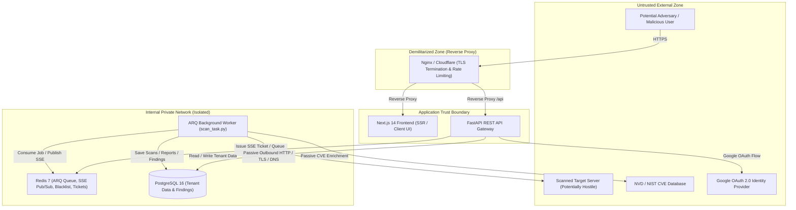

# SentinelScan — Threat Model & Security Architecture

> **Document Version**: 1.0  
> **Target System**: SentinelScan v1.0.x  
> **Status**: Feature-Complete / Hardened  

---

## 1. System Overview

SentinelScan is a full-stack, passive web security scanner. It allows security practitioners and organizations to analyze the defensive posture of target web applications without performing destructive penetration testing or credentialed exploitation.

The system consists of:
- **Next.js 14 Frontend**: Single-page dashboard, real-time scan visualizer, and reporting UI.
- **FastAPI Backend (Python 3.13)**: REST API gateway, authentication, tenant authorization, and scan lifecycle management.
- **Redis 7 & ARQ Worker**: Job queue, task distribution, rate limiting, and real-time Server-Sent Events (SSE) Pub/Sub stream.
- **PostgreSQL 16**: Relational storage for users, monitored assets, scan results, evidence findings, and audit logs.
- **Passive Scanner Pipeline**: Modular inspection engines for DNS, TLS/SSL, HTTP headers, tech fingerprinting, CVE correlation, and content exposure.

---

## 2. Trust Boundaries & Architecture Diagram

---

## 3. Assets & Security Objectives

| Asset | Confidentiality | Integrity | Availability | Description |
|---|---|---|---|---|
| **User Credentials & Password Hashes** | High | High | Medium | Passwords stored strictly as salted bcrypt hashes. |
| **JWT Secrets & Signing Keys** | Critical | Critical | High | Asymmetric/symmetric secrets used for token verification. |
| **Scan Reports & Finding Evidence** | High | High | Medium | Vulnerability findings, evidence chains, and risk ratings. |
| **Monitored Assets & Verified Targets** | Medium | High | Medium | Customer infrastructure inventory and ownership records. |
| **OAuth Client Secrets** | Critical | High | High | Google OAuth credentials (kept on backend only). |
| **Audit Logs & System Health** | Medium | Critical | High | Non-repudiation audit trails for sensitive operations. |

---

## 4. Threat Actors

1. **Unauthenticated External Adversaries**: Attackers attempting credential stuffing, auth bypass, SSRF attacks against internal infrastructure, or denial-of-service.
2. **Malicious Authenticated Tenants**: Legitimate users attempting cross-tenant data access (IDOR), scanning internal/private networks, or exhausting background worker queues.
3. **Hostile Target Web Servers**: External servers scanned by SentinelScan attempting decompression bombs, slowloris timeouts, massive payload injection, or DNS rebinding.
4. **Network Eavesdroppers**: Passive observers attempting to intercept JWT access tokens or sensitive report exports over unencrypted transit.

---

## 5. Threat Scenarios & Implemented Defenses

### 5.1 Server-Side Request Forgery (SSRF)
* **Threat**: An attacker submits internal IP ranges (`127.0.0.1`, `10.0.0.0/8`, `192.168.0.0/16`, `169.254.169.254`, `[::1]`) or internal DNS hostnames to map the private network or steal cloud instance metadata.
* **Mitigations in Source Code**:
  - `app/utils/ssrf.py` & `app/routers/scans.py` perform strict hostname resolution via `socket.getaddrinfo`.
  - Rejection of loopback, RFC 1918 private subnets, carrier-grade NAT (`100.64.0.0/10`), link-local (`169.254.0.0/16`), and AWS/GCP/Azure metadata services (`169.254.169.254`).
  - Strict URI scheme enforcement (`http://` and `https://` only; `file://`, `gopher://`, `dict://` blocked).
  - Outbound HTTP requests in scanner modules use timeout caps (10s) to prevent hanging sockets.

### 5.2 Insecure Direct Object References (IDOR)
* **Threat**: User A manipulates a scan ID or report ID in `/api/reports/{id}` to view or delete User B's scan history and vulnerability findings.
* **Mitigations in Source Code**:
  - All database queries for scans, reports, findings, assets, and share links enforce `filter(Model.user_id == current_user.id)` in SQLAlchemy.
  - Public report sharing requires explicit share tokens generated by the owner (`/api/reports/{id}/share`) stored in `share_links` table with independent UUIDs.

### 5.3 OAuth 2.0 State Injection & CSRF
* **Threat**: An attacker intercepts an OAuth login flow or forces a victim into authenticating with an attacker-controlled Google account.
* **Mitigations in Source Code**:
  - `app/routers/auth.py` generates a cryptographically random `state` token on `/api/auth/google`.
  - The state token is stored in Redis with a 5-minute TTL and validated strictly on `/api/auth/google/callback`.
  - OAuth account-linking safely verifies if the incoming Google email is already registered and confirmed.

### 5.4 Token Theft & Session Hijacking
* **Threat**: XSS or script injection in the frontend attempts to exfiltrate long-lived session credentials from local storage.
* **Mitigations in Source Code**:
  - Refresh tokens are stored strictly in `HttpOnly`, `SameSite=Lax`, `Secure` cookies — inaccessible to JavaScript.
  - Short-lived JWT access tokens (15–60 min expiry) carry strict `type: "access"` claims.
  - Revoked tokens on logout are pushed to a Redis blacklist with a TTL matching their remaining lifespan.

### 5.5 Server-Sent Events (SSE) Progress Token Leakage
* **Threat**: SSE `EventSource` web APIs cannot send custom HTTP headers in standard browser implementations. Putting JWT tokens in query parameters leaks them in browser histories, access logs, and proxy traces.
* **Mitigations in Source Code**:
  - `POST /api/scans/{id}/sse-ticket` requires standard `Bearer` authorization and generates a single-use, 60-second Redis ticket.
  - `GET /api/scans/{id}/stream?ticket=<ticket>` consumes and deletes the ticket immediately upon connection.

### 5.6 Sensitive Data & Credential Disclosure in Reports
* **Threat**: A scan finding reveals raw API tokens, passwords, database URLs, or session cookies which are subsequently exported to shared PDF reports.
* **Mitigations in Source Code**:
  - `app/utils/pdf_generator.py` and finding serializers automatically run regular expression redaction masks across technical details.
  - Passwords, bearer tokens, AWS keys, private keys, and session cookies are replaced with `[REDACTED]` prior to ReportLab PDF rendering.

### 5.7 Worker Denial of Service & Queue Starvation
* **Threat**: A malicious user submits hundreds of concurrent scans to exhaust worker threads and freeze scans for other users.
* **Mitigations in Source Code**:
  - `MAX_ACTIVE_SCANS_PER_USER = 2` concurrency limit enforced at enqueue time.
  - Worker timeout set to 600 seconds per scan job.
  - Scheduled orphan reconciliation cron (`reconcile_orphan_scans`) cleans up abandoned or timed-out tasks every 5 minutes.

---

## 6. Residual Risks & Security Assumptions

1. **Passive-Only Limitations**: SentinelScan intentionally does not perform active exploitation, SQLi payload testing, or authenticated application crawling. Findings represent observable surface risks.
2. **DNS Rebinding Window**: Target IP validation occurs at scan initiation. An adversary controlling a malicious authoritative DNS server with an ultra-short TTL (0 seconds) could theoretically alter record resolution mid-scan.
3. **NVD Rate Limiting**: The public NIST NVD API is rate-limited without an API key. Degraded CVE lookups fall back to cached local dictionaries.
4. **Hosting Environment**: Production deployment assumes TLS is terminated by a hardened reverse proxy (Nginx / Cloudflare) with appropriate rate limiting, CSP, and HSTS headers.
