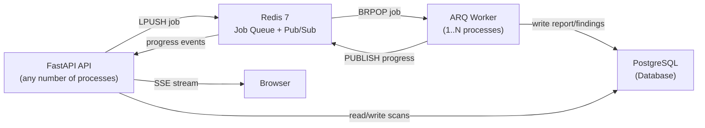
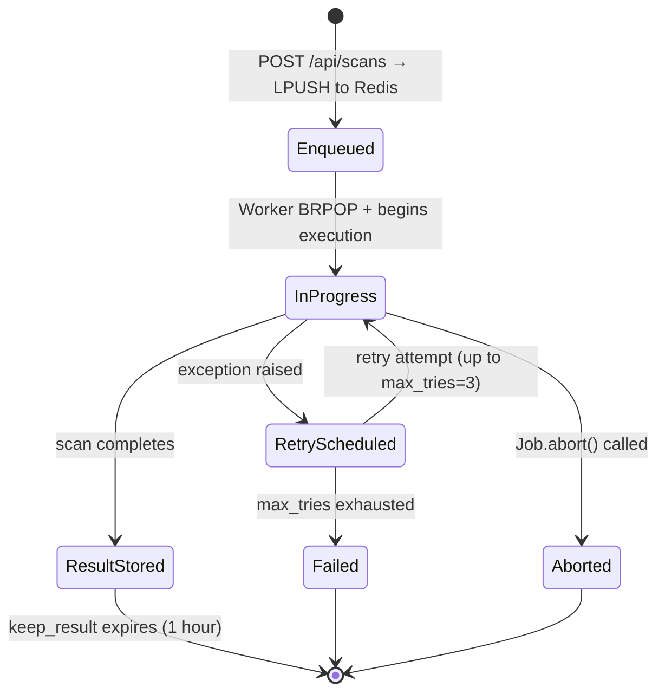
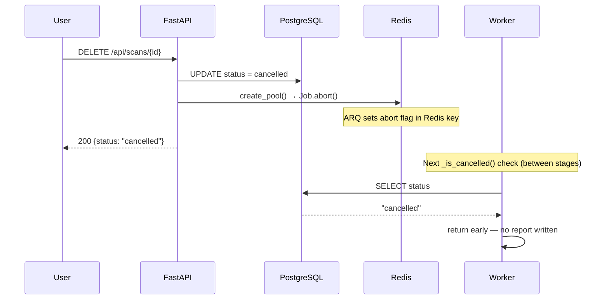
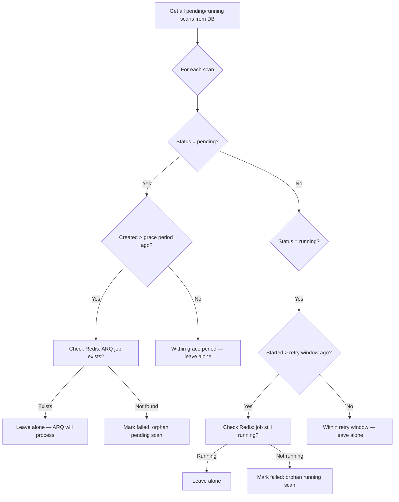
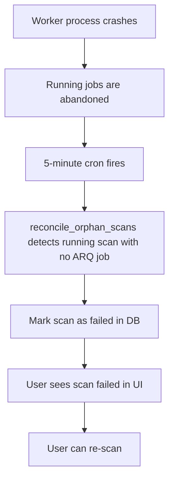

# Worker System

## Overview

SentinelScan uses **ARQ** (Async Redis Queue) to decouple scan execution from the HTTP API. This architecture ensures:

- Scans survive API restarts — jobs persist in Redis until a worker processes them
- Multiple scans execute concurrently without blocking HTTP requests
- Failed scans can be retried automatically
- Orphaned scans are cleaned up by a periodic cron reconciler

---

## Architecture



The API and Worker **share no in-process state**. They communicate only through Redis (queue + pub/sub) and PostgreSQL (data).

---

## ARQ Configuration (`app/worker.py`)

```python
class WorkerSettings:
    functions = [run_scan_job]
    cron_jobs = [
        cron(reconcile_orphan_scans,
             minute={0,5,...,55},       # every 5 minutes
             run_at_startup=True,
             unique=True,
             max_tries=1,
             timeout=120)
    ]
    on_startup = startup                # lifecycle hook
    on_shutdown = shutdown
    queue_name = settings.ARQ_QUEUE_NAME  # "arq:queue"
    max_jobs = settings.WORKER_CONCURRENCY  # 5 concurrent scans
    job_timeout = settings.MAX_SCAN_TIMEOUT # 600 seconds
    max_tries = settings.WORKER_MAX_TRIES   # 3 delivery attempts
    keep_result = 3600                  # keep results 1 hour
    allow_abort_jobs = True             # enables Job.abort()
    poll_delay = 0.5                    # seconds between queue polls
    health_check_key = "arq:health:sentinelscan-worker"
    health_check_interval = 60         # seconds
```

---

## Job Lifecycle



---

## Scan Execution (`tasks/scan_task.py`)

The registered ARQ function:

```python
async def run_scan_job(ctx: dict, scan_id: str, url: str) -> dict:
    """
    ARQ-registered scan function.
    - Idempotent: checks scan status before executing
    - Publishes progress via Redis pub/sub
    - Updates DB with results
    """
```

**Idempotency:**
Before executing, the task checks the scan's current status in the database:
- `completed` → return early (scan already done, possibly a late retry)
- `cancelled` → return early (user cancelled)
- `failed` → return early (previous attempt marked it failed; let reconciler handle)

This prevents duplicate report creation if ARQ re-delivers a job.

---

## Retry Behaviour

ARQ retries a job automatically when the task function raises an exception:

| Attempt | Behaviour |
|---|---|
| 1st delivery | Job executes normally |
| Exception raised | ARQ schedules retry with exponential backoff |
| 2nd delivery | Idempotency check; re-executes scan |
| 3rd delivery | Final attempt |
| Exception on 3rd | Job moves to failed state; `reconcile_orphan_scans` cleans up DB |

**Timeout:** If a job exceeds `job_timeout=600s`, ARQ raises `asyncio.CancelledError` and the job is treated as failed.

---

## Cancellation

User cancellation flow:



`_is_cancelled(scan_id)` is called between each scanner stage. This means cancellation takes effect within one stage boundary — at most the time of the longest stage (~20 seconds for SSL/TLS check on slow hosts).

---

## Reconciliation (`tasks/reconcile.py`)

The `reconcile_orphan_scans` cron job runs every 5 minutes and handles scans that have become orphaned due to:
- Worker crash
- Job timeout exceeded without proper DB update
- ARQ job delivery exhausted without completing

**Algorithm:**



**Grace periods:**
- Pending scans: grace period before considering orphaned (allows for worker restart time)
- Running scans: `MAX_SCAN_TIMEOUT + buffer` before marking failed

---

## Worker Startup Reconciliation

On worker startup (`on_startup` hook), the worker logs all scans currently in `running` or `pending` state. This serves as an observability signal — the periodic cron reconciler handles actual cleanup.

---

## Redis Key Structure

| Key Pattern | Purpose | TTL |
|---|---|---|
| `arq:queue` | Job queue (Redis list) | Managed by ARQ |
| `arq:job:{job_id}` | Job state and result | Auto-managed |
| `scan:{id}:progress` | Pub/sub channel for SSE | No TTL (pub/sub) |
| `scan:{id}:last_event` | Last progress JSON for reconnect | 1 hour |
| `arq:health:sentinelscan-worker` | Worker heartbeat timestamp | 90 seconds |
| `blacklist:{jti}` | Revoked JWT token | Token remaining lifetime |

---

## Worker Health Monitoring

The ARQ worker automatically writes to `arq:health:sentinelscan-worker` every 60 seconds.

The `/api/readiness` endpoint reads this key:

```python
worker_ts = await redis.get("arq:health:sentinelscan-worker")
if worker_ts:
    checks["worker"] = {"status": "ok", "last_heartbeat": worker_ts}
else:
    checks["worker"] = {"status": "unknown",
                        "detail": "No worker heartbeat — start the worker process"}
```

If the heartbeat key is missing (key expired = worker down), the readiness endpoint returns `503`.

---

## Concurrent Scan Limits

**Per worker:** `max_jobs = WORKER_CONCURRENCY` (default: 5) — ARQ's internal semaphore prevents more than 5 jobs from executing simultaneously.

**Per user:** `MAX_ACTIVE_SCANS_PER_USER = 2` — enforced by the API before enqueuing. A user cannot have more than 2 scans in `pending` or `running` state simultaneously.

---

## Failure Recovery



If the **API process restarts** while SSE connections are open:
- Browser `EventSource` auto-reconnects
- On reconnect, the SSE endpoint checks `scan:{id}:last_event` in Redis
- Replays the last known progress event
- The worker's in-progress scan continues unaffected (separate process)

---

## Starting the Worker

**Development:**
```bash
cd backend
python run_worker.py
```

**Docker:**
The `worker` service in `docker-compose.yml` runs `python run_worker.py` in a separate container from the API.

**Scaling:** To run multiple workers, start multiple `worker` container instances. All workers share the same Redis queue — ARQ handles job distribution.

---

## Progress Event Schema

Each SSE event published to Redis has this structure:

```json
{
  "scan_id": "7f000001-...",
  "progress": 55,
  "stage": "Technology Detection",
  "message": "Fingerprinting technology stack and CMS",
  "status": "running"
}
```

On completion:
```json
{
  "scan_id": "7f000001-...",
  "progress": 100,
  "stage": "Generating Report",
  "message": "Scan complete",
  "status": "completed",
  "report_id": "abc123..."
}
```
