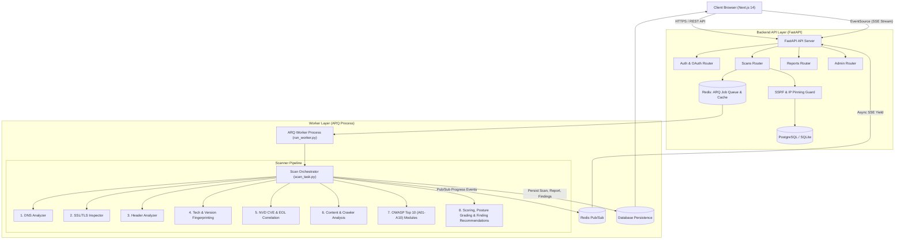
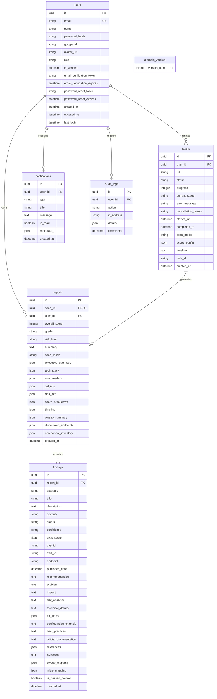
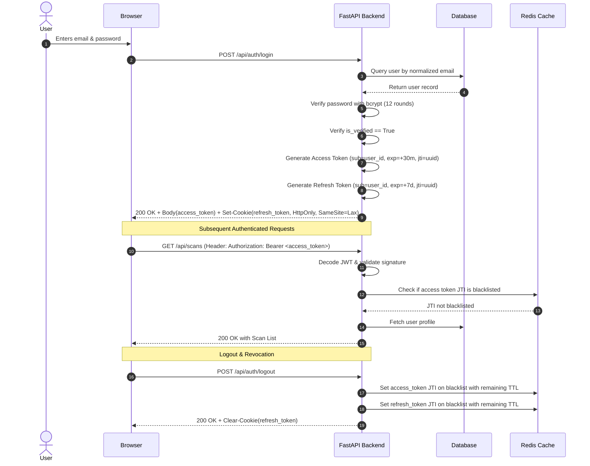
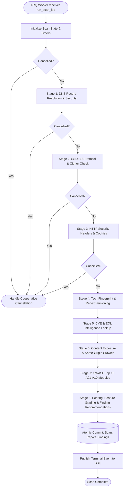
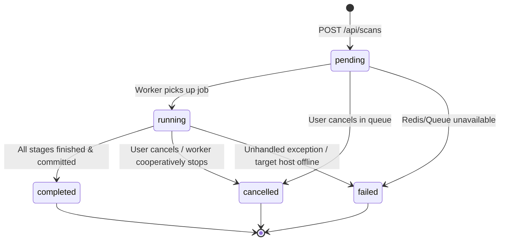
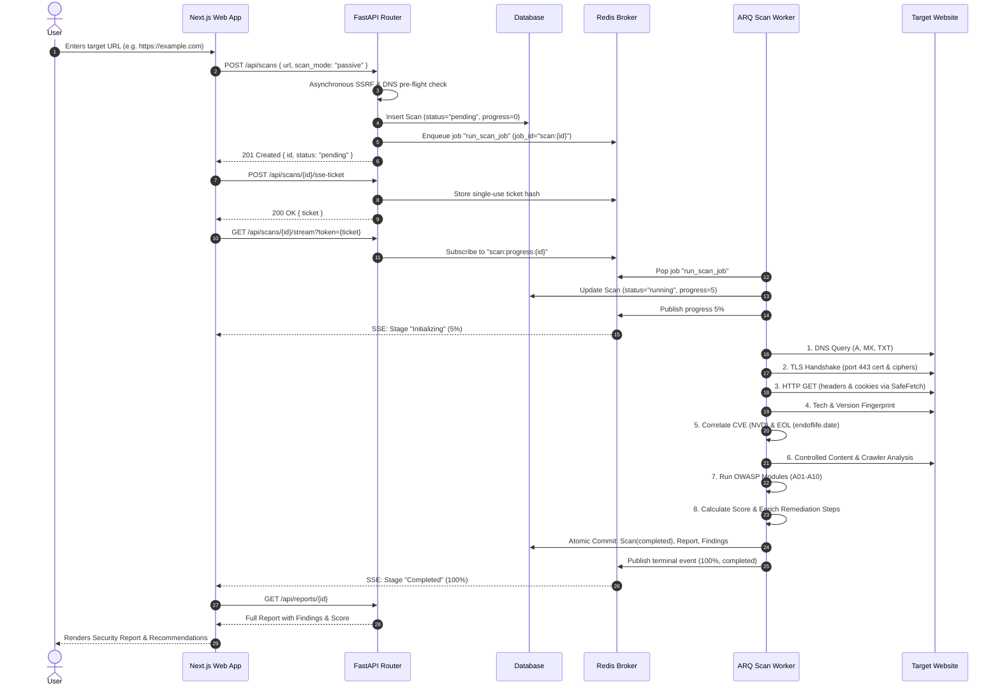

# SentinelScan
## Complete Technical Project Documentation

> **Document Status:** Authoritative Master Technical Documentation<br>
> **Repository Baseline:** Current Cleaned Architecture (10 Unused Features Retired)<br>
> **Verification Status:** 704/704 Automated Backend Tests Passing (33 warnings, documented validation run) | Next.js 14 Production Build Clean (20/20 Routes Prerendered in Observed Build) | GitHub Actions CI Passing (3/3 Jobs) | Alembic Schema Synchronized (`7340c9ab6be5`)<br>
> **Repository:** https://github.com/Nandinivora18/AttackSurface (Branch: `main`)<br>
> **Last Audited:** September 2026

---

## Table of Contents

1. [Project Overview](#1-project-overview)
2. [Project Scope](#2-project-scope)
3. [High-Level System Architecture](#3-high-level-system-architecture)
4. [Technology Stack](#4-technology-stack)
5. [Frontend Architecture](#5-frontend-architecture)
6. [UI / UX Design](#6-ui--ux-design)
7. [User Journeys](#7-user-journeys)
8. [Backend Architecture](#8-backend-architecture)
9. [API Documentation](#9-api-documentation)
10. [Database Architecture](#10-database-architecture)
11. [Authentication and Authorization](#11-authentication-and-authorization)
12. [Security Architecture](#12-security-architecture)
13. [Scanner Architecture](#13-scanner-architecture)
14. [Detector Registry](#14-detector-registry)
15. [Security Headers Analysis](#15-security-headers-analysis)
16. [Cookie Security Analysis](#16-cookie-security-analysis)
17. [SSL / TLS Analysis](#17-ssl--tls-analysis)
18. [DNS Security Analysis](#18-dns-security-analysis)
19. [Technology Detection](#19-technology-detection)
20. [CVE Correlation](#20-cve-correlation)
21. [Lifecycle / EOL Intelligence](#21-lifecycle--eol-intelligence)
22. [OWASP Top 10:2025 Coverage](#22-owasp-top-102025-coverage)
23. [Findings System](#23-findings-system)
24. [Scoring System](#24-scoring-system)
25. [Scan Lifecycle](#25-scan-lifecycle)
26. [Redis + ARQ Worker Architecture](#26-redis--arq-worker-architecture)
27. [Real-Time Progress / SSE](#27-real-time-progress--sse)
28. [Reporting System](#28-reporting-system)
29. [PDF Generation](#29-pdf-generation)
30. [Export System](#30-export-system)
31. [Admin System](#31-admin-system)
32. [Email System](#32-email-system)
33. [Input Validation](#33-input-validation)
34. [Rate Limiting](#34-rate-limiting)
35. [Error Handling](#35-error-handling)
36. [Logging and Observability](#36-logging-and-observability)
37. [Testing Architecture](#37-testing-architecture)
38. [Database Migrations](#38-database-migrations)
39. [Feature Inventory](#39-feature-inventory)
40. [Current Database Table Inventory](#40-current-database-table-inventory)
41. [File / Module Map](#41-file--module-map)
42. [Data Flow](#42-data-flow)
43. [Security Threat Model](#43-security-threat-model)
44. [Performance / Scalability](#44-performance--scalability)
45. [Deployment Architecture](#45-deployment-architecture)
46. [Configuration and Environment Variables](#46-configuration-and-environment-variables)
47. [Development Setup](#47-development-setup)
48. [Production / Deployment Considerations](#48-production--deployment-considerations)
49. [Known Limitations](#49-known-limitations)
50. [Security Assumptions](#50-security-assumptions)
51. [Design Decisions](#51-design-decisions)
52. [Removed Features and Why](#52-removed-features-and-why)
53. [Why the Current Architecture is Simpler](#53-why-the-current-architecture-is-simpler)
54. [Project Differentiation](#54-project-differentiation)
55. [Use Cases](#55-use-cases)
56. [Sample End-to-End Scenario](#56-sample-end-to-end-scenario)
57. [Viva / Presentation Explanation](#57-viva--presentation-explanation)
58. [Glossary](#58-glossary)
59. [Final Technical Summary](#59-final-technical-summary)

---

# 1. Project Overview

### Project Name
**SentinelScan** (Platform Subtitle: *Passive Web Security Scanner & Attack Surface Intelligence*)

### Purpose & Problem Statement
Modern web applications expose significant security risk through misconfigured HTTP response headers, deprecated cryptographic protocols, exposed administrative files, outdated technology components, and unauthenticated parameter surfaces. Development teams and security evaluators often lack lightweight, non-destructive tools capable of assessing internet-facing perimeters without running hazardous, destructive exploit payloads or requiring complex local agent installations.

### Proposed Solution
SentinelScan provides an automated, non-destructive web security assessment platform. By combining **passive network reconnaissance**, **controlled active probing**, **fingerprinting engines**, and **external threat intelligence correlation**, SentinelScan evaluates target URLs against the **OWASP Top 10:2025** framework, calculates posture scores based on SentinelScan's implemented scoring model (0–100), and outputs actionable finding-level remediation guidance in web and PDF formats.

### Project Objectives
1. Develop an automated external web security assessment platform for submitted target URLs.
2. Identify observable security weaknesses across DNS, TLS/SSL, HTTP security headers, cookies, technologies, and exposed content.
3. Detect identifiable technology versions where externally observable evidence allows version extraction.
4. Correlate detected software versions with NIST NVD CVE information and technology lifecycle/EOL information.
5. Provide OWASP Top 10:2025 assessment coverage across A01–A10 using passive analysis, controlled non-destructive probing, and evidence-assisted assessment.
6. Generate a Security Posture Score from 0–100 using SentinelScan's implemented scoring model.
7. Store structured findings with severity, confidence, evidence, standards mappings, and applicable finding-level remediation guidance.
8. Provide web, JSON, Executive PDF, and Technical PDF reporting.
9. Protect the scanner itself through input validation, SSRF defenses, DNS rebinding/redirect protections, authentication, authorization, rate limiting, and sensitive-data sanitization.

### Why SentinelScan Was Selected
SentinelScan was selected because web applications expose multiple security layers simultaneously, including DNS, TLS, HTTP headers, cookies, technology components, exposed content, and application-level security indicators. Instead of focusing on a single security check, the project combines these externally observable signals into one assessment workflow. The project also provides an opportunity to apply cybersecurity concepts including SSRF protection, secure authentication, asynchronous task processing, vulnerability classification, CVE correlation, OWASP mapping, evidence collection, scoring, and security reporting within one system.

### Elevator Pitch
> *"SentinelScan is a full-stack, passive-first web security scanner that inspects external attack surfaces, identifies cryptographic and configuration misconfigurations, correlates outdated software components with live CVE and End-of-Life databases, and produces executive and technical PDF reports with finding-level remediation guidance—designed to minimize target impact through passive analysis and controlled non-destructive probing."*

### Repository Identity & Publication Baseline
- **Canonical GitHub Repository**: [https://github.com/Nandinivora18/AttackSurface](https://github.com/Nandinivora18/AttackSurface)
- **Primary Branch**: `main`
- **Publication Baseline**: The complete SentinelScan project source tree (FastAPI backend, Next.js 14 frontend, 37-detector scanning engine, 704 passing tests, Alembic migrations, ReportLab PDF generation, Docker/Nginx assets, and authoritative documentation) is published directly at the repository root.
- **Repository Safety & Hygiene**: Published with verified exclusion of sensitive environment files (`.env`, `.env.local`), real credentials, API keys, private keys, virtual environments (`.venv`), Node dependencies (`node_modules`), local SQLite runtime databases (`*.db`), and transient build/test caches.
- **Continuous Integration**: Monitored via a multi-job GitHub Actions CI workflow covering backend Pytest suites, frontend TypeScript checking, Next.js production builds, and repository secret safety checks.

### Security Assessment Philosophy
1. **Safety First (Non-Destructive)**: The scanner does not perform destructive exploitation or attempt to retrieve data through SQL/command injection; its active probes are designed as controlled, non-destructive checks avoiding denial of service.
2. **Fail-Closed Perimeter Guarding**: The scanner treats its own outbound requests as potential vectors for Server-Side Request Forgery (SSRF) and terminates invalid or private-range resolutions before socket connection.
3. **Actionable Intelligence**: Applicable findings are paired with human-readable problem descriptions, potential business impact, code-level remediation steps, configuration snippets, and authoritative documentation references.

### What SentinelScan Is vs. What SentinelScan Is NOT

| SentinelScan IS | SentinelScan IS NOT |
|---|---|
| A passive-first and controlled non-destructive external security assessment platform | A full automated Penetration Testing (VAPT) suite |
| An attack-surface discovery and posture auditing tool | A credential brute-forcing or dictionary attacking tool |
| An OWASP Top 10:2025 configuration & header assessment platform | An intrusive dynamic exploit generator (e.g., Metasploit, SQLMap) |
| A software version, CVE, and lifecycle correlation engine | A static application security testing (SAST) source-code analyzer |
| A security assessment and executive reporting generator | An invasive internal network vulnerability scanner |

### Project Impact

SentinelScan provides tangible security, operational, and educational value across multiple operational dimensions:

- **Security Impact**:
  Helps security evaluators and website owners identify externally observable weaknesses before adversaries can exploit them. This includes cryptographic gaps (deprecated TLS protocols, weak ciphers, expiring certificates), critical missing security headers (HSTS, CSP, X-Frame-Options), cookie misconfigurations, information disclosure through server banners, and software components with known CVEs or reached End-of-Life (EOL) status.

- **Operational Impact**:
  Consolidates what traditionally required multiple standalone tools (such as separate DNS query utilities, SSL test tools, header checkers, and technology detectors) into a single, unified, asynchronous assessment pipeline. The scanner persists structured findings in a single commit, computes category-based posture grades, and automatically compiles Executive and Technical PDF reports alongside machine-readable JSON exports.

- **Developer & Security-Team Impact**:
  Replaces vague vulnerability notices with structured, evidence-backed findings. Applicable findings provide a concrete problem statement, potential business/technical impact, sequential fix steps, copy-ready configuration snippets for major web servers (Nginx, Apache, Express/Helmet, Caddy), and authoritative RFC/NIST/OWASP reference links, streamlining triage and remediation without requiring deep cryptographic or server administration expertise.

- **Educational & Research Impact**:
  Serves as an authoritative demonstration of modern web security assessment engineering. It demonstrates how to apply defensive cybersecurity concepts—including fail-closed Server-Side Request Forgery (SSRF) prevention with IP pinning to eliminate TOCTOU DNS rebinding, asynchronous task processing with cooperative cancellation, multi-signal technology fingerprinting, EOL cache fallbacks, and deterministic scoring models—within a cohesive full-stack architecture.

- **Risk-Awareness & Scope Impact**:
  Promotes transparent risk visibility by explicitly reporting `NOT_VERIFIABLE` and surface-observation boundaries. Rather than creating a false sense of security, SentinelScan clearly delineates externally observable perimeter posture from internal, multi-tenant, or business-logic vulnerabilities that require authenticated or manual source-code audit.

### Evaluation Requirement Traceability

| Evaluation Requirement | SentinelScan Implementation Response | Evidence / Section in Documentation |
|---|---|---|
| **1. Problem Statement** | Modern web apps expose attack surfaces through headers, TLS, DNS, and outdated components lacking lightweight non-destructive auditing. | Section 1 (Purpose & Problem Statement) |
| **2. Expected Outcome / Proposed Solution** | Automated external web scanner evaluating target URLs with passive intelligence and controlled non-destructive probing. | Section 1 (Proposed Solution, Project Objectives) |
| **3. Technologies & Tools Used** | Python 3.11+ (verified on Python 3.13 runtime), FastAPI, PostgreSQL / aiosqlite, Redis, ARQ, Next.js 14, Tailwind CSS, ReportLab. | Section 4 (Technology Stack), Section 8, Section 5 |
| **4. Key Features** | 37 registered detectors, multi-mode scanning, SSRF protection, CVE/lifecycle correlation, SSE live HUD, PDF reports. | Section 2 (Scope), Section 14 (Registry), Section 39 |
| **5. Project Impact** | Multi-dimensional impact: security hardening, operational consolidation, developer remediation, and educational value. | Section 1 (Project Impact) |
| **6. Understanding & Significance** | Fail-closed security philosophy, perimeter visibility, and clear boundary between what SentinelScan IS vs IS NOT. | Section 1 (Philosophy, IS vs IS NOT), Section 2 |
| **7. Well-Researched Solution** | Grounded in OWASP Top 10:2025, NIST NVD, CWE, MITRE ATT&CK, IETF RFCs, and endoflife.date lifecycle data. | Section 54 (Research Basis and Technical Justification) |
| **8. Working Proof of Concept (POC)** | Fully functional full-stack platform verified with 704 passing tests (33 warnings) in documented validation run, clean build, and synchronized database schema. | Section 59 (Proof of Concept, Verification Outcome) |
| **9. Strong Supporting Research** | Normative protocol standards (RFC 6797, 7489, 7208, 6265, 8446) and vulnerability repositories (NVD v2 API). | Section 54 (Research Basis and Technical Justification) |
| **10. Industry Feedback & Adaptation** | Iterative engineering evolution: retired 10 unused features, simplified schema to 7 tables, hardened SSRF and cancellations. | Section 53 (Industry Feedback, Adaptation & Engineering Changes) |
| **11. Unique Selling Proposition (USP)** | Unified passive-first reconnaissance, version/CVE/lifecycle correlation, scanner SSRF defenses, and PDF reporting. | Section 54 (Unique Selling Proposition) |
| **12. Workflow & Architecture Diagram** | High-level component diagram (graph TD) and detailed end-to-end sequence diagram (sequenceDiagram). | Section 3 (System Architecture), Section 42 (Data Flow) |
| **13. Visual Presentation Guidance** | Prioritized visual artifacts for presentation slides (problem flowchart, architecture, OWASP matrix, HUD screenshots). | Section 57 (Recommended Visuals for Presentation) |
| **14. Pseudocode & Algorithms** | Deterministic pipeline orchestration algorithm and category penalty deduction scoring algorithm. | Section 13 (Scanner Orchestration & Scoring Algorithms) |
| **15. Assumptions, Challenges & Limits** | Explicitly documented target consent, DNS integrity, SSRF pinning challenges, and external observation horizons. | Section 49 (Limitations & Challenges), Section 50 |

---

# 2. Project Scope

## In Scope
- **Domain & Protocol Reconnaissance**: DNS record analysis (A, AAAA, MX, TXT, SPF, DMARC status) and TLS/SSL certificate lifecycle inspection.
- **Security Headers & Cookie Audit**: Verification of HSTS, CSP, X-Frame-Options, X-Content-Type-Options, Referrer-Policy, Permissions-Policy, CORS access controls, and Cookie security flags (`Secure`, `HttpOnly`, `SameSite`).
- **Technology Stack Identification**: Heuristic fingerprinting of 23 web technologies across 10 categories, automated regex version extraction for 10 technologies, and live CVE correlation via NIST NVD API v2 and vendor-published lifecycle schedules.
- **OWASP Top 10:2025 Mapping**: Modular evaluation covering categories A01 through A10 via non-destructive observation and controlled canary probes.
- **Asynchronous Pipeline & Reporting**: Redis/ARQ worker orchestration, real-time Server-Sent Events (SSE) progress streaming, multi-tier scoring (0–100 with A+ to F grading), and publication of Web, JSON, and ReportLab-generated Technical/Executive PDF reports.
- **Role-Based Access Control & User Identity**: User authentication via secure bcrypt password hashing and Google OAuth 2.0, HttpOnly refresh cookies, Redis-backed JWT token revocation (JTI blacklisting), and an administrative control portal.

## Out of Scope
- Destructive penetration testing, fuzzing of stateful endpoints, or SQL/command injection data retrieval.
- Authenticated multi-step session crawling behind client login forms.
- Source code repository analysis (SAST) or internal network range pivoting.
- Automated code patching, live repository PR generation, or direct server modification.

## Current Limitations
- **External Observability Horizon**: Technologies stripped of identifying headers and file signatures cannot be version-pinned.
- **CVE Backport Discrepancies**: Distribution-backported security patches (e.g., Debian/RedHat Apache patches) may report nominal CVEs despite vendor backport mitigation.
- **Canary Probe Boundary**: Active probing evaluates parameter responsiveness and header reflections using inert canaries; it does not execute browser JavaScript or exploit DOM sinks.
- **SSRF Validation Threading**: Target host resolution executes off the main asyncio loop via worker thread pools, which depends on upstream operating system resolver speed.

## Future Possibilities
- Integration of headless browser DOM inspection (e.g., Playwright) for client-rendered Single Page Application (SPA) DOM XSS analysis.
- Webhook notification delivery (Slack/Discord alerts on scan completion).
- Multi-region scanner agents for geographically distributed latency and DNS geo-routing assessments.

---

# 3. High-Level System Architecture

## Workflow / System Architecture Diagram

SentinelScan separates the presentation layer, the synchronous REST API boundary, the distributed asynchronous job queue, the scanning pipeline, and the persistence tier.



### Architectural Component Interaction
1. **User Interaction**: The operator authenticates via the Next.js frontend, submits a target URL, and starts the assessment.
2. **API Ingestion & SSRF Check**: `POST /api/scans` validates scheme and format, executes asynchronous DNS resolution against forbidden subnets (RFC 1918, RFC 6598, RFC 5737, loopbacks, IPv4-mapped IPv6, and RFC 6052 NAT64), creates a `pending` Scan in the database, and pushes an ARQ job with deterministic ID `scan:{scan_id}` to Redis.
3. **Worker Processing**: The detached ARQ worker process picks up the scan, executes cooperative cancellation checks, runs stages 1 through 8, collects structured findings and evidence, applies scoring penalties, and enriches applicable findings with tailored remediation guidance.
4. **Progress Broadcasting**: Throughout the execution, the worker publishes stage completion percentages to Redis Pub/Sub channel `scan:progress:{scan_id}`. The client receives these events live via an SSE connection (`GET /api/scans/{scan_id}/stream`) authenticated via single-use tickets.
5. **Persistence & Reporting**: The scan completes; `Scan` transitions to `completed`, and the corresponding `Report` and `Finding` rows are committed in a single atomic transaction. The user views the responsive report online or exports sanitized JSON and ReportLab PDFs.

---

# 4. Technology Stack

| Layer | Technology | Version | Purpose | Why Used | Actual Usage in Code |
|---|---|---|---|---|---|
| **Frontend Core** | Next.js | 14.2.5 | Application framework | App router, server-side layouts, React 18 support | `frontend/src/app` |
| **Frontend UI** | React | 18.3.1 | Component rendering | Declarative component UI and lifecycle management | All UI components |
| **Language (Web)** | TypeScript | 5.5.3 | Static typing | Compile-time safety and schema synchronization | `frontend/tsconfig.json` |
| **Styling** | Tailwind CSS | 3.4.7 | CSS utility framework | Custom design system tokens and glassmorphism styling | `tailwind.config.js`, `globals.css` |
| **Theming Engine** | next-themes | 0.3.0 | Global theme management | Class-based dark/light theme switching with localStorage persistence | `frontend/src/components/shared/ThemeProvider.tsx` |
| **Motion** | Framer Motion | 11.3.19 | UI Micro-interactions | Progress bars, animated score gauges, page transitions | Dashboard, Report sub-views |
| **Icons** | Lucide React | 0.414.0 | UI iconography | Security, network, and operational status icons | Throughout UI components |
| **Client HTTP** | Axios | 1.7.3 | API Client | Centralized interceptors for JWT injection and 401 handling | `frontend/src/lib/api.ts` |
| **State** | Zustand | 4.5.4 | Client global state | UI layout state and client preferences | `frontend/src/store/index.ts` |
| **Backend API** | FastAPI | 0.115.0 | Async web framework | High throughput, native OpenAPI, Pydantic validation | `backend/app/main.py` |
| **ASGI Server** | Uvicorn | 0.30.6 | ASGI web server | Asynchronous ASGI Python server | `uvicorn app.main:app` |
| **Data Validation** | Pydantic | 2.x | Schema validation | Request/response DTOs and environment settings | `backend/app/schemas/` |
| **Settings** | Pydantic-Settings | 2.5.2 | Config management | Validates `.env` variables and enforces production guards | `backend/app/config.py` |
| **Database ORM** | SQLAlchemy | 2.0.35 | Database abstraction | Async session management and declarative models | `backend/app/models/` |
| **DB Drivers** | asyncpg / aiosqlite | 0.30.0 / 0.19.0 | Asynchronous drivers | Postgres (production) and SQLite (development) | `backend/app/database.py` |
| **Async Bridge** | Greenlet | >=3.1.1 | Python 3.13 SQLAlchemy bridge | Required for SQLAlchemy asyncio engine and run_sync operations | `backend/requirements.txt` |
| **Migrations** | Alembic | 1.13.3 | Schema migrations | Versioned schema migration tracking | `backend/migrations/` |
| **Job Queue** | ARQ | 0.26.1 | Async task queue | Native Redis async job queue for scanning jobs and crons | `backend/app/worker.py` |
| **Caching/Broker** | Redis | 5.0.8 | In-memory store | Queue transport, token blacklist, SSE pub/sub, CVE cache | `backend/app/utils/cache.py` |
| **HTTP Client** | HTTPX | 0.27.2 | Async HTTP engine | Safe fetch, redirects, and custom DNS pinning client | `backend/app/utils/safe_http.py` |
| **DNS Engine** | dnspython | 2.6.1 | DNS resolver | Queries A, AAAA, MX, TXT, SPF, DMARC | `backend/app/scanner/dns_checker.py` |
| **Cryptography** | Cryptography / Jose | 43.0.1 / 3.3.0 | Token & cipher security | TLS cipher validation, JWT encode/decode, JTI parsing | `backend/app/utils/security.py` |
| **Password Auth** | Passlib & Bcrypt | 1.7.4 / 4.0.1 | Password security | 12-round salted bcrypt hashing | `backend/app/utils/security.py` |
| **HTML Parser** | BeautifulSoup4 / lxml | 4.12.3 / 5.3.0 | Document parsing | Fast HTML DOM extraction for crawler and technology signals | `backend/app/scanner/tech_detector.py` |
| **PDF Engine** | ReportLab | 4.2.5 | Document generation | Native PDF layout, canvas styling, and tables | `backend/app/utils/pdf_generator.py` |
| **Rate Limiter** | SlowAPI | 0.1.9 | Rate limiting | Token bucket rate limiting on auth endpoints | `backend/app/routers/auth.py` |
| **Testing** | Pytest / Asyncio | 9.1.1 / 1.4.0 | Test automation | 704 automated unit, integration, and regression tests (33 warnings) | `backend/tests/` |

---

# 5. Frontend Architecture

The frontend is a Single Page Application (SPA) built on Next.js 14 utilizing the App Router architecture. All application pages enforce authentication checks and render inside dedicated route groups.

### Directory Structure Map
```
frontend/src/
├── app/
│   ├── (auth)/                  # Unauthenticated route group
│   │   ├── login/               # Standard user login
│   │   ├── signup/              # Account registration
│   │   ├── forgot-password/     # Password reset request
│   │   ├── reset-password/      # Token-based password update
│   │   ├── verify-email/        # Account verification acknowledgment
│   │   └── admin/login/         # Dedicated administrator login portal
│   ├── (dashboard)/             # Protected authenticated dashboard group
│   │   ├── layout.tsx           # Global authenticated shell (Sidebar + Header)
│   │   ├── dashboard/           # Security posture overview & score gauges
│   │   ├── scan/                # New scan launcher & real-time HUD
│   │   ├── history/             # Historical scan list, filters, and management
│   │   ├── reports/             # Paginated list of generated reports
│   │   │   └── [id]/            # Dynamic report breakdown routes
│   │   │       ├── page.tsx     # Overview & categorized finding list
│   │   │       ├── headers/     # HTTP Security Headers detail view
│   │   │       ├── ssl/         # SSL/TLS Certificate detail view
│   │   │       ├── dns/         # DNS record verification view
│   │   │       └── tech/        # Technology stack and CVE view
│   │   ├── findings/[id]/       # Finding remediation triage view
│   │   ├── profile/             # User identity, security, & credential change
│   │   ├── settings/            # Theme mode and notification toggles
│   │   └── admin/               # Administrative portal group
│   │       ├── page.tsx         # Platform statistics & system overview
│   │       ├── health/          # Live dependency health & ARQ worker probe
│   │       └── users/           # User administration & role modification
│   ├── auth/callback/           # OAuth redirect callback handler
│   ├── globals.css              # Global styles, variables, & utility classes
│   ├── layout.tsx               # Root document layout, fonts, & metadata
│   └── page.tsx                 # Public marketing & feature landing page
├── components/
│   ├── layout/                  # Navigation, Sidebar, and DashboardHeader
│   ├── reports/                 # ReportSubNav, FindingCard, and Export actions
│   ├── shared/                  # GlassCard, SeverityBadge, ScanTimeline, LoadingSkeleton, ThemeProvider, ThemeToggle
│   └── ui/                      # Base Design System (Button, Input, Badge, PageHeader, etc.)
├── lib/
│   ├── api.ts                   # Configured Axios instance with token interceptors
│   └── utils.ts                 # Formatting, score colors, grades, and location resolvers
├── store/
│   └── index.ts                 # Zustand store managing UI and layout states
└── types/
    └── index.ts                 # Synchronized TypeScript data contracts
```

### Key Frontend Components
- **`ThemeToggle.tsx`**: Accessible, keyboard-navigable top-left floating theme switcher (`fixed top-3.5 left-3.5 z-50`) toggling between Dark (Obsidian Black) and Light (Executive Alabaster & Warm Gold) modes with dynamic Sun/Moon iconography, smooth transitions, and ARIA labels.
- **`ThemeProvider.tsx`**: Application-root theme provider wrapping `next-themes` with `attribute="class"`, `defaultTheme="dark"`, `enableSystem={false}`, and localStorage persistence.
- **`DashboardHeader.tsx`**: Renders dynamic user initials, real-time unread notification counts, and dropdown navigation to settings, profile, and logout.
- **`Sidebar.tsx`**: Primary left-hand navigation linking to Dashboard, New Scan, Scan History, Reports, Profile, Settings, and conditionally Admin.
- **`ReportSubNav.tsx`**: In-page tab bar switching between Overview, Headers, SSL, DNS, and Technology sub-pages without reloading parent metadata.
- **`ScanTimeline.tsx`**: Live visualization displaying the active scan stage, elapsed milliseconds, and animated progress percentages during an assessment.
- **`SeverityBadge.tsx`**: Color-coded semantic indicator for Critical (Red/Rose), High (Orange/Amber), Medium (Yellow), Low (Green/Emerald), and Info (Slate), adapted with high-contrast variants for both dark and light modes.

---

# 6. UI / UX Design

### Dual-Theme Visual Design Language
SentinelScan implements a unified **Dual-Theme Design System** maintaining the platform's luxury cybersecurity identity across both dark and light modes:

1. **Dark Theme (Default Experience)**:
   - **Canvas Background**: Deep obsidian black (`#070707`) with subtle cyber grid overlay.
   - **Surfaces & Panels**: Dark charcoal (`#111111`) and elevated panels (`#161616`).
   - **Borders & Accents**: Subtle charcoal borders (`#2A2A2A`) with metallic gold accents (`#D4AF37`).
   - **Typography**: High-contrast ivory text (`#F5F3ED`) with muted warm secondary text (`#A7A39A`).

2. **Light Theme ("Executive Alabaster & Warm Gold")**:
   - **Canvas Background**: Soft porcelain alabaster (`#F7F6F2`) with subtle warm grid overlay.
   - **Surfaces & Panels**: Crisp pure white panels (`#FFFFFF`) and elevated panels (`#F4F3EE`).
   - **Borders & Accents**: Warm stone borders (`#E7E5DF`) with bronze-gold accents (`#B8860B`, `#C6A15B`).
   - **Typography**: Deep rich charcoal text (`#18181B`) with slate secondary text (`#71717A`).
   - **Code Surfaces**: Light gray monospace background (`#F4F4F5`) with distinct border (`#E4E4E7`).

### Global Theme Switcher
- **Placement**: Fixed floating button in the top-left corner (`fixed top-3.5 left-3.5 z-50`).
- **Iconography**: Renders a Sun icon in dark mode indicating "Switch to light mode", and a Moon icon in light mode indicating "Switch to dark mode".
- **Zero Hydration Flicker**: Handled via `suppressHydrationWarning`, initial dark class default on `<html>`, and client-side mount guards.
- **Persistence**: Persists across route navigation, page reloads, browser sessions, and authenticated states via `next-themes` and `localStorage`.
- **Accents**: Subtle gold/champagne accents (`#D4AF37`, `#5C4A20`) denote brand identity, primary actions, and system stability.
- **Borders & Glassmorphism**: Cards feature subtle alpha borders (`rgba(255, 255, 255, 0.08)`) and backdrop blur filters (`backdrop-blur-md`).

### Semantic Severity Hierarchy
Vulnerabilities are styled with distinct, instantly recognizable status colors:
- **Critical (`#EF4444`)**: Immediate risk requiring emergency mitigation.
- **High (`#F97316`)**: Severe configuration flaw exposing sensitive data.
- **Medium (`#F59E0B`)**: Defense-in-depth weakness or missing hardening header.
- **Low (`#4FAF72`)**: Minor hygiene finding or informational gap.
- **Info (`#94A3B8`)**: Contextual observation or verified passing security control.

### Typography & Spacing
Typography utilizes modern system sans-serif fonts (`Inter`, system UI fallback) with strict weight hierarchy: 900/Black for posture scores and grades, 700/Bold for section titles and card metrics, and 400/Regular for vulnerability descriptions and technical evidence. Spacing follows an 8-point geometric grid (p-2, p-4, p-6, gap-4, gap-6).

### Homepage Interactive Cursor Experience
- **Component Implementation**: Implemented in `frontend/src/components/shared/SplashCursor.jsx` and mounted on the public marketing landing view (`frontend/src/app/page.tsx`).
- **Visual Aesthetic & Rendering Architecture**: Renders a dynamic fluid simulation cursor splash effect using WebGL (requesting WebGL 2 with WebGL 1 fallback) on an HTML5 `<canvas id="fluid">` element. Custom GLSL vertex and fragment shaders compute Navier-Stokes fluid physics (advection, curl, vorticity, divergence, and pressure iterations). The fluid dye is styled using the platform's brand gold/champagne accent (`#D4AF37`) against the dark background (`#070707`).
- **Non-Blocking Interaction**: The container element enforces `position: fixed` and `pointer-events: none` overlay styling, ensuring all mouse clicks, hovers, navigation links, and hero action buttons on the page remain immediately clickable without pointer interference.
- **Pointer & Multi-Touch Input**: Interactivity is driven by window-level listeners for mouse (`mousedown`, `mousemove`) and multi-touch mobile events (`touchstart`, `touchmove`, `touchend`), mapping coordinates scaled by `window.devicePixelRatio`. Programmatic reduced-motion detection is not implemented within the WebGL component.
- **Scoped Presentation**: The component inspects Next.js route navigation via `usePathname()`, returning `null` when `pathname !== '/'` to ensure the simulation runs strictly on the marketing landing page and is never loaded on authenticated dashboard, scan, history, or report pages.
- **Separation of Concerns**: Pure frontend visual enhancement with zero backend dependencies, zero scanner involvement, and zero network traffic.

---

# 7. User Journeys

### 1. Signup & Account Registration
`User Input (Name, Email, Password)` $\rightarrow$ Frontend validation via Zod $\rightarrow$ `POST /api/auth/register` $\rightarrow$ Password hashed with 12-round bcrypt $\rightarrow$ User record inserted (`is_verified = False`) $\rightarrow$ Verification email dispatched via SMTP $\rightarrow$ Verification token persisted in DB with 24-hour expiration.

### 2. Login & Token Acquisition
`User Credentials` $\rightarrow$ `POST /api/auth/login` (Rate limited to 5 req/min via SlowAPI) $\rightarrow$ Bcrypt password verification $\rightarrow$ Check `is_verified == True` $\rightarrow$ API generates short-lived JWT Access Token (30 min) and long-lived Refresh Token (7 days) $\rightarrow$ Refresh token set as secure `HttpOnly; SameSite=Lax` cookie $\rightarrow$ Access token returned in JSON body and stored in browser memory.

### 3. Scan Submission & Queueing
`Target URL` entered on `/scan` $\rightarrow$ Client validates URL format $\rightarrow$ `POST /api/scans` $\rightarrow$ Asynchronous SSRF pre-flight validation $\rightarrow$ Concurrency check (Max 2 active scans per user) $\rightarrow$ Hourly rate check (Max 10 scans per hour) $\rightarrow$ Insert `Scan` record (`status: pending`) $\rightarrow$ ARQ enqueues `run_scan_job` with deterministic job ID `scan:{scan_id}` $\rightarrow$ Return 201 Created with Scan ID.

### 4. Real-Time Scan Progress (SSE)
Client requests one-time ticket via `POST /api/scans/{scan_id}/sse-ticket` $\rightarrow$ Redis stores cryptographically random ticket $\rightarrow$ Client connects to `GET /api/scans/{scan_id}/stream?token={ticket}` $\rightarrow$ API subscribes to Redis Pub/Sub channel `scan:progress:{scan_id}` $\rightarrow$ Worker emits stage updates (0% $\rightarrow$ 100%) $\rightarrow$ Client updates live HUD $\rightarrow$ Terminal event closes stream.

### 5. Report Inspection & Finding Remediation
Worker persists findings to DB and updates Scan to `completed` $\rightarrow$ Client navigates to `/reports/{id}` $\rightarrow$ Dashboard displays executive posture score, grade, and findings $\rightarrow$ User clicks finding $\rightarrow$ Frontend displays: What's Wrong, Impact, Location, Evidence, and Concrete Code/Config Fix Steps $\rightarrow$ User triages finding to `Resolved` via `PATCH /api/reports/findings/{id}/status`.

### 6. PDF & Technical Export
User clicks "Export Report" $\rightarrow$ Selects "Technical" or "Executive" mode $\rightarrow$ `GET /api/reports/{id}/pdf?mode=technical` $\rightarrow$ Backend generates ReportLab PDF document with full finding breakdowns, remediation instructions, and redacted evidence $\rightarrow$ Client downloads PDF directly.

---

# 8. Backend Architecture

The backend is built with **FastAPI** running asynchronously on Python 3.11+ (verified on Python 3.13 runtime and Docker `python:3.13-slim`). The core application initializes middleware, database pools, and route controllers in `backend/app/main.py`.

```
backend/app/
├── config.py              # Central Pydantic BaseSettings with production validation
├── database.py            # Async engine, sessionmaker, and table auto-creation hooks
├── exceptions.py          # Custom SentinelException hierarchy and error handlers
├── main.py                # FastAPI app creation, middleware stack, and lifespan hooks
├── worker.py              # ARQ WorkerSettings, cron jobs, and lifecycle hooks
├── models/                # SQLAlchemy Declarative Models
│   ├── user.py            # User identity, role, and authentication tokens
│   ├── scan.py            # Scan status, scope configuration, and execution metadata
│   ├── report.py          # Assessment report, posture scores, and tech stack
│   ├── finding.py         # Vulnerability findings, evidence, and remediation data
│   ├── misc.py            # AuditLog and Notification models
│   └── remediation.py     # Backward-compatible migration enums (ConnectionType, Status)
├── schemas/               # Pydantic Request & Response DTOs
│   ├── user.py            # User registration, login, update, and response models
│   ├── scan.py            # ScanCreate, ScanResponse, and ProgressEvent models
│   └── report.py          # ReportResponse, FindingResponse, and DashboardStats models
├── routers/               # API Route Handlers
│   ├── auth.py            # Authentication, registration, login, refresh, and logout
│   ├── oauth.py           # Google OAuth authorization code flow
│   ├── users.py           # Current user profile and password management
│   ├── scans.py           # Scan submission, list, stats, cancellation, and SSE stream
│   ├── reports.py         # Report retrieval, dashboard aggregates, finding triage, PDF/JSON
│   ├── notifications.py   # In-app notifications listing and read state updates
│   └── admin.py           # Administrative statistics, user inspection, and account deletion
├── services/              # Domain Business Services
│   ├── auth_service.py    # FastAPI Depends providers (get_current_user, get_admin_user)
│   ├── email_service.py   # SMTP asynchronous email transmission
│   └── notification_service.py # Database notification creation helpers
├── tasks/                 # Asynchronous Distributed Worker Tasks
│   ├── scan_task.py       # 8-stage scan orchestrator (run_scan_job)
│   └── reconcile.py       # Orphan scan reaper cron job (reconcile_orphan_scans)
├── scanner/               # Core Scanning Engine & Assessment Modules
│   ├── metadata.py        # Authoritative DETECTOR_REGISTRY (37 detectors)
│   ├── dns_checker.py     # DNS records, SPF, DMARC, DKIM verification
│   ├── ssl_checker.py     # SSL/TLS protocol, cipher, and certificate verification
│   ├── header_analyzer.py # HTTP security headers, CORS, cookies, server disclosure
│   ├── tech_detector.py   # Technology fingerprinting (23 signatures) & version extraction
│   ├── cve_checker.py     # NIST NVD API v2 CVE correlation
│   ├── lifecycle.py       # Vendor-sourced lifecycle & EOL assessment database
│   ├── content_analyzer.py# Sensitive file and directory exposure analyzer
│   ├── crawler.py         # Controlled Same-Origin crawler
│   ├── scoring.py         # Posture score (0-100), letter grading, and executive summaries
│   ├── threat_intel.py    # OWASP/MITRE mappings and remediation recommendation generator
│   └── modules/           # OWASP Top 10:2025 Assessment Modules (A01 through A10)
└── utils/                 # Utilities and Helpers
    ├── safe_http.py       # Authoritative SSRF protection, IP pinning, & SafeFetchClient
    ├── sanitize.py        # Sensitive credential redaction from headers and evidence
    ├── security.py        # Bcrypt password hashing & JWT token encoding/decoding
    ├── cache.py           # Redis connection pool, token blacklisting, and SSE tickets
    ├── progress.py        # Redis Pub/Sub SSE pipeline
    ├── pdf_generator.py   # ReportLab PDF document compiler
    └── exporter.py        # Sanitized JSON report exporter
```

---

# 9. API Documentation

All API endpoints reside under the `/api` prefix.

### Authentication & Identity (`/api/auth`)
- **`POST /api/auth/register`**: Register new user. Accepts `email`, `name`, `password`. Hashes password with bcrypt, generates verification token, dispatches email. Returns `UserResponse`.
- **`POST /api/auth/login`**: Authenticate credentials. Rate limited (5/min). Validates password and email verification status. Sets `refresh_token` in HttpOnly cookie; returns JWT access token and user profile.
- **`POST /api/auth/refresh`**: Refresh expired access token. Reads refresh cookie or body payload. Validates token signature and checks JTI against Redis revocation blacklist. Issues new access token and rotates refresh cookie.
- **`POST /api/auth/logout`**: Revoke credentials. Places access token JTI and refresh token JTI on Redis blacklist with remaining TTL; clears refresh cookie.
- **`GET /api/auth/verify-email/{token}`**: Verify email address via URL verification token hash.
- **`POST /api/auth/resend-verification`**: Resend account activation link if unverified.
- **`POST /api/auth/forgot-password`**: Request password reset token. Always returns 200 to prevent email enumeration.
- **`POST /api/auth/reset-password`**: Submit reset token and new password. Enforces length and complexity rules.
- **`GET /api/auth/google`**: Redirects user to Google OAuth 2.0 consent screen with state token.
- **`GET /api/auth/google/callback`**: Handles Google redirect, exchanges authorization code, verifies state, provisions user account, sets cookies, and redirects to frontend.

### Scans Management (`/api/scans`)
- **`POST /api/scans`**: Submit new scan target. Validates SSRF safety, checks user active limit (2 max) and hourly rate limit (10/hour). Creates Scan row in DB, enqueues ARQ job `run_scan_job`, and returns Scan metadata.
- **`GET /api/scans`**: List scans for authenticated user (supports `limit` and `offset` pagination).
- **`GET /api/scans/stats`**: Retrieve personal scan metrics: total scans, completed scans, average score, latest grade, and findings breakdown.
- **`GET /api/scans/{scan_id}`**: Fetch scan status, progress percentage, error message, and associated report ID.
- **`DELETE /api/scans/{scan_id}`**: Delete completed, failed, or cancelled scan and cascaded findings. Returns 409 Conflict if scan is running.
- **`DELETE /api/scans/clear-all`**: Delete all non-active scans for current user.
- **`PATCH /api/scans/{scan_id}/cancel`**: Cooperatively cancel a pending or running scan using atomic row-level status guarding.
- **`POST /api/scans/{scan_id}/sse-ticket`**: Issues a single-use cryptographically random ticket stored in Redis with 300-second TTL for SSE stream authorization.
- **`GET /api/scans/{scan_id}/stream`**: Establishes Server-Sent Events stream using `?token=` ticket parameter. Streams real-time progress events from Redis Pub/Sub.

### Reports & Findings (`/api/reports`)
- **`GET /api/reports`**: List reports belonging to authenticated user.
- **`GET /api/reports/dashboard_stats`**: Computes aggregated security score, score trend, open critical/high counts, and actionable security items (excluding passed controls and resolved items).
- **`GET /api/reports/{report_id}`**: Fetch full report details including executive summary, tech stack, raw headers, DNS info, SSL certificate, and finding inventory.
- **`DELETE /api/reports/{report_id}`**: Delete report and cascaded findings.
- **`GET /api/reports/{report_id}/pdf`**: Generates and downloads PDF report (`?mode=technical` or `?mode=executive`).
- **`GET /api/reports/{report_id}/json`**: Exports sanitized machine-readable JSON structure.
- **`GET /api/reports/findings/{finding_id}`**: Fetch detailed single-finding view with finding-level remediation guidance, problem description, business impact, fix steps, configuration examples, technical evidence, and historical occurrence counts across scans of the target URL.
- **`PATCH /api/reports/findings/{finding_id}/status`**: Update finding triage status (`open`, `accepted_risk`, `resolved`, `false_positive`).

### User Management (`/api/users`)
- **`GET /api/users/me`**: Return current user profile.
- **`PUT /api/users/me`**: Update current user name or profile metadata.
- **`PUT /api/users/me/password`**: Change user password after verifying current password.

### Administrative Control (`/api/admin`)
- **`GET /api/admin/stats`**: Returns platform-wide aggregate counts: total users, total scans, total reports, common vulnerabilities, and system status.
- **`GET /api/admin/users`**: Paginated list of all platform users (requires `UserRole.admin`).
- **`DELETE /api/admin/users/{user_id}`**: Remove user account from system and record an audit log. Cannot delete own account.
- **`GET /api/admin/scans`**: List all platform scans with status, progress, and completed timestamps.
- **`GET /api/admin/logs`**: List system security audit logs.
- **`GET /api/admin/health`**: Detailed system health including database query latency and Redis ping.

### Notifications & System (`/api/notifications`, `/api/health`, `/api/readiness`)
- **`GET /api/notifications`**: List in-app notifications for user.
- **`GET /api/notifications/unread-count`**: Return integer count of unread notifications.
- **`PATCH /api/notifications/read-all`**: Mark all notifications as read.
- **`PATCH /api/notifications/{id}/read`**: Mark single notification as read.
- **`DELETE /api/notifications/{id}`**: Delete notification.
- **`GET /api/health`**: Liveness probe returning app name, version, and environment.
- **`GET /api/readiness`**: Readiness probe validating database connectivity, Redis ping, and worker heartbeat staleness.

---

# 10. Database Architecture

The SentinelScan current migration-managed application schema is tracked via **Alembic**. Following the feature reduction pass, the active database schema consists of **6 core business domain tables** (`users`, `scans`, `reports`, `findings`, `notifications`, `audit_logs`) and **1 Alembic migration tracking table** (`alembic_version`), totaling 7 tables.



### Active Database Table Inventory
1. **`users`**: Platform user accounts, authentication hashes, Google OAuth identity, role flags, and email verification status.
2. **`scans`**: Scan execution metadata, operational state (`pending`, `running`, `completed`, `failed`, `cancelled`), progress (0–100), scope config, and worker task identifiers.
3. **`reports`**: Computed security assessments, overall score, letter grade, category breakdowns, raw sanitized headers, DNS/SSL summaries, and component inventories.
4. **`findings`**: Individual security observations, severities, triage status, evidence, confidence, OWASP/MITRE tags, and finding-level remediation steps.
5. **`notifications`**: User in-app notifications regarding completed, failed, or cancelled scans.
6. **`audit_logs`**: Security-sensitive event logs (user logins, role modifications, account changes) recording IP address and timestamp.
7. **`alembic_version`**: Single-row migration metadata table storing the active schema revision (`7340c9ab6be5`), used by Alembic rather than application business logic.

### Historical Migrations vs. Current Runtime Schema
Earlier development iterations contained tables for assets, asset change tracking, public share links, database sessions, and project connection remediation automations. These 7 tables were cleanly dropped in migration `7340c9ab6be5`. For historical migration compatibility, the Python enums `ConnectionType` and `RemediationStatus` remain preserved in `app/models/remediation.py` because the initial baseline migration `0001_initial_schema.py` references their types during historical replay.

---

# 11. Authentication and Authorization

SentinelScan enforces layered defense-in-depth credential management combining **stateless JWT access tokens** with **HttpOnly cookie-backed refresh tokens** and **Redis-based JTI revocation**.

### Authentication Workflow


### Key Security Controls
- **Password Security**: Passwords are never stored in plaintext or reversible encryption. Passwords require minimum 8 characters, 1 digit, and 1 uppercase letter, hashed and salted using bcrypt via `passlib[bcrypt]` with an adaptive work factor of 12 rounds.
- **Access-Token Lifetime & Transmission**: Short-lived JWT access tokens have an active lifetime of 30 minutes (`ACCESS_TOKEN_EXPIRE_MINUTES: int = 30`). Returned directly in the JSON response payload (`access_token`, `token_type="bearer"`) upon login or token refresh, stored in client-side memory, and transmitted via the standard `Authorization: Bearer <access_token>` request header.
- **Refresh-Token Lifetime & Cookie Policy**: Long-lived refresh tokens have an active lifetime of 7 days (`REFRESH_TOKEN_EXPIRE_DAYS: int = 7`). Transmitted via `Set-Cookie` with `HttpOnly=True`, `SameSite="lax"`, `Path="/api/auth"`, and `max_age=604800` (7 days). In production (`ENVIRONMENT=production`), the cookie automatically sets `Secure=True`. Scoping `Path="/api/auth"` ensures the browser never transmits the refresh cookie on standard scanner or report queries. For non-browser and API test clients, the refresh token is also provided in the login JSON response.
- **Token Blacklisting**: Revoked access tokens and rotated refresh tokens have their unique `jti` (JWT ID) stored in Redis with an expiration matching the token's remaining TTL.
- **Route Authorization Guards**:
  - `get_current_user`: Verifies token signature, expiration, and blacklist status.
  - `get_verified_user`: Enforces that the account has confirmed their email address.
  - `get_admin_user`: Enforces that `user.role == UserRole.admin`. Unauthorized standard users receive `403 Forbidden`.

---

# 12. Security Architecture

SentinelScan acts as a client making outbound requests to untrusted, user-provided hosts. Therefore, its primary security perimeter is its **outbound SSRF safeguard layer**. SentinelScan implements layered SSRF defenses designed to prevent requests from reaching blocked address ranges and to reduce DNS rebinding and redirect-based bypass opportunities.

### SSRF Defense Architecture (`app/utils/safe_http.py`)
To protect internal cloud metadata endpoints, internal microservices, and private networks, all outbound network traffic routes through the `SafeFetchClient`.

```
Target URL Input
  │
  ├─ Scheme Validation: Strict HTTP or HTTPS only (reject file://, gopher://, etc.)
  ├─ Hostname Literal Check: Reject localhost, loopback, metadata.google.internal, etc.
  ├─ Port Validation: Ports must be within standard range [1..65535]
  │
  ├─ Off-Loop DNS Resolution (`asyncio.to_thread` with `socket.getaddrinfo`): Resolves target to all IP addresses
  │    │
  │    └─ Subnet Validation: Every resolved IP checked against FORBIDDEN_IP_NETWORKS:
  │         • 127.0.0.0/8 (Loopback)
  │         • 10.0.0.0/8, 172.16.0.0/12, 192.168.0.0/16 (Private IPv4)
  │         • 169.254.0.0/16 (Link-Local & Cloud Metadata e.g. AWS/GCP 169.254.169.254)
  │         • 100.64.0.0/10 (Carrier-Grade NAT)
  │         • 192.0.2.0/24, 198.51.100.0/24, 203.0.113.0/24 (Test Networks)
  │         • 224.0.0.0/4, 240.0.0.0/4, 0.0.0.0/8 (Multicast / Reserved / Unspecified)
  │         • ::1/128 (IPv6 Loopback), fc00::/7 (Unique Local), fe80::/10 (Link-Local)
  │         • ::ffff:127.0.0.1 (IPv4-Mapped IPv6)
  │         • 64:ff9b::/96 (RFC 6052 NAT64 Well-Known Prefix)
  │
  ├─ DNS Rebinding (TOCTOU) Protection & IP Pinning:
  │    Destination IP is pinned. HTTP request connects directly to validated IP:
  │    URL: https://198.51.100.1:443/path, Host Header: target.com, SNI: target.com
  │
  └─ Manual Redirect Validation:
       Redirects are NOT followed automatically by HTTP client. Each hop re-enters
       the complete validation and IP pinning routine.
```

### Additional Security Controls
- **Outbound TLS Verification by Default**: Normal HTTP fetching operations enforce standard certificate validation (`verify=True`). Earlier insecure outbound `verify=False` patterns were removed from runtime fetching routines. Safe HTTP transport handles canonical hostname and SNI matching.
- **Scan State Transition Guards**: The transition from `pending` to `running` uses atomic conditional SQL updates, ensuring cancelled or terminal scans cannot be inadvertently revived. Cooperative cancellation checks between stages allow jobs to terminate cleanly upon cancellation.
- **Rate Limiting**: Protected by SlowAPI at 5 auth requests/minute per IP, max 2 concurrent scans per user, and 10 scans/hour via database timestamp query.
- **Sensitive Data Redaction (`app/utils/sanitize.py`)**: Automatic regex scrubbing removes passwords, API tokens, JWTs, AWS secret keys, and Set-Cookie credentials from headers, raw bodies, and PDF/JSON exports before storage or rendering.
- **Production Settings Validator (`app/config.py`)**: Application refuses to boot if `ENVIRONMENT=production` and `SECRET_KEY` is weak, `DEBUG` is True, or `REQUIRE_EMAIL_VERIFICATION` is False.

---

# 13. Scanner Architecture

The scanner is orchestrated by `backend/app/tasks/scan_task.py`. It executes inside the detached ARQ worker process, ensuring that scan execution does not block API request threads.

### Scanner Execution Pipeline


## Scanner Orchestration & Scoring Algorithms

### Algorithm 1: Asynchronous Scan Pipeline Orchestration
```python
async def run_scan_pipeline(scan_id: UUID, target_url: str, scan_mode: str) -> ScanReport:
    """
    Core orchestrator executing in an independent ARQ worker process.
    Guarantees cooperative cancellation checks and atomic database persistence.
    """
    # 1. Cooperative cancellation check
    if await check_cancellation_requested(scan_id):
        return await transition_scan_state(scan_id, ScanStatus.CANCELLED)
    
    await transition_scan_state(scan_id, ScanStatus.RUNNING, progress=5)
    await publish_progress(scan_id, stage="Initializing", progress=5)
    
    findings: List[Finding] = []
    
    try:
        # Stage 1: DNS Reconnaissance (A, AAAA, MX, TXT, SPF, DMARC)
        await publish_progress(scan_id, stage="DNS Analysis", progress=15)
        dns_res = await execute_dns_assessment(target_url)
        findings.extend(dns_res.findings)
        
        # Stage 2: SSL/TLS Cryptographic Inspection (Port 443 handshake, cert chain)
        await publish_progress(scan_id, stage="SSL/TLS Inspection", progress=30)
        ssl_res = await execute_ssl_assessment(target_url, pinned_ip=dns_res.pinned_ip)
        findings.extend(ssl_res.findings)
        
        # Stage 3: HTTP Security Headers & Cookie Audit (via SafeFetch / pinned IP)
        await publish_progress(scan_id, stage="Header & Cookie Audit", progress=45)
        http_res = await execute_header_and_cookie_audit(target_url, pinned_ip=dns_res.pinned_ip)
        findings.extend(http_res.findings)
        
        # Stage 4 & 5: Tech Detection, Version Extraction & CVE/EOL Correlation
        await publish_progress(scan_id, stage="Technology & CVE Analysis", progress=60)
        tech_res = await fingerprint_technologies(http_res.response_headers, http_res.body)
        cve_res = await correlate_cves_and_eol(tech_res.technologies)
        findings.extend(cve_res.findings)
        
        # Stage 6 & 7: Content Crawler & OWASP Top 10:2025 Modules (A01-A10)
        await publish_progress(scan_id, stage="OWASP Assessment", progress=75)
        owasp_res = await execute_owasp_modules(target_url, scan_mode, pinned_ip=dns_res.pinned_ip)
        findings.extend(owasp_res.findings)
        
        # Stage 8: Posture Scoring & Finding-Level Remediation Enrichment
        await publish_progress(scan_id, stage="Scoring & Finalization", progress=90)
        score_card = calculate_security_posture_score(findings)
        enriched_findings = enrich_finding_remediation_guidance(findings)
        
        # Atomic Persistence: Commit Scan, Report, Findings, and Evidence in one transaction
        report = await commit_scan_results_atomic(
            scan_id=scan_id,
            status=ScanStatus.COMPLETED,
            score=score_card.total_score,
            grade=score_card.letter_grade,
            findings=enriched_findings
        )
        
        await publish_progress(scan_id, stage="Completed", progress=100)
        return report

    except Exception as exc:
        await handle_scan_failure_atomic(scan_id, error=str(exc))
        raise
```

### Algorithm 2: Category-Weighted Score Deduction Algorithm
```python
def calculate_security_posture_score(findings: List[Finding]) -> ScoreCard:
    """
    Computes 0-100 posture score using SentinelScan's implemented category-weighted model.
    Deductions are scaled by severity and capped to avoid single-issue category zeroing.
    """
    BASE_SCORE = 100
    SEVERITY_WEIGHTS = {"CRITICAL": 25, "HIGH": 10, "MEDIUM": 5, "LOW": 2, "INFO": 0}
    
    CATEGORY_MAX_POINTS = {
        "ssl_tls": 20,
        "security_headers": 20,
        "dns": 15,
        "tech_stack": 15,
        "cookies": 10,
        "content_exposure": 10,
        "configuration": 10,
    }
    
    category_penalties = {cat: 0.0 for cat in CATEGORY_MAX_POINTS}
    
    for finding in findings:
        cat = finding.category
        if cat in category_penalties:
            weight = SEVERITY_WEIGHTS.get(finding.severity.upper(), 0)
            penalty = (weight / 25.0) * CATEGORY_MAX_POINTS[cat] * 0.6
            category_penalties[cat] += penalty
            
    total_deductions = sum(
        min(category_penalties[cat], float(points))
        for cat, points in CATEGORY_MAX_POINTS.items()
    )
    
    final_score = max(0, min(100, round(BASE_SCORE - total_deductions)))
    
    letter_grade = (
        "A+" if final_score >= 90 else
        "A"  if final_score >= 80 else
        "B"  if final_score >= 70 else
        "C"  if final_score >= 60 else
        "D"  if final_score >= 50 else "F"
    )
    
    return ScoreCard(total_score=final_score, letter_grade=letter_grade)
```

### Assessment Categories Explained
1. **Passive Analysis**: Observes responses without modifying request behaviors (e.g., evaluating response headers, reading TLS certificates, inspecting DNS records, and analyzing public HTML).
2. **Controlled Active-Safe Probing**: Emits non-destructive canary requests to verify specific configurations (e.g., sending `OPTIONS` to detect dangerous HTTP methods, probing `robots.txt` or `.git/HEAD`, checking CORS preflight reflections with an arbitrary test origin).
3. **Evidence-Assisted Assessment**: Collects raw server responses, cryptographic fingerprints, and status codes to substantiate detected findings.
4. **`NOT_VERIFIABLE` Status**: Used when a security category cannot be determined from external observation alone (e.g., A06 Insecure Design when no OpenAPI documentation exists, or A09 Internal Alerting which cannot be seen externally).

---

# 14. Detector Registry

SentinelScan maintains **37 registered detectors** in `backend/app/scanner/metadata.py`.

### 1. Security Headers & Cookies (12 Detectors)
*(Includes 11 HTTP response header detectors + 1 cookie security attribute detector)*
- **`header.hsts.missing`**: Checks absence of `Strict-Transport-Security` on HTTPS targets. (Category: Security Headers, Passive, Severity: High, OWASP: A04).
- **`header.hsts.value`**: Validates HSTS `max-age` (minimum 15,552,000s / 180 days), `includeSubDomains`, and preload flags. (Severity: Low, OWASP: A04).
- **`header.csp.missing`**: Checks absence of `Content-Security-Policy` on HTML responses. (Severity: High, OWASP: A02).
- **`header.csp.value`**: Analyzes CSP for `unsafe-inline`, `unsafe-eval`, or standalone wildcard `*` directives. (Severity: Medium, OWASP: A02).
- **`header.xfo.missing`**: Checks absence of `X-Frame-Options` where CSP `frame-ancestors` is not defined. (Severity: Medium, OWASP: A02).
- **`header.xcto.missing`**: Checks absence of `X-Content-Type-Options: nosniff`. (Severity: Low, OWASP: A02).
- **`header.referrer_policy.missing`**: Checks absence of `Referrer-Policy` or presence of dangerous `unsafe-url`. (Severity: Low, OWASP: A02).
- **`header.permissions_policy.missing`**: Verifies restriction of sensitive browser features (camera, microphone, geolocation). (Severity: Low, OWASP: A02).
- **`header.cors.wildcard`**: Detects `Access-Control-Allow-Origin: *` on sensitive responses. (Severity: Medium, OWASP: A01).
- **`header.server.version`**: Identifies banner disclosure in `Server` response header (e.g., `Apache/2.4.41`). (Severity: Low, OWASP: A02).
- **`header.xpoweredby.present`**: Detects framework disclosure via `X-Powered-By` (e.g., `Express`, `PHP/8.1`). (Severity: Low, OWASP: A02).
- **`header.cookie.security`**: Identifies missing `Secure`, `HttpOnly`, or `SameSite` flags on cookies. (Severity: Medium, OWASP: A07).

### 2. SSL / TLS Certificates (6 Detectors)
- **`ssl.cert.expired`**: Detects expired X.509 certificate. (Severity: Critical, OWASP: A04).
- **`ssl.cert.expiring_soon`**: Warns if certificate expires within 14 days. (Severity: Medium, OWASP: A04).
- **`ssl.protocol.weak`**: Detects support for deprecated TLS 1.0 or TLS 1.1 protocols. (Severity: High, OWASP: A04).
- **`ssl.cipher.weak`**: Identifies legacy CBC or RC4 cipher suites. (Severity: Medium, OWASP: A04).
- **`ssl.cert.self_signed`**: Detects untrusted or self-signed certificate issuer. (Severity: High, OWASP: A04).
- **`ssl.unavailable`**: Flags target failing to negotiate TLS on port 443. (Severity: High, OWASP: A04).

### 3. DNS Security (4 Detectors)
- **`dns.spf.missing`**: Detects absence of SPF TXT record for domain spoofing protection. (Severity: Low, OWASP: A02).
- **`dns.dmarc.missing`**: Detects absence of `_dmarc` TXT policy record. (Severity: Low, OWASP: A02).
- **`dns.dmarc.weak_policy`**: Flags DMARC configured with inert `p=none` policy instead of `quarantine` or `reject`. (Severity: Low, OWASP: A02).
- **`dns.mx.missing`**: Informational check verifying mail exchange routing configuration. (Severity: Info, OWASP: A02).

### 4. Technology & Content Exposure (4 Detectors)
- **`tech.fingerprint`**: Documents identified technology components and libraries. (Severity: Info, OWASP: A03).
- **`tech.version_disclosure`**: Identifies exact software versions exposed via headers or HTML. (Severity: Low, OWASP: A03).
- **`tech.cve_match`**: Correlates identified version against NIST NVD database for published CVEs. (Severity: Variable [Critical/High/Med], OWASP: A03).
- **`content.exposed_file`**: Identifies publicly accessible sensitive files (`robots.txt`, `.git`, `.env`, backup files). (Severity: Variable, OWASP: A01).

### 5. OWASP Assessment Detectors (Active-Safe & Passive) (11 Detectors)
- **`active.cors.wildcard_credentials`**: Tests for dangerous CORS reflection pairing arbitrary `Origin` with `Access-Control-Allow-Credentials: true`. (Active, Severity: High, OWASP: A01).
- **`active.sensitive_path.exposed`**: Probes for exposed administrative panels, debug interfaces, and config endpoints. (Active, Severity: High, OWASP: A01).
- **`active.crypto.mixed_content`**: Detects insecure `http://` subresources loaded on HTTPS pages. (Passive, Severity: Medium, OWASP: A04).
- **`active.injection.differential`**: Emits benign canary probes into URL query parameters to check for raw reflection or SQL syntax error leaks. (Active, Severity: High, OWASP: A05).
- **`active.insecure_design.evaluation`**: Evaluates public architectural documentation or OpenAPI specifications against design security standards. (Passive, Severity: Info, OWASP: A06).
- **`active.misconfig.options_methods`**: Sends `OPTIONS` request to check if dangerous HTTP methods (`PUT`, `DELETE`, `TRACE`) are allowed. (Active, Severity: Medium, OWASP: A02).
- **`active.components.lifecycle`**: Evaluates detected technology versions against vendor lifecycle schedules to detect unmaintained or End-of-Life software stacks. (Passive, Severity: High, OWASP: A03).
- **`active.auth.session_flags`**: Evaluates session token entropy and authentication forms over insecure transport. (Passive, Severity: High, OWASP: A07).
- **`active.integrity.sri`**: Checks external script tags for missing `integrity` Subresource Integrity attributes. (Passive, Severity: Medium, OWASP: A08).
- **`active.logging.observability`**: Evaluates presence of request correlation headers (`X-Request-ID`, `X-Correlation-ID`) and error leak disclosures. (Passive, Severity: Low, OWASP: A09).
- **`passive.ssrf.parameter_surface`**: Analyzes discovered query parameter names (`url=`, `dest=`, `redirect=`, `target=`) as candidate outbound relay surfaces. (Passive, Severity: Medium, OWASP: A01).

---

# 15. Security Headers Analysis

SentinelScan performs structured parsing and analysis of HTTP response headers:
- **Strict-Transport-Security (HSTS)**: Validates presence, checks `max-age >= 15552000` (180 days), checks `includeSubDomains`, and verifies `preload` candidate syntax.
- **Content-Security-Policy (CSP)**: Checks for presence on HTML responses. Flags hazardous keywords (`unsafe-inline`, `unsafe-eval`, `data:`) in `script-src` and warns if `frame-ancestors` is missing.
- **X-Frame-Options (XFO)**: Recommends `DENY` or `SAMEORIGIN` to mitigate clickjacking attacks when CSP `frame-ancestors` is absent.
- **X-Content-Type-Options**: Verifies `nosniff` directive to prevent MIME-confusion attacks.
- **Referrer-Policy**: Recommends privacy-preserving policies (`strict-origin-when-cross-origin`, `no-referrer`) over leakage-prone policies (`unsafe-url`).
- **Permissions-Policy**: Verifies modern replacement for Feature-Policy, verifying restrictions on device sensors.
- **Server & Technology Banners**: Detects detailed version disclosures in `Server` and `X-Powered-By` headers and advises stripping them to prevent targeted reconnaissance.

### HSTS Finding Normalization & Deduplication
- **Value Normalization**: Missing, empty, or whitespace-only `Strict-Transport-Security` headers are normalized consistently as absent.
- **Pipeline Deduplication**: When both passive header analysis and OWASP A04 cryptographic analysis evaluate HSTS compliance, findings are canonicalized and deduplicated by canonical finding identity (`(detector_id, category, title)`) prior to scoring, summary compilation, and database persistence.
- **Single Penalty Guarantee**: Deduplication ensures missing HSTS generates exactly one finding and one 4.8-point category deduction, preventing duplicate score penalties across pipeline stages.
- **Observed Validation**: Verified on controlled targets (e.g., `ginandjuice.shop`), emitting exactly 1 HSTS finding without duplicate representation.

---

# 16. Cookie Security Analysis

During HTTP crawling and header analysis, every `Set-Cookie` response directive is parsed:
- **`Secure` Flag**: Flags any cookie set without the `Secure` attribute on HTTPS connections, preventing plaintext transmission over HTTP downgrades.
- **`HttpOnly` Flag**: Flags session and authentication cookies lacking `HttpOnly`, mitigating session theft via Cross-Site Scripting (XSS).
- **`SameSite` Attribute**: Verifies configuration (`Strict` or `Lax`). Missing or `None` attributes without proper protection are flagged for Cross-Site Request Forgery (CSRF) exposure.
- **Multi-Cookie Aggregation**: Correctly handles multiple `Set-Cookie` lines in a single response header block without truncation.

---

# 17. SSL / TLS Analysis

The TLS analyzer inspects certificate health and transport encryption capabilities on port 443:
- **Certificate Expiration**: Calculates days remaining. Flags certificates that are expired (Critical) or expiring within 14 days (Medium).
- **Trust Chain & Issuer**: Inspects Common Name (CN) and Subject Alternative Names (SANs); flags self-signed or untrusted certificate authorities.
- **Protocol Support**: Detects server support for deprecated protocols: TLS 1.0 (RFC 2246) and TLS 1.1 (RFC 4346).
- **Cipher Suite Analysis**: Detects legacy stream ciphers (RC4) and CBC-mode ciphers vulnerable to padding oracle attacks.
- **Mixed Content Detection**: Scans page source for insecure `http://` script, image, or stylesheet resources delivered on secure pages.

---

# 18. DNS Security Analysis

The DNS analyzer queries authoritative nameservers for perimeter email and routing security:
- **SPF (Sender Policy Framework)**: Inspects TXT records for `v=spf1`. Flags missing SPF configurations allowing domain spoofing.
- **DMARC (Domain-based Message Authentication)**: Queries `_dmarc.{domain}`. Validates whether policy enforces `reject` or `quarantine`, flagging weak `p=none` testing policies.
- **DKIM / Email Routing**: Checks DKIM selector availability and validates MX records for proper mail routing posture.
- **MX Records**: Confirms legitimate mail routing configurations and flags missing perimeter mail handling.

*(Note: DNSSEC detection was deliberately removed from SentinelScan because the earlier implementation did not perform authoritative cryptographic DNSSEC validation. Active DNS checks focus on SPF, DMARC, and MX records across 4 verified detectors).*

---

# 19. Technology Detection

SentinelScan contains **23 technology signatures across 10 categories** in `backend/app/scanner/tech_detector.py`.

### Categories & Detected Technologies (23 Signatures across 10 Categories)
1. **CMS** (3): WordPress, Drupal, Joomla
2. **E-Commerce** (2): Shopify, Magento
3. **JavaScript Framework** (5): React, Next.js, Vue.js, Angular, Nuxt.js
4. **JavaScript Library** (1): jQuery
5. **CSS Framework** (2): Bootstrap, Tailwind CSS
6. **Web Server** (3): Nginx, Apache, IIS
7. **CDN / Proxy** (1): Cloudflare
8. **Programming Language** (1): PHP
9. **Web Framework** (3): Django, Laravel, ASP.NET
10. **Website Builder** (2): Wix, Squarespace

### Automated Version Extraction
Regex version extraction is implemented for **10 core technologies** via dedicated `version_pattern` definitions:
- **WordPress**: Extracted from generator meta tag (`WordPress ([0-9.]+)`)
- **Drupal**: Extracted from generator meta tag (`Drupal ([0-9]+)`)
- **Joomla**: Extracted from generator meta tag (`Joomla! ([0-9.]+)`)
- **jQuery**: Extracted from script filenames and paths (`jquery[.-]([0-9.]+)`)
- **Bootstrap**: Extracted from CSS comments and files (`Bootstrap v([0-9.]+)`)
- **Nginx**: Extracted from `Server` response header (`nginx/([0-9.]+)`)
- **Apache**: Extracted from `Server` response header (`Apache/([0-9.]+)`)
- **IIS**: Extracted from `Server` response header (`Microsoft-IIS/([0-9.]+)`)
- **PHP**: Extracted from `X-Powered-By` response header (`PHP/([0-9.]+)`)
- **ASP.NET**: Extracted from `X-AspNet-Version` response header (`ASP.NET Version:([0-9.]+)`)

---

# 20. CVE Correlation

When a technology version is extracted (e.g., `Apache 2.4.49`), SentinelScan queries the **NIST National Vulnerability Database (NVD) API v2**:
- **CPE 2.3 Construction**: Converts technology name and version into standard Common Platform Enumeration format (`cpe:2.3:a:apache:http_server:2.4.49:*:*:*:*:*:*:*`).
- **Semantic Version Matching**: Evaluates CVE vulnerability ranges using semver logic.
- **Redis Caching**: Cached with a 24-hour TTL to prevent redundant upstream API queries and respect NVD rate limits.
- **Graceful Fallback**: If the NVD API is unreachable or rate limited, the scan continues without failure, logging the event and marking the tech finding with CVE lookup pending/unreachable status.
- **Backport Caveat**: Explains in finding details that Linux distributions often backport security fixes without bumping the upstream version number.

---

# 21. Lifecycle / EOL Intelligence

In `backend/app/scanner/lifecycle.py`, SentinelScan evaluates technology versions against an authoritative, vendor-sourced lifecycle database (`_LIFECYCLE_DB`):
- Evaluates operational support status for technologies with reliable passive version signals (PHP, Nginx, Apache, IIS, WordPress, Python).
- Sourced directly from official vendor release documentation and support schedules (e.g., php.net, nginx.org, httpd.apache.org, learn.microsoft.com, wordpress.org, devguide.python.org).
- Distinguishes between the 4 implemented lifecycle states:
  1. `active`: Within the vendor's active support window (receiving standard feature and security updates).
  2. `security-only`: In maintenance mode (receiving critical security patches only, no feature updates).
  3. `approaching-eol`: Active support scheduled to end within 180 days (`_EOL_WARNING_DAYS`) based on vendor published dates.
  4. `eol`: Past the vendor's end-of-life date or a superseded release line no longer receiving security patches.
- Generates categorized findings (`High` for `eol`, `Medium` for `approaching-eol`, `Low` for `security-only`) with vendor documentation links and remediation upgrade guidance.

---

# 22. OWASP Top 10:2025 Coverage

SentinelScan evaluates the target across all 10 categories of the authoritative **OWASP Top 10:2025** framework:

| Category | Title | SentinelScan Assessment Approach | Key Detectors & Modules | Verification Level | Limitations |
|---|---|---|---|---|---|
| **A01:2025** | Broken Access Control | Probes exposed administrative paths, directory listings, wildcards in CORS, and candidate URL parameters. | `active.cors.wildcard_credentials`, `active.sensitive_path.exposed`, `passive.ssrf.parameter_surface`, `assess_a01_access_control` | Evidence-assisted & controlled probes | Cannot test multi-tenant authenticated tenant isolation. |
| **A02:2025** | Security Misconfiguration | Inspects security headers, server banners, debug error leakage, directory indexing, and HTTP options. | `header.csp.missing`, `header.xfo.missing`, `header.server.version`, `active.misconfig.options_methods`, `assess_a02_misconfiguration` | Verified | Limited to externally observable HTTP responses. |
| **A03:2025** | Software Supply Chain Failures | Fingerprints technologies, extracts versions, correlates with NVD CVE database, checks EOL status. | `tech.fingerprint`, `tech.version_disclosure`, `tech.cve_match`, `active.components.lifecycle`, `assess_a03_supply_chain` | Verified version match; CVE correlation | Backport patches on Linux distros may cause false positives. |
| **A04:2025** | Cryptographic Failures | Checks TLS versions, ciphers, certificate expiry, HSTS headers, and mixed content resources. | `ssl.cert.expired`, `ssl.protocol.weak`, `header.hsts.missing`, `active.crypto.mixed_content`, `assess_a04_cryptography` | Verified | Cannot observe internal backend TLS or database-at-rest encryption. |
| **A05:2025** | Injection | Sends non-destructive canary payloads into query parameters; checks for reflection and SQL syntax errors. | `active.injection.differential`, `assess_a05_injection` | Controlled probe / Indicator | Does not run active exploit payloads or out-of-band blind SQLi. |
| **A06:2025** | Insecure Design | When architectural documentation or an OpenAPI specification is available, SentinelScan can perform evidence-assisted A06 assessment; otherwise the category may be reported as NOT_VERIFIABLE. | `active.insecure_design.evaluation`, `assess_a06_insecure_design` | Evidence-assisted / NOT_VERIFIABLE | Business logic design flaws cannot be deduced from HTTP responses alone. |
| **A07:2025** | Authentication Failures | Analyzes cookie security flags (`Secure`, `HttpOnly`, `SameSite`), login over HTTP, and session token formats. | `header.cookie.security`, `active.auth.session_flags`, `assess_a07_authentication` | Verified transport & cookie policy | Does not perform credential stuffing or brute-force password guessing. |
| **A08:2025** | Software & Data Integrity Failures | Checks external third-party script tags for Subresource Integrity (`integrity` / SRI) hashes. | `active.integrity.sri`, `assess_a08_integrity` | Verified script tag observation | Cannot inspect internal CI/CD pipeline or artifact signing. |
| **A09:2025** | Security Logging & Alerting Failures | Observes presence of request correlation headers (`X-Request-ID`) and flags verbose stack trace leaks. | `active.logging.observability`, `assess_a09_logging` | Surface observation | External scanners cannot observe internal SIEM or SOC alert pipelines. |
| **A10:2025** | Mishandling of Exceptional Conditions | Analyzes error responses to malformed inputs, unhandled exceptions, and stack trace dumps. | `assess_a10_exceptional_conditions` | Verified error response observation | Deep fault injection across internal RPC boundaries is out of scope. |

---

# 23. Findings System

Detected misconfigurations, risks, and passing observations are transformed into structured `Finding` records stored in the database.

### Finding Model Lifecycle
```
[Observation Detected] 
       │
       ▼
[Deduplication & Severity Classification]
       │
       ▼
[Threat Intel Enrichment: Problem, Impact, Solution, Fix Steps, Docs]
       │
       ▼
[Check is_passed_control Flag: Open Vulnerability vs. Passed Defense]
       │
       ▼
[Database Persistence] ──► Status: "open"
       │
       ├── User Triages: ──► "accepted_risk"
       ├── User Triages: ──► "resolved"
       └── User Triages: ──► "false_positive"
```

### Finding Structure & Fields
- **Identification**: `id`, `report_id`, `category`, `title`.
- **Classification**: `severity` (Critical, High, Medium, Low, Info), `confidence` (High, Medium, Low), `status` (`open`, `accepted_risk`, `resolved`, `false_positive`).
- **Target Context**: `endpoint` (specific URL path or parameter where observation was made).
- **Standards**: `cve_id`, `cwe_id`, `cvss_score`, `owasp_mapping` (e.g. `{"id": "A02:2025", "title": "Security Misconfiguration"}`), `mitre_mapping`.
- **Actionable Remediation**:
  - `problem`: Plain explanation of the specific risk.
  - `impact`: Explanation of the operational/business consequence.
  - `recommendation`: High-level fix guidance.
  - `fix_steps`: Array of sequential configuration steps.
  - `configuration_example`: Concrete code/config snippet (e.g. Nginx config or Apache directive).
  - `official_documentation`: URL to RFC or authoritative vendor guide.
- **Evidence**: Raw sanitized header snippet or server response.

---

# 24. Scoring System

In `backend/app/scanner/scoring.py`, SentinelScan computes a **Security Posture Score (0–100)** and letter grade based on SentinelScan's implemented category-weighted scoring model.

### Category Weight Allocations (100 Points Total)
1. **SSL / TLS**: Max 20 points
2. **Security Headers**: Max 20 points
3. **DNS Security**: Max 15 points
4. **Technology Stack**: Max 15 points
5. **Cookies**: Max 10 points
6. **Content Exposure**: Max 10 points
7. **Configuration**: Max 10 points

### Penalty Calculation Formula
Findings deduct points within their mapped category according to severity:
$$\text{Scaled Penalty} = \left( \frac{\text{Severity Weight}}{25.0} \right) \times \text{Category Max Points} \times 0.6$$

Where Severity Weights are:
- Critical: 25
- High: 10
- Medium: 5
- Low: 2
- Info: 0 (No deduction)

Penalties are summed per category and capped at that category's maximum points:
$$\text{Category Score} = \max\left(0, \text{Category Max} - \sum \text{Scaled Penalties}\right)$$
$$\text{Overall Score} = \sum_{\text{all categories}} \text{Category Score}$$

### Letter Grade Mapping
- **A+**: Score $\ge$ 90
- **A**: Score $\ge$ 80
- **B**: Score $\ge$ 70
- **C**: Score $\ge$ 60
- **D**: Score $\ge$ 50
- **F**: Score $<$ 50

*Passed controls (`is_passed_control: True`) and informational observations never incur score deductions.*

*Example: A High-severity finding in Security Headers (such as missing HSTS, severity weight 10, category max 20) incurs a penalty of exactly $(10 / 25.0) \times 20 \times 0.6 = 4.8$ points. It does not cause a 15-point deduction.*

---

# 25. Scan Lifecycle

Scans progress through a strict, deterministic state machine with atomic row-level guards.



### Cancellation Safety
Cancellation is executed atomically in `scans.py` via an atomic database query:
```sql
UPDATE scans 
SET status = 'cancelled', cancellation_reason = 'Cancelled by user', completed_at = NOW() 
WHERE id = :scan_id AND status IN ('pending', 'running');
```
The worker checks `_is_cancelled(scan_id)` between scan stages. If marked cancelled, execution terminates immediately, preventing any subsequent writes from transitioning the scan to `completed`.

---

# 26. Redis + ARQ Worker Architecture

SentinelScan utilizes **Redis** as an in-memory data store and **ARQ** for asynchronous job queueing.

### Architecture Highlights
- **Process Isolation**: The API server (`uvicorn app.main:app`) and the worker process (`python run_worker.py`) run as independent processes. A long-running scan cannot degrade API throughput.
- **Durable Task Queue**: Scans are enqueued as `run_scan_job` with deterministic job IDs (`scan:{scan_id}`) preventing duplicate simultaneous executions.
- **Worker Concurrency**: Configured via `WORKER_CONCURRENCY` (default 5 concurrent jobs per worker process).
- **Heartbeat Monitoring**: The worker continuously updates a Redis heartbeat key (`arq:health:sentinelscan-worker`). The API `/api/readiness` endpoint checks this timestamp to confirm worker liveness.
- **Orphan Reconciliation Cron**: In `app/tasks/reconcile.py`, an automated cron job runs every 5 minutes to identify scans stuck in `running` or `pending` state past the maximum scan timeout and transitions them cleanly to `failed`.

---

# 27. Real-Time Progress / SSE

Real-time scan progress is delivered using **Server-Sent Events (SSE)** over HTTP streaming.

```
Worker (scan_task.py) ──► Redis Pub/Sub: scan:progress:{id}
                                │
                                ▼
                       FastAPI SSE Endpoint
                    GET /api/scans/{id}/stream
                                │
                                ▼
                      Browser EventSource HUD
```

### Security & Token Handling
- Browsers cannot pass custom `Authorization: Bearer` headers to native JavaScript `EventSource`.
- To avoid exposing raw JWT tokens in query parameters, SentinelScan implements single-use SSE tickets:
  1. Client calls `POST /api/scans/{scan_id}/sse-ticket` with standard Bearer auth.
  2. Backend generates a 32-byte cryptographically secure random token, stores its SHA-256 hash in Redis with a 300-second TTL bound to the scan and user ID.
  3. Client opens `EventSource('/api/scans/{scan_id}/stream?token=' + ticket)`.
  4. Backend consumes and immediately deletes the ticket in Redis (single-use validation).

---

# 28. Reporting System

SentinelScan supports three reporting formats:

### 1. Interactive Web Report (`/reports/[id]`)
- Executive summary with posture score gauge and letter grade.
- Tabbed deep-dives: Security Headers, SSL Certificate, DNS Records, and Technology Stack.
- Filterable vulnerability list with expandable cards displaying Problem, Impact, Evidence, Fix Steps, and Configuration Snippets.
- Tab of verified passing security controls.

### 2. Technical & Executive PDF Report
Compiled using ReportLab. The Technical report includes deep vulnerability breakdowns, evidence blocks, and configuration examples. The Executive report provides leadership summaries, grade cards, and high-level risk distributions.

### 3. Machine-Readable JSON Export
Delivered via `GET /api/reports/{id}/json`, providing automated CI/CD pipeline consumption with all findings, evidence, and scores.

---

# 29. PDF Generation

The PDF generation engine is implemented in `backend/app/utils/pdf_generator.py` using **ReportLab 4.2.5**.

### Document Layout & Features
- **PDF Styling**: Generates crisp, printable PDF layouts without external web-browser dependencies (no Chromium/Puppeteer overhead).
- **Executive Summary Block**: Includes target URL, scan date, total findings, posture score badge, and letter grade banner.
- **Severity Data Tables**: Formatted finding summaries color-coded by risk level.
- **Finding Detail Cards**: Renders plain-language problem statements, impact assessments, sequential fix steps, code-block configuration examples, and documentation references.
- **Text Escaping & Sanitization**: All user-provided URLs and finding descriptions pass through XML-entity escaping to prevent ReportLab markup injection. Raw evidence undergoes credential redaction.

---

# 30. Export System

- **JSON Export (`GET /api/reports/{report_id}/json`)**: Produces a standardized JSON export containing scan metadata, overall score, grade, risk level, tech stack, raw headers, DNS information, SSL status, and full finding details.
- **PDF Export (`GET /api/reports/{report_id}/pdf`)**: Produces downloadable binary PDF files with appropriate `Content-Disposition: attachment; filename="..."` headers.
- **Ownership & Authorization**: Both export endpoints enforce strict ownership validation. Requesting reports belonging to another user returns `404 Not Found`.

---

# 31. Admin System

SentinelScan includes a dedicated administrative portal for platform governance.

### Features
- **Platform Overview (`/admin`)**: Aggregated system metrics including total registered users, total scans run, platform-wide average security scores, most frequent vulnerabilities, and common missing security headers.
- **System Health (`/admin/health`)**: Live status indicators for the database connection, Redis connectivity, ARQ worker heartbeat freshness, and active queue depths.
- **User Management (`/admin/users`)**: Searchable user table allowing administrators to inspect registered accounts, review verification status, and administratively delete user accounts with audit logging.
- **Strict Authorization**: Admin endpoints and frontend routes check `user.role == UserRole.admin`. Standard users are rejected with `403 Forbidden`.

### Verified Admin API Routes
- `GET /api/admin/stats`: Aggregates platform-wide metrics (user count, scan count, report count, average score, top 5 common vulnerabilities, top missing headers).
- `GET /api/admin/users`: Returns paginated user records with role, email verification status, and creation timestamps.
- `DELETE /api/admin/users/{user_id}`: Deletes user record and enqueues administrative audit record.
- `GET /api/admin/scans`: Returns platform scan inventory with target URLs and execution states.
- `GET /api/admin/logs`: Returns system audit logs for administrative inspection.
- `GET /api/admin/health`: Real-time probe of database connection, Redis connectivity, and ARQ worker heartbeat.

### Administrative Audit Logging
Administrative user deletion creates an `AuditLog` record documenting `admin_id`, `target_user_id`, `action="user_deletion"`, timestamp, and outcome details without storing sensitive passwords, auth secrets, or unnecessary PII.

---

# 32. Email System

Email delivery is handled asynchronously in `backend/app/services/email_service.py`:
- **Protocol**: Standard SMTP using `aiosmtplib` with STARTTLS encryption on port 587.
- **Templates**: Clean, responsive HTML email templates for Account Verification and Password Reset.
- **Security Safeguards**: Token hashes are stored in the database; tokens expire automatically (24 hours for verification, 1 hour for password reset).
- **Development Bypass**: In development (`ENVIRONMENT=development`), `DEV_BYPASS_EMAIL_VERIFICATION=true` enables local developers to test without an active SMTP server via the `POST /api/auth/dev-verify` route. This bypass is strictly forbidden in production.

---

# 33. Input Validation

Validation is applied defensively across all layers:
- **Frontend Validation**: Zod schemas enforce URL formatting, password complexity, and string length restrictions before API transmission.
- **API Boundary Validation**: FastAPI and Pydantic models validate all incoming request bodies, query parameters, and path variables.
- **URL Sanitization**: Rejects unsupported schemes (e.g., `javascript:`, `file:`, `ftp:`); automatically prepends `https://` if no scheme is provided; validates domain syntax and TLD presence.
- **SSRF Boundary**: Enforces fail-closed resolution against forbidden IP subnets and DNS rebinding pinning before socket creation.
- **Database Constraints**: String length constraints, unique email indexes, foreign key cascade behaviors, and non-nullable type requirements prevent invalid data persistence.

---

# 34. Rate Limiting

Rate limiting protects SentinelScan from abuse across three tiers:
1. **Authentication Limiting (SlowAPI)**: Auth endpoints are throttled per client IP to mitigate brute-force and credential stuffing:
   - `POST /api/auth/register`: 5 requests/minute per IP
   - `POST /api/auth/login`: 5 requests/minute per IP
   - `POST /api/auth/forgot-password`: 10 requests / 15 minutes per IP
   - `POST /api/auth/reset-password`: 30 requests/minute per IP
   - `POST /api/auth/verify-email`: 10 requests/minute per IP
   - `POST /api/auth/resend-verification`: 10 requests/minute per IP
   - `GET /api/auth/google/login`: 3 requests/minute per IP
   - `GET /api/auth/google/callback`: 5 requests/minute per IP
   - `POST /api/auth/refresh`: 20 requests/minute per IP
   - Exceeding any threshold returns standard HTTP `429 Too Many Requests`.
2. **Concurrent Active Scans**: In `app/routers/scans.py`, users are restricted to `MAX_ACTIVE_SCANS_PER_USER` (default 2 concurrent scans in `pending` or `running` status).
3. **Hourly Scan Quota**: Users are restricted to `RATE_LIMIT_SCANS_PER_HOUR` (default 10 scans per hour) enforced by counting user scans in the database created within the past 60 minutes.

---

# 35. Error Handling

- **Uniform Error Responses**: API errors return standard RFC 7807 / FastAPI JSON payloads: `{"detail": "Error message"}`.
- **Fail-Closed Security**: Any network failure, DNS resolution timeout, or unexpected exception during SSRF checks immediately rejects the target URL.
- **Non-Leaking Production Errors**: Unhandled 500 exceptions are caught by a global exception handler, logged with full tracebacks to internal server logs, and returned to the client as generic `"An internal server error occurred"` messages to prevent internal path and credential leakage.
- **Graceful Scanner Recovery**: If an individual detector fails during a scan, the error is logged, the stage records an error state, and the remaining pipeline stages proceed without crashing the entire scan.

---

# 36. Logging and Observability

- **Structured Logging**: Configured via Python's standard `logging` library with timestamps, log levels, and module names.
- **Audit Logs (`audit_logs` table)**: Security events (user registration, user logins, administrative account deletions) record user ID, client IP address, action string, and JSON details.
- **Worker Telemetry**: Worker logs detailed job transitions: `SCAN_ENQUEUED`, `SCAN_STARTED`, `SCAN_STAGE_COMPLETED`, and `SCAN_COMPLETED`.
- **System Readiness Endpoint**: `/api/readiness` returns JSON reporting database reachability, Redis responsiveness, and worker heartbeat age.

---

# 37. Testing Architecture

SentinelScan maintains an extensive automated testing suite located in `backend/tests/`.

### Verified Test Results (Documented Validation Run)
- **Backend Test Suite**: **704 passed, 33 warnings in 101.71s (0 failures, 0 errors)** (observed during documented validation runs; demonstrates automated test coverage across implemented paths without serving as an absolute guarantee against all potential edge defects).
- **Test Collection**: 704 tests collected cleanly across 37 test modules in `backend/tests/`.
- **Latest CI Validation**: Multi-job GitHub Actions workflow executing on clean Ubuntu Python 3.13 runners:
  - *Backend Test Suite (Pytest)*: **PASS** (all 704 tests passing cleanly).
  - *Frontend Typecheck & Build*: **PASS** (`tsc --noEmit` 0 errors, `next build` 20/20 routes prerendered).
  - *Repository & Secret Safety Checks*: **PASS** (clean git diff, zero secret/key leaks).
- **Dependency Reproducibility**: `greenlet>=3.1.1` declared in `backend/requirements.txt`, ensuring clean Python 3.13 virtual environments and CI containers resolve SQLAlchemy's async greenlet bridge without missing module exceptions.
- **Test Categories**:
  - `test_ssrf.py`: 39 tests verifying loopbacks, private subnets, link-local metadata, NAT64 prefixes, IPv4-mapped IPv6, DNS rebinding, and redirect safety.
  - `test_worker.py`: 26 tests verifying state transitions, cancellation race conditions, idempotency, and progress structures.
  - `test_report_limits.py`: 8 tests verifying query caps (500 limit), dashboard aggregations, and actionable items filtering.
  - `test_auth_security.py` & `test_auth_regression.py`: 40 tests verifying password hashing, token rotation, blacklisting, and role authorization.
  - `test_owasp_modules.py` & `test_owasp_2025_regression.py`: 50 tests verifying assessment modules A01 through A10.
  - `test_component_engine.py`, `test_lifecycle.py`, `test_cve_checker.py`: Supply chain and EOL intelligence verification.
  - `test_pdf.py` & `test_exporter.py`: PDF rendering, escaping, and JSON sanitization.

---

# 38. Database Migrations

Database migrations are managed via **Alembic**.

### Migration Version Chain
1. **`0001_initial_schema`**: Baseline authoritative schema establishing initial tables, relationships, and foreign keys.
2. **`24e193c914f1`**: Added hybrid assessment fields (`owasp_summary`, `discovered_endpoints`, `component_inventory`, `is_passed_control`).
3. **`7340c9ab6be5` (Current Head)**: Cleanly dropped unused feature tables (`assets`, `asset_change_events`, `remediation_audit_logs`, `remediation_records`, `project_connections`, `sessions`, `share_links`) and dropped column `users.scan_preferences`.

### Migration Verification
- `alembic upgrade head`: Applied cleanly.
- `alembic check`: Output: `"No new upgrade operations detected."` (Schema perfectly matches models).
- `python test_migrations.py`: Applies full migration chain from scratch on a fresh database; verifies all table and column schemas without error.

---

# 39. Feature Inventory

### Master Feature Matrix

| Feature | Status | Frontend Screen | Backend Endpoint | Database Table | Worker Task | Purpose |
|---|---|---|---|---|---|---|
| **User Authentication** | Implemented | `/login`, `/signup` | `/api/auth/*` | `users`, `audit_logs` | — | User registration, bcrypt login, JWT refresh tokens |
| **Google OAuth** | Implemented | `/login`, `/auth/callback` | `/api/auth/google/*` | `users` | — | Google OpenID Connect single sign-on |
| **Email Verification** | Implemented | `/verify-email` | `/api/auth/verify-email/*` | `users` | — | Email verification via tokenized SMTP links |
| **SSRF Protection** | Implemented | `/scan` | `/api/scans` (pre-flight) | — | SafeFetchClient | Blocks malicious target requests to internal/private IPs |
| **Scan Submission** | Implemented | `/scan` | `POST /api/scans` | `scans` | ARQ Queue | Enqueues background scan with concurrency & rate checks |
| **Real-Time Progress (SSE)**| Implemented | `/scan` (HUD) | `/api/scans/{id}/stream` | — | Redis Pub/Sub | Streams live stage completion percentage to client |
| **Scan Cancellation** | Implemented | `/scan`, `/history` | `PATCH /api/scans/{id}/cancel` | `scans` | Inter-stage check| Cooperatively terminates pending or running scans |
| **DNS Assessment** | Implemented | `/reports/[id]/dns` | `/api/reports/{id}` | `reports`, `findings` | Stage 1 | Inspects A, AAAA, MX, TXT, SPF, DMARC records |
| **SSL/TLS Assessment** | Implemented | `/reports/[id]/ssl` | `/api/reports/{id}` | `reports`, `findings` | Stage 2 | Checks certificates, expiry, protocols, and weak ciphers |
| **Header Analysis** | Implemented | `/reports/[id]/headers` | `/api/reports/{id}` | `reports`, `findings` | Stage 3 | Evaluates HSTS, CSP, XFO, XCTO, Referrer, CORS |
| **Cookie Inspection** | Implemented | `/reports/[id]/headers` | `/api/reports/{id}` | `findings` | Stage 3 | Checks `Secure`, `HttpOnly`, and `SameSite` flags |
| **Technology Fingerprint** | Implemented | `/reports/[id]/tech` | `/api/reports/{id}` | `reports`, `findings` | Stage 4 | Identifies 23 technologies with automated regex versions |
| **CVE Correlation** | Implemented | `/reports/[id]/tech` | `/api/reports/{id}` | `findings` | Stage 5 | Correlates versioned components with NIST NVD database |
| **EOL Intelligence** | Implemented | `/reports/[id]/tech` | `/api/reports/{id}` | `findings` | Stage 5 | Evaluates software lifecycle status against vendor schedules |
| **OWASP Top 10:2025** | Implemented | `/reports/[id]` | `/api/reports/{id}` | `reports`, `findings` | Stage 7 | Assesses A01–A10 via passive and active-safe modules |
| **Finding Details** | Implemented | `/findings/[id]` | `/api/reports/findings/{id}` | `findings` | — | Deep finding inspection with evidence and remediation |
| **Posture Scoring** | Implemented | `/dashboard`, `/reports/[id]`| `/api/reports/{id}` | `reports` | Stage 8 | Computes 0–100 score and A+ to F letter grade |
| **Remediation Guidance** | Implemented | `/findings/[id]`, Reports | `/api/reports/findings/{id}` | `findings` | Stage 8 | Provides tailored fix steps, configs, and RFC references |
| **Finding Triage** | Implemented | `/findings/[id]` | `PATCH /api/reports/findings/{id}/status` | `findings` | — | Updates finding status (`open`, `resolved`, etc.) |
| **ReportLab PDF Export** | Implemented | `/reports/[id]` | `/api/reports/{id}/pdf` | — | — | Compiles Technical and Executive PDF reports |
| **JSON Export** | Implemented | `/reports/[id]` | `/api/reports/{id}/json` | — | — | Standardized JSON security report export |
| **Scan History** | Implemented | `/history` | `/api/scans` | `scans`, `reports` | — | Filterable past scan execution logs |
| **Admin User Portal** | Implemented | `/admin/users` | `/api/admin/users` | `users` | — | User inspection, account status, and administrative deletion |
| **System Readiness** | Implemented | `/admin/health` | `/api/readiness` | — | — | Health probes for PostgreSQL, Redis, and ARQ worker |

### 10 Removed Features & Architectural Reductions
The following 10 features were previously prototyped or planned but have been **completely removed** from active code to maintain architectural focus:
1. **Avatar Upload**: Removed `/api/users/me/avatar` image upload endpoints. Profile metadata preserves OAuth avatars.
2. **Unused Scan Preferences**: Removed unconsumed preferences table column and endpoints.
3. **Global Search / Command Palette**: Removed `/api/search` and frontend `CommandPalette.tsx`.
4. **Assets / Portfolio Tracking**: Removed `assets` and `asset_change_events` tables and `/api/assets` endpoints. Monitored domain count is derived from distinct scanned URLs.
5. **Analytics Engine**: Removed redundant `/api/reports/analytics` endpoint.
6. **Delta Engine**: Removed differential scan engine and UI widget (`/api/scans/{id}/delta`).
7. **ShareLink Public Sharing**: Removed public unauthenticated share link tokens and `/api/reports/{id}/share` routes.
8. **Session Database Model**: Removed stateful DB session table; authentication uses stateless JWT with Redis blacklisting.
9. **`coverage_report.py`**: Removed internal code coverage generator.
10. **Full Remediation Engine**: Removed external auto-patching engine (`ProjectConnection`, `RemediationRecord`, `remediation_audit_logs`). Finding-level recommendations (`recommendation`, `problem`, `impact`, `fix_steps`, `configuration_example`, and documentation references) remain active and integrated as finding-level remediation guidance in reports.

---

# 40. Current Database Table Inventory

| Table Name | Primary Purpose | Cardinality in Current Migration-Managed Application Schema | Key Relationships |
|---|---|---|---|
| **`users`** | Core user identity, password hash, role, email status | 1 row per registered account | 1-to-many with `scans`, `reports`, `notifications`, `audit_logs` |
| **`scans`** | Execution state, target URL, mode, progress percentage | 1 row per requested scan | Belongs to `users`, 1-to-1 with `reports` |
| **`reports`** | Computed assessment, overall score, grade, summaries | 1 row per completed scan | Belongs to `scans` and `users`, 1-to-many with `findings` |
| **`findings`** | Individual vulnerabilities, evidence, and remediation | Many rows per report | Belongs to `reports` |
| **`notifications`** | In-app user alerts | Multiple rows per user | Belongs to `users` |
| **`audit_logs`** | Security-sensitive action history | Append-only log rows | Belongs to `users` |
| **`alembic_version`** | Active database migration tracking | Exactly 1 tracking row | None |

---

# 41. File / Module Map

### Major Backend Modules
- **`backend/app/main.py`**: Application factory, CORS middleware, GZip middleware, CSP headers, lifespan startup/shutdown hooks, readiness probe.
- **`backend/app/config.py`**: Pydantic BaseSettings class loading configuration and enforcing production validation.
- **`backend/app/database.py`**: Async SQLAlchemy session maker and database engine management.
- **`backend/app/worker.py`**: ARQ worker entry point, cron configuration, and worker concurrency limits.
- **`backend/app/tasks/scan_task.py`**: The central orchestrator running all 8 assessment stages and persisting reports.
- **`backend/app/utils/safe_http.py`**: Authoritative SSRF protection, IP subnet validation, and destination IP pinning client.
- **`backend/app/scanner/metadata.py`**: Authoritative detector registry defining all 37 detectors and standards mappings.
- **`backend/app/scanner/scoring.py`**: Category weight allocations, penalty curves, letter grades, and executive summary generator.
- **`backend/app/scanner/threat_intel.py`**: Maps findings to OWASP Top 10:2025 and MITRE ATT&CK; enriches findings with remediation steps.
- **`backend/app/utils/pdf_generator.py`**: ReportLab PDF compiler building Technical and Executive PDF reports.

### Modular Technical Documentation (`docs/`)
The repository maintains comprehensive, verified technical documentation organized into 18 topic guides under `docs/`:
- `docs/API.md`: Complete OpenAPI REST endpoints, request/response DTO schemas, parameters, and HTTP error codes.
- `docs/ARCHITECTURE.md`: Asynchronous topology, decoupled worker processing, state machine, and data flow.
- `docs/COVERAGE.md`: Assessment coverage matrix, supported security categories, and observation boundaries.
- `docs/Database.md`: PostgreSQL schema, relational entity models, cascade rules, and Alembic versioning.
- `docs/Deployment.md`: Docker Compose multi-container setup, environment configuration, and production hardening.
- `docs/DETECTION_ACCURACY_MATRIX.md`: Detector precision, evidence structures, confidence scoring, and false-positive controls.
- `docs/Detectors.md`: Comprehensive reference guide for all 37 registered security detectors.
- `docs/DeveloperGuide.md`: Local development workflow, coding conventions, test execution, and worker debugging.
- `docs/Frontend.md`: Next.js 14 App Router architecture, component hierarchy, Zustand stores, and Tailwind design tokens.
- `docs/Limitations.md`: Honest technical limitations, passive-first boundaries, and non-goals.
- `docs/Performance.md`: Concurrency scaling, task timeouts, queue throughput, and latency profiles.
- `docs/Reports.md`: PDF and JSON export data specifications and server-side credential redaction rules.
- `docs/Roadmap.md`: Planned future milestones and post-v1.0 capability proposals.
- `docs/Security.md`: Platform security architecture, dual-token JWT auth, rate limits, and tenant isolation.
- `docs/Testing.md`: Pytest suite architecture, async test fixtures, datasets, and regression testing protocols.
- `docs/THREAT_MODEL.md`: STRIDE threat modeling analysis and defense-in-depth security mitigations.
- `docs/UserGuide.md`: End-user scanner manual, target submission, live progress monitoring, and remediation triage.
- `docs/Workers.md`: Distributed ARQ worker execution, Redis job orchestration, and background cron schedules.

---

# 42. Data Flow

### Complete Scan Execution Data Flow


### Input → Processing → Output

**INPUT**
- Authenticated user
- Target HTTP/HTTPS URL

**PROCESSING**
1. URL and request validation
2. SSRF and destination safety validation
3. Scan creation and queueing
4. ARQ/Redis worker execution
5. DNS analysis
6. SSL/TLS analysis
7. Security header and cookie analysis
8. Technology/version fingerprinting
9. CVE and lifecycle correlation
10. Content/crawler analysis
11. OWASP Top 10:2025 assessment
12. Finding/evidence generation
13. Scoring and posture grading
14. Applicable finding-level remediation enrichment
15. Database persistence and report generation

**OUTPUT**
- Security Posture Score
- Letter Grade
- Findings
- Severity and confidence
- Technical evidence
- OWASP/CWE/CVE/MITRE mappings where applicable
- Finding-level remediation guidance where applicable
- Web report
- JSON export
- Executive PDF
- Technical PDF

---

# 43. Security Threat Model

| Threat | Attack Surface | Mitigation Implemented | Residual Limitation |
|---|---|---|---|
| **Server-Side Request Forgery (SSRF)** | Target URL input field in `/api/scans` | Fail-closed validation against private, loopback, link-local, multicast, IPv4-mapped, and NAT64 subnets. Destination IP pinning. | DNS resolution latency depends on upstream resolver; worker connects directly to IP. |
| **DNS Rebinding (TOCTOU)** | Changing DNS records between validation and connection | Destination IP is pinned at resolution time. SafeFetchClient connects directly to validated IP with host header spoofing. | Web servers requiring SNI receive pinned IP in transport layer while SNI matches host. |
| **Malicious Redirect Chains** | Target redirecting to internal metadata IP (e.g. `169.254.169.254`) | Automatic redirects disabled in HTTP client. Each redirect hop is manually intercepted and re-validated against SSRF filters. | Targets with circular redirects hit max-redirect limit (default 5 hops) and terminate. |
| **Credential Theft via XSS** | Refresh tokens stored in browser | Refresh token stored in `HttpOnly; SameSite=Lax` cookie, inaccessible to JavaScript. | Access token stored in browser memory is vulnerable to runtime XSS until browser reload. |
| **Brute-Force Authentication** | `/api/auth/login` endpoint | SlowAPI token-bucket rate limiter restricts login attempts to 5 requests per minute per IP. | Distributed brute-force attacks across large botnets requires upstream WAF/Cloudflare mitigation. |
| **Unauthorized Report Access** | `/api/reports/{id}` endpoint | Database queries enforce row-level tenant isolation: `WHERE Report.user_id == current_user.id`. | System administrator accounts can view platform-wide reports via admin routes. |
| **ReportLab Markup Injection** | Malicious server headers in PDF export | All external text strings undergo XML-entity escaping (`html.escape`) before canvas rendering. | Extremely long uninterrupted strings are clamped to prevent PDF layout overflow. |

---

# 44. Performance / Scalability

- **Non-Blocking Asynchronous API**: FastAPI handles request routing and token validation asynchronously using Python `asyncio`.
- **Worker Concurrency**: Scanning tasks run detached in ARQ. Concurrency is governed by `WORKER_CONCURRENCY` (default 5 concurrent jobs per worker process).
- **Resource Timeouts**:
  - Individual HTTP requests enforce 10.0-second connect/read timeouts.
  - Overall scan jobs enforce a 600-second (10-minute) maximum hard timeout in ARQ.
- **Cache Offloading**: NIST NVD CVE responses and endoflife.date API results are cached in Redis with a 24-hour TTL, preventing external API rate limits.
- **Query Capping**: Dashboard and listing endpoints enforce database query limit clamps (`limit=500`) to prevent unbounded memory allocation on large historical datasets.

---

# 45. Deployment Architecture

SentinelScan includes Docker and Docker Compose definitions in `docker/`:

```
docker/
├── docker-compose.yml       # Production/Staging multi-container stack
├── docker-compose.dev.yml   # Development overlay (mounts live volumes)
├── docker-compose.prod.yml  # Production hardening overlay
└── init.sql                 # PostgreSQL initialization scripts
```

### Container Services
1. **`frontend`**: Next.js Node.js container serving production web build on port 3000.
2. **`api`**: FastAPI Python container serving ASGI API on port 8000 via Uvicorn.
3. **`worker`**: ARQ worker running `python run_worker.py` processing scan jobs and cron reapers.
4. **`postgres`**: PostgreSQL 15 relational database storing application models.
5. **`redis`**: Redis 7 in-memory broker handling queues, pub/sub, and caching.
6. **`nginx`**: Reverse proxy handling TLS termination, gzip compression, and routing `/api` to backend and `/` to frontend.

---

# 46. Configuration and Environment Variables

### Central Settings (`backend/app/config.py`)

| Variable | Purpose | Required? | Sensitive? | Default Value | Used By |
|---|---|---|---|---|---|
| **`ENVIRONMENT`** | Runtime environment mode | Yes | No | `"development"` | Config validators, cookie security |
| **`DEBUG`** | Toggles API docs and debug logging | Yes | No | `True` (dev) / `False` (prod) | FastAPI, docs routers |
| **`SECRET_KEY`** | JWT cryptographic signing key | Yes | **YES** | Minimum 32-char secret | `app.utils.security` |
| **`DATABASE_URL`** | Async database connection URI | Yes | **YES** | `postgresql+asyncpg://...` | SQLAlchemy async engine |
| **`SYNC_DATABASE_URL`** | Sync database connection URI | Yes | **YES** | `postgresql://...` | Alembic migrations |
| **`REDIS_URL`** | Redis connection URI | Yes | **YES** | `redis://localhost:6379/0` | ARQ queue, cache, SSE pub/sub |
| **`REQUIRE_EMAIL_VERIFICATION`**| Enforces email verification | Yes | No | `True` | Auth router |
| **`DEV_BYPASS_EMAIL_VERIFICATION`**| Bypasses SMTP verification in dev | No | No | `False` | Auth dev-verify router |
| **`ACCESS_TOKEN_EXPIRE_MINUTES`**| Access JWT lifetime | No | No | `30` | JWT generation |
| **`REFRESH_TOKEN_EXPIRE_DAYS`** | Refresh cookie lifetime | No | No | `7` | Refresh cookie setter |
| **`GOOGLE_CLIENT_ID`** | Google OAuth client ID | No | No | `None` | OAuth router |
| **`GOOGLE_CLIENT_SECRET`** | Google OAuth secret | No | **YES** | `None` | OAuth router |
| **`SMTP_HOST`** / **`SMTP_PORT`** | Mail server connection | No | No | `smtp.gmail.com` / `587` | Email service |
| **`SMTP_USER`** / **`SMTP_PASSWORD`**| Mail server credentials | No | **YES** | `None` | Email service |
| **`FRONTEND_URL`** | Allowed CORS origin & email links | Yes | No | `http://localhost:3000` | CORS middleware, email service |
| **`BACKEND_URL`** | Backend public URL | Yes | No | `http://localhost:8000` | OAuth redirects |
| **`MAX_ACTIVE_SCANS_PER_USER`**| Max concurrent scans per user | No | No | `2` | Scans router rate limiter |
| **`RATE_LIMIT_SCANS_PER_HOUR`**| Hourly scan creation quota | No | No | `10` | Scans router rate limiter |
| **`WORKER_CONCURRENCY`** | Max concurrent jobs per worker | No | No | `5` | ARQ WorkerSettings |
| **`MAX_SCAN_TIMEOUT`** | Scan job timeout in seconds | No | No | `600` | ARQ WorkerSettings |
| **`NVD_API_KEY`** | NIST NVD API access token | No | **YES** | `None` | CVE checker |

---

# 47. Development Setup

### Prerequisites
- Python 3.11+ (verified on Python 3.13)
- Node.js 18+ and npm
- Redis server running on `localhost:6379`
- PostgreSQL or SQLite (SQLite is default for local development)

### Step 1: Backend Setup
```bash
# Navigate to backend directory
cd backend

# Create and activate virtual environment
python -m venv .venv
source .venv/bin/activate  # On Windows: .venv\Scripts\activate

# Install dependencies
pip install -r requirements.txt

# Run migrations
alembic upgrade head

# Start API server (Terminal 1)
uvicorn app.main:app --reload --port 8000
```

### Step 2: Worker Setup (Separate Terminal)
```bash
# Navigate to backend and activate venv
cd backend
source .venv/bin/activate  # On Windows: .venv\Scripts\activate

# Start ARQ scan worker (Terminal 2)
python run_worker.py
```

### Step 3: Frontend Setup (Separate Terminal)
```bash
# Navigate to frontend directory
cd frontend

# Install Node dependencies
npm install

# Start Next.js development server (Terminal 3)
npm run dev
```

### Step 4: Run Test Suites
```bash
# Backend test suite (from backend/)
python -m pytest tests/ -q

# TypeScript validation (from frontend/)
npx tsc --noEmit

# Frontend production build verification
npm run build
```

---

# 48. Production / Deployment Considerations

### Current Implementation Baseline
- FastAPI runs asynchronously behind Uvicorn.
- Frontend compiles to an optimized standalone Next.js production build.
- Database migrations execute deterministically via Alembic head `7340c9ab6be5`.

### Recommended Production Hardening
1. **Reverse Proxy (Nginx / Cloudflare)**: Place Nginx or Cloudflare in front of the API and frontend to enforce global DDoS mitigation, rate-limiting buffers, and HTTP/3 termination.
2. **PostgreSQL Configuration**: Use managed PostgreSQL (AWS RDS / GCP Cloud SQL) with connection pooling enabled (e.g. PgBouncer).
3. **Redis Persistence**: Enable Redis AOF (Append Only File) persistence to ensure queued ARQ jobs survive unexpected Redis restarts.
4. **Secrets Management**: Store `SECRET_KEY`, `NVD_API_KEY`, and database credentials in AWS Secrets Manager or HashiCorp Vault rather than raw `.env` files.
5. **Egress Firewall Rules**: Restrict scanner worker egress to prevent intentional or accidental outbound scanning of cloud VPC private network interfaces.

---

# 49. Known Limitations

1. **Passive Observation Horizon**: SentinelScan cannot identify vulnerabilities in backend code, internal database queries, or unauthenticated internal microservices that do not manifest in external HTTP/DNS responses.
2. **Linux Distribution Backport Ambiguity**: If an Apache server runs on Debian and reports `Server: Apache/2.4.41`, NVD CVE lookup may flag nominal vulnerabilities that Debian maintainers have already backported and patched without updating the version number.
3. **No Stateful Authenticated Crawling**: SentinelScan evaluates publicly reachable interfaces and unauthenticated parameters; it does not log into complex multi-step user accounts or execute multi-page stateful workflows.
4. **Inert Canary Active Probes**: Active probing evaluates parameter reflections and HTTP method reactions using inert canary strings; it does not execute full SQL injection payloads or browser-based DOM XSS exploit execution.
5. **A06 Insecure Design Bounds**: When architectural documentation or an OpenAPI specification is available, SentinelScan can perform evidence-assisted A06 assessment; otherwise the category may be reported as NOT_VERIFIABLE.

### Engineering & Implementation Challenges
1. **Outbound SSRF Defenses with DNS Rebinding (TOCTOU) Prevention**:
   - *Challenge*: Resolving target hostnames during pre-flight checks does not prevent attackers from switching DNS records to private IP ranges (`127.0.0.1`, `169.254.169.254`) during subsequent HTTP socket connections or HTTP 30x redirect hops.
   - *Mitigation*: Implemented a custom HTTP transport that intercepts socket connections, validates both IPv4 and IPv6 translations (including IPv4-mapped IPv6 and NAT64), pins the exact resolved socket destination IP, and re-validates every redirect target before following.
2. **Asynchronous Worker Cooperative Cancellation**:
   - *Challenge*: Scanner jobs execute across multiple network I/O stages. Standard worker thread termination can leave database connections in inconsistent states or leak open socket handles.
   - *Mitigation*: Scanner workers query Redis cancellation flags between assessment stages, enabling polite cancellation and clean resource cleanup without corrupting database state.
3. **Distribution-Backported Package Versions**:
   - *Challenge*: Enterprise Linux distributions (Debian, RHEL, Ubuntu) routinely backport security fixes to older package versions without incrementing upstream version numbers, producing potential nominal CVE false positives.
   - *Mitigation*: Documented this external observation boundary explicitly in report deliverables and user interfaces, distinguishing raw version matching from verified exploitability.
4. **Controlled Active Safety vs. Detection Depth**:
   - *Challenge*: Verifying input reflection and configuration flags without executing hazardous injection payloads or causing denial-of-service alerts.
   - *Mitigation*: Active probes use inert canary identifiers, benign HTTP method inquiries (e.g. `OPTIONS`), and strict same-origin bounds (maximum 20 pages, depth 2, 50 requests max, GET/HEAD only) to ensure non-destructive evaluation.

---

# 50. Security Assumptions

1. **Target Authorization**: The platform assumes the operator possesses authorization to assess the target domain, in accordance with the user consent agreement acknowledged during active scan creation.
2. **Public DNS Integrity**: The platform assumes upstream public DNS nameservers return untampered records.
3. **Environment Security**: The platform assumes the hosting infrastructure (PostgreSQL, Redis) is protected by local network boundaries and not exposed directly to the public internet.

---

# 51. Design Decisions

| Decision | Reason | Benefit | Trade-Off |
|---|---|---|---|
| **FastAPI Backend** | High asynchronous performance and native OpenAPI typing | High concurrency with low memory footprint; automated interactive API docs | Requires careful management of synchronous blocking calls (e.g., DNS resolution) |
| **Next.js 14 App Router** | Modern React Server Component architecture with nested layouts | Unified layouts, fast client transitions, and clean page route structuring | Increased client build complexity compared to plain HTML/Vite |
| **ARQ Worker Queue** | Lightweight, async-native Redis job queue | Simple integration with `asyncio`, low overhead compared to Celery | Less enterprise monitoring tooling compared to Celery/RabbitMQ |
| **ReportLab for PDF** | Native Python PDF layout engine | No heavy headless Chromium/Puppeteer browser dependencies in worker container | Programmatic canvas and table styling requires exact coordinate and flowable management |
| **Passive-First Philosophy**| Controlled, non-destructive assessment | Can safely assess live production targets without availability risk | Cannot uncover complex multi-stage dynamic exploit chains |
| **SSRF IP Pinning** | Defeats DNS Rebinding (TOCTOU) attacks | Guarantees the IP validated is the exact IP connected to | Requires manual redirect handling and custom HTTP transport configuration |
| **Stateless JWT + Redis Revocation**| Scalable authentication with instant revocation | Horizontal API scaling without database session queries on every request | Requires Redis connectivity to enforce token revocation |

### Constraints and Corresponding Design Decisions

| Project Constraint | Design Decision |
|---|---|
| Scanner accepts untrusted target URLs | SSRF validation and destination IP validation/pinning |
| Scan execution can take time | Redis + ARQ asynchronous worker processing |
| Users need live progress | SSE + Redis Pub/Sub |
| Some security properties cannot be observed externally | NOT_VERIFIABLE/evidence-assisted assessment |
| Active testing must remain controlled | Non-destructive canary and configuration probes |
| Reports may contain sensitive response data | Evidence sanitization/redaction |
| Multiple user privilege levels exist | Authentication and role-based authorization |
| Findings should be actionable | Finding-level remediation guidance |

---

# 52. Removed Features and Why

To transform SentinelScan into a focused, highly maintainable web security scanner, **10 non-core features were systematically retired**:

1. **Avatar Upload**: Removed local image file upload. *Rationale*: Storing user profile images introduced local disk management and file-upload attack surfaces unrelated to security scanning. *Impact*: OAuth `avatar_url` remains for identity; custom file upload is removed.
2. **Unused Scan Preferences**: Removed unconsumed preferences table column. *Rationale*: Preferences configured in settings were never consumed by scanner modules. *Impact*: Cleaner database schema.
3. **Global Search / Command Palette**: Removed UI search modal and backend `/api/search` route. *Rationale*: Redundant UI complexity for a platform focused on domain reporting. *Impact*: Cleaner UI and lower frontend bundle size.
4. **Assets / Portfolio Tracking**: Removed dedicated `assets` table and router. *Rationale*: Tracking domains as persistent asset entities duplicated the `scans` table. *Impact*: Monitored domain counts are computed directly from distinct scanned URLs.
5. **Analytics Engine**: Removed redundant `/api/reports/analytics` endpoint. *Rationale*: Duplicated metrics provided by `/dashboard_stats`. *Impact*: Consolidated single source of dashboard truth.
6. **Delta Engine**: Removed differential scan calculation engine. *Rationale*: Experimental and rarely used by evaluators. *Impact*: Codebase reduction and faster test runs.
7. **ShareLink Public Sharing**: Removed public unauthenticated report sharing links. *Rationale*: Prevented accidental public leakage of sensitive vulnerability reports. *Impact*: Reports require authentication to view.
8. **Session Database Model**: Removed stateful DB `sessions` table. *Rationale*: Redundant with stateless JWT authentication. *Impact*: Database writes eliminated on user login.
9. **`coverage_report.py`**: Removed internal code coverage tool. *Rationale*: Stale internal script that duplicated standard `pytest --cov`. *Impact*: Removed dead scanner file.
10. **Full Remediation Engine**: Removed external auto-patching engine (`ProjectConnection`, `RemediationRecord`). *Rationale*: External automated code patching was out-of-scope for a passive security scanner. *Impact*: Finding-level recommendations (`recommendation`, `problem`, `impact`, `fix_steps`, `configuration_example`, and documentation references) remain active and integrated as finding-level remediation guidance in reports.

---

# 53. Why the Current Architecture is Simpler

1. **Focused Core Purpose**: The remaining codebase directly serves URL ingestion, SSRF safety, finding detection, posture scoring, or report generation.
2. **Reduced Failure Surface**: Dropping 7 database tables and unneeded background workers eliminated dead database locks, orphaned migrations, and foreign key cascades.
3. **Faster Test & Build Execution**: The test suite runs 704 automated tests (33 warnings) in approximately 100 seconds with 0 failures and 0 errors.
4. **Cognitive Clarity**: Developers, evaluators, and reviewers can trace the entire project lifecycle without navigating dead or half-implemented prototype modules.

## Industry Feedback, Adaptation & Engineering Changes

Rather than treating the initial implementation as static, SentinelScan evolved through systematic requirement review, architectural dependency audits, forensic code evaluations, and defensive security hardening.

### Key Evolutionary Phases and Implemented Changes
1. **Architecture Rationalization & Feature Pruning**:
   - *Review Finding*: Several legacy prototype features (asset portfolio tracking, delta differential engine, public unauthenticated share links, stateful database sessions, custom avatar uploads, unconsumed scan preferences, and generic search) expanded attack surface and database lock contention without supporting the core passive scanning goal.
   - *Implemented Change*: Cleanly retired exactly 10 non-core features, dropping 7 redundant database tables in forward migration `7340c9ab6be5` and reducing the codebase to 6 core business tables.
2. **Remediation Boundary Clarification**:
   - *Review Finding*: An external remediation engine attempting automatic remote patching and repository integration introduced excessive operational complexity and strayed from SentinelScan's non-invasive, passive intelligence charter.
   - *Implemented Change*: Fully retired the external remediation automation package, verification jobs, and connection models, while preserving finding-level remediation guidance (problem statements, impact, sequential fix steps, configuration code snippets, and official RFC/OWASP links) within security findings and reports.
3. **Outbound SSRF & DNS-Rebinding Hardening**:
   - *Review Finding*: Standard HTTP clients follow redirects automatically and resolve hostnames dynamically, leaving the scanner vulnerable to TOCTOU DNS-rebinding attacks and internal network redirection.
   - *Implemented Change*: Built custom `SafeTransport` and asynchronous socket pre-flight checks with IP pinning, blocking RFC 1918, RFC 6598, link-local, loopback, IPv4-mapped IPv6, and RFC 6052 NAT64 translations across initial connections and subsequent redirect hops.
4. **Cooperative Worker Lifecycle Management**:
   - *Review Finding*: Long-running asynchronous scans risked entering orphaned or permanently blocked states upon worker restart or Redis disconnects.
   - *Implemented Change*: Implemented cooperative cancellation checks between scan stages, atomic database transactions committing findings and reports together, and a background orphan reconciliation cron running every 5 minutes.
5. **Security Standards Alignment**:
   - *Review Finding*: Earlier detector taxonomy relied on generic security labels rather than current industry frameworks.
   - *Implemented Change*: Realigned the assessment engine to the **OWASP Top 10:2025** standard (A01–A10), explicitly introducing the `NOT_VERIFIABLE` status for internal categories that cannot be verified from external HTTP responses alone.
6. **HSTS Finding Deduplication & Scoring Normalization**:
   - *Review Finding*: Target scanning occasionally produced duplicate HSTS findings across passive header checks and OWASP A04 cryptographic modules, causing double score deductions.
   - *Implemented Change*: Normalized empty/whitespace HSTS headers and added pre-scoring canonical finding deduplication, ensuring exactly one HSTS finding and one 4.8-point category deduction.
7. **Forensic Security Hardening & DNSSEC Removal**:
   - *Review Finding*: Outbound requests previously permitted `verify=False` in some code paths, scan state transitions had potential revival races, and DNSSEC detection was unverified.
   - *Implemented Change*: Enforced outbound TLS verification by default with canonical SNI, implemented atomic conditional scan state transitions (`pending -> running`), and removed the unverified DNSSEC detector (stabilizing the registry at 37 verified detectors).
8. **Homepage Interactive UI Polish**:
   - *Review Finding*: The landing page required an engaging, modern visual cursor interaction aligned with the dark-mode aesthetic without impacting performance or dashboard workflows.
   - *Implemented Change*: Integrated WebGL-driven `SplashCursor` fluid simulation (`frontend/src/components/shared/SplashCursor.jsx`) with gold/champagne accent (`#D4AF37`), multi-touch event handling, and a non-blocking `pointer-events: none` overlay, strictly isolated to the marketing landing view (`/`).
9. **GitHub Repository Publication & CI Stabilization**:
   - *Review Finding*: The project required canonical GitHub publication under `AttackSurface` with zero tracked secrets and reproducible CI on Python 3.13.
   - *Implemented Change*: Published project to `https://github.com/Nandinivora18/AttackSurface` (branch `main`), declared `greenlet>=3.1.1` in `backend/requirements.txt` to support async SQLAlchemy on Python 3.13 in clean CI runners, achieving 100% passing status across all 3 GitHub Actions jobs and 704 backend pytest runs.
10. **Documentation Synchronization**:
    - *Review Finding*: Outdated counts (27/38 detectors, 679 tests, old repository URLs, stale trends/analytics) lingered in legacy text.
    - *Implemented Change*: Fully audited and synchronized README and master documentation to reflect current verified reality.

---

# 54. Project Differentiation

## Unique Selling Proposition (USP)

SentinelScan's USP is its combination of passive-first external assessment, controlled non-destructive probing, evidence-driven findings, standards mapping, software version/CVE/lifecycle correlation, scanner-side SSRF protections, and unified web/PDF reporting within one assessment workflow.

### Concrete Differentiators
1. **Passive-First + Controlled Non-Destructive Assessment**: Evaluates internet-facing targets safely by combining passive network reconnaissance with bounded, non-destructive canary probes, avoiding availability disruption or database contamination.
2. **Evidence-Driven Findings**: Rather than producing generic risk labels, findings include raw HTTP header strings, TLS certificate fingerprints, server banners, or DNS response records that substantiate the finding.
3. **Technology Detection with CVE & Lifecycle Correlation**: Fingerprints 23 technologies, extracts versions for 10 technologies, normalizes distribution-specific suffixes, checks vendor End-of-Life (EOL) dates via cached upstream data, and correlates known vulnerabilities directly against the NIST NVD database.
4. **OWASP Top 10:2025 Assessment Coverage with Explicit Boundaries**: Evaluates target perimeters across all ten 2025 categories (A01–A10), explicitly marking unobservable internal architectural categories (e.g., A06 Insecure Design or A09 Internal Alerting) as `NOT_VERIFIABLE` or evidence-assisted.
5. **Built-in Outbound SSRF & IP Pinning Guard**: Protects the scanner infrastructure against malicious loopback redirection, private subnet probing, and DNS-rebinding (TOCTOU) attacks by pinning validated destination IPs across redirect hops.
6. **Unified Multi-Format Reporting**: Generates responsive web reports, direct SIEM-ready JSON streams, and two-tier PDF report assessments (Executive Summaries for leadership and 16-section Technical Reports for engineers) via ReportLab with automated sensitive data redaction.

### Research Basis and Technical Justification

SentinelScan's architecture and detector implementations are grounded in internationally recognized cybersecurity standards, RFC protocol specifications, and authoritative technical resources:

| Standard / Authority | What It Provides | Why SentinelScan Uses It | Implemented Component | Scope & Limitations |
|---|---|---|---|---|
| **OWASP Top 10:2025** | Authoritative consensus standard for critical web application security risks. | Provides a structured, globally understood categorization framework for reporting risks to stakeholders. | Modules in `app/scanner/modules/` (A01–A10), mapped via `threat_intel.py`. | Limited to externally observable indicators; internal design (A06) and logging (A09) are evidence-assisted or `NOT_VERIFIABLE`. |
| **NIST National Vulnerability Database (NVD)** | U.S. government repository of standards-based vulnerability management data (CVE, CVSS, CPE). | Enables correlating fingerprinted software versions with publicly disclosed CVEs and severity scores. | `tech_detector.py` and `cve_checker.py` query local/cached CVE feeds and CVSS v3 vectors. | Vendor security backports (e.g., Debian/RHEL patching without incrementing version strings) can produce nominal false positives. |
| **Common Weakness Enumeration (CWE)** | Community-developed taxonomy of software and hardware weakness types. | Standardizes finding descriptions and maps observed weaknesses to root technical flaws. | Finding schema `cwe_id` field mapped in `threat_intel.py`. | Passive observations identify weakness symptoms rather than underlying source-code flaws. |
| **MITRE ATT&CK** | Globally accessible knowledge base of adversary tactics and techniques based on real-world observations. | Contextualizes findings within threat actor methodologies (e.g., Reconnaissance, Discovery). | `threat_intel.py` attaches relevant ATT&CK technique IDs to structured findings. | Mappings are informational and categorize external discovery risks rather than confirmed exploitation. |
| **IETF RFC Specifications** | Formal Internet standards defining web protocols: RFC 6797 (HSTS), RFC 7489 (DMARC), RFC 7208 (SPF), RFC 6265 (Cookies), RFC 8446 (TLS 1.3), RFC 7034 (XFO), RFC 1918 / 6598 (Private IPs). | Establishes normative syntax and security directive rules required for deterministic compliance checks. | `header_analyzer.py`, `ssl_checker.py`, `dns_checker.py`, and `safe_http.py`. | RFC compliance reflects transport and header configuration; it cannot verify application-layer semantics. |
| **endoflife.date API** | Community-maintained, machine-readable database of software lifecycle, release, and End-of-Life (EOL) schedules. | Identifies unsupported technologies that no longer receive security maintenance patches. | `app/scanner/modules/a03_injection.py` (component engine) with local fallback cache. | Upstream API availability is mitigated via local JSON cache; unlisted niche technologies cannot be lifecycle-verified. |

### Research / Practical Gap
Web security assessment tools commonly specialize in areas such as HTTP inspection, network discovery, vulnerability detection, technology fingerprinting, or penetration testing. A practical gap exists in providing a lightweight external assessment workflow that brings together multiple externally observable security signals, software intelligence, OWASP mapping, evidence, scoring, and reporting while keeping active testing controlled and non-destructive.

### SentinelScan's Approach to the Gap
SentinelScan addresses this practical gap by integrating these assessment stages into a single asynchronous workflow while explicitly limiting its assessment boundary to externally observable and controlled checks.

### Existing Approach vs. Proposed SentinelScan Approach

| Existing / Common Approach | Limitation or Boundary | SentinelScan Approach |
|---|---|---|
| Manual security configuration checking | Time-consuming and fragmented | Automated assessment workflow |
| Individual header/TLS/DNS checking tools | Often focused on a narrower assessment area | Combined external assessment pipeline |
| Technology fingerprinting alone | Identifies technologies without necessarily producing a security assessment | Technology + version + CVE + lifecycle correlation |
| Raw vulnerability output | Requires additional interpretation | Structured findings with evidence and applicable guidance |
| Intrusive penetration-testing workflows | May involve exploit payloads or state-changing activity | Passive-first and controlled non-destructive assessment |
| Manual report preparation | Additional documentation effort | Web, JSON, Executive PDF, and Technical PDF reporting |

### Key Differentiators
1. **Passive-First & Controlled**: Uses passive analysis and controlled non-destructive probes designed to minimize target impact.
2. **Outbound SSRF Protection**: Uses destination validation, IP pinning, and NAT64/IPv4-mapped address handling designed to reduce SSRF, DNS-rebinding, and redirect-bypass exposure.
3. **Direct OWASP Top 10:2025 Mapping**: Systematically categorizes findings against the latest 2025 OWASP standard.
4. **Context-Rich Remediation**: Avoids generic "fix your headers" messages by supplying specific code snippets (Nginx, Apache, Express) and sequential configuration steps for applicable findings.
5. **Lightweight PDF Reports**: Generates executive and technical PDF reports directly via ReportLab without the bloat of headless browser engines.

---

# 55. Use Cases

- **Academic Cybersecurity Projects & Demonstrations**: Demonstrating modern OWASP Top 10 assessment principles and non-destructive scanning.
- **Pre-Deployment Security Audits**: Fast verification of security headers, TLS configurations, and exposed files in staging environments prior to production release.
- **Client Posture Reporting**: Generating branded, clean executive and technical PDF reports for stakeholders.
- **Educational Web Security Training**: Inspecting real-world web applications to understand the relationship between misconfigurations and potential exploit vectors.

### Target Users / Target Audience
- Cybersecurity students and educators
- Developers and development teams
- Security evaluators
- Small security teams
- Organizations assessing internet-facing staging or production web applications
- Academic/project evaluators and demonstration environments

*(Note: These represent intended target audiences and evaluation use cases, not claims about current commercial customer scale).*

---

# 56. Sample End-to-End Scenario

### Illustrative Scenario: Scanning `https://example.com`

> This scenario is illustrative and is intended to demonstrate the end-to-end workflow; the exact observations shown are not presented as a current scan result.

1. **User Submission**: The operator enters `https://example.com` and launches the security assessment.
2. **SSRF Pre-Flight**: The API resolves `example.com` to `93.184.216.34`. The IP is verified as public (not in RFC 1918, loopback, or metadata ranges). The scan is saved as `pending` and pushed to Redis.
3. **Worker Pickup**: ARQ worker picks up the job. Status transitions to `running`. The client establishes an SSE stream and watches the live HUD.
4. **Stage 1 (DNS)**: Evaluates nameservers. Evaluates the presence and policy of the DMARC record and reports the observed configuration.
5. **Stage 2 (SSL)**: Checks certificate issuer (DigiCert), validity (expires in 120 days), TLS 1.3 protocol support, and strong AES-GCM cipher negotiation.
6. **Stage 3 (Headers)**: Connects to pinned IP `93.184.216.34`. Evaluates headers: Flags missing `Content-Security-Policy` (High), missing `Strict-Transport-Security` (High), and missing `X-Content-Type-Options` (Low).
7. **Stage 4 & 5 (Tech & CVE)**: Fingerprints web server `ECS (ECCTest)`. No outdated frameworks identified.
8. **Stage 6 & 7 (Content & OWASP)**: Crawls public sitemap. Probes for `.git/HEAD` (returns 404). Tests query parameters with canary probe.
9. **Stage 8 (Scoring & Report)**: Calculates deductions: 10 points deducted for missing headers. Overall Posture Score: **82 (Grade: A)**. Enriches findings with Apache/Nginx configuration snippets.
10. **Delivery**: Report committed to database. SSE stream emits `completed`. The user views the report online and downloads the Executive PDF.

### Fresh Scan Validation Scenario: `https://ginandjuice.shop`
*(Controlled Training/Demonstration Target — Illustrative Validation Scenario)*

> **Context**: `https://ginandjuice.shop` is an intentionally vulnerable public training/demo target used to validate the end-to-end scanner pipeline, finding deduplication, scoring accuracy, and multi-format report export fidelity in a controlled setting. This scenario is documented for verification purposes and is not a universal benchmark or an endorsement of unauthorized testing.

- **Observed Scan Metadata**:
  - **Scan ID**: `7e3ce8c7-7b65-42b5-831d-504dae290550`
  - **Report ID**: `1480150f-1d51-468f-abcc-9146c48dee5e`
  - **Target URL**: `https://ginandjuice.shop`
- **Observed Assessment Outcome**:
  - **Security Posture Score**: **81 / 100**
  - **Letter Grade**: **A**
  - **Overall Assessed Risk**: **HIGH**
  - **Total Emitted Findings**: **14 findings**
  - **Severity Breakdown**: 2 High, 2 Medium, 6 Low, 4 Informational
- **Key Pipeline Validations Observed**:
  - **HSTS Deduplication**: Exactly **1 HSTS finding** emitted (deduplicated across header analysis and OWASP A04 cryptographic stages with a single 4.8-point deduction).
  - **DNSSEC Validation**: **0 DNSSEC findings** emitted, confirming complete removal of the unverified DNSSEC detector.
  - **Cross-Format Consistency**: Database entity persistence, REST API JSON output, and generated ReportLab PDF export all rendered exactly **14 findings** with identical scores and severity distributions.

---

# 57. Viva / Presentation Explanation

### 30-Second Summary
> *"SentinelScan is an automated web security scanner that inspects external websites for configuration flaws, cryptographic weaknesses, and outdated components against the OWASP Top 10:2025 standard. It calculates a Security Posture Score from 0 to 100 using SentinelScan's implemented scoring model and generates executive and technical PDF reports with step-by-step remediation instructions—using passive analysis and controlled non-destructive probing."*

### 1-Minute Summary
> *"When organizations deploy web applications, small misconfigurations in HTTP headers, TLS ciphers, or DNS records can expose them to major security breaches. SentinelScan solves this by providing an automated reconnaissance platform. A user submits a target URL, which passes through a strict SSRF protection layer before entering an asynchronous ARQ/Redis worker queue. The worker executes an 8-stage assessment covering DNS, SSL/TLS, headers, technologies, CVEs, and OWASP Top 10 modules. Rather than just reporting raw vulnerabilities, SentinelScan calculates category-weighted scores and enriches applicable findings with tailored remediation steps, code examples, and RFC documentation references. The platform is built on FastAPI, Next.js 14, SQLAlchemy, and ReportLab."*

### 3-Minute Technical Architecture Summary
> *"Architecturally, SentinelScan is structured into three distinct decoupled tiers: the presentation frontend, the asynchronous API gateway, and the distributed worker pipeline.*  
> *The frontend is a Next.js 14 Single Page Application using Tailwind CSS and Framer Motion for real-time visualization. The API is powered by FastAPI, enforcing authentication via bcrypt password hashing, stateless JWTs, and HttpOnly refresh cookies. When a scan is initiated, the API performs pre-flight SSRF validation to block private and link-local networks, pins the target IP to eliminate DNS rebinding TOCTOU vulnerabilities, and enqueues a deterministic job into Redis.*  
> *The scanning engine runs in an ARQ worker process. It executes 37 distinct detectors across DNS, SSL, security headers, technology fingerprinting, and OWASP modules. Software components are cross-referenced with live NIST NVD CVEs and vendor lifecycle databases. Upon completion, the scoring engine calculates category deductions across a 100-point rubric, maps findings to MITRE ATT&CK techniques, and persists results atomically to PostgreSQL. Users monitor scans live via Server-Sent Events authorized through single-use Redis tickets and export PDF reports compiled by ReportLab. The codebase is thoroughly tested with 704 automated tests passing (33 warnings) with zero failures."*

## Recommended Visuals for Presentation

For academic evaluations, viva examinations, and technical project demonstrations, presentation slides should prioritize the following high-impact visual artifacts:

1. **Problem $\rightarrow$ Research Gap $\rightarrow$ Solution Flowchart**: Visual representation of fragmented point tools vs. SentinelScan's integrated, non-destructive workflow.
2. **Workflow / System Architecture Diagram**: The 3-tier decoupled architecture diagram showing Client Browser $\rightarrow$ FastAPI Gateway $\rightarrow$ Redis/ARQ Worker $\rightarrow$ Target, highlighting SSRF IP pinning boundaries.
3. **End-to-End Execution Sequence**: The 8-stage sequence diagram illustrating chronological progression from URL submission to atomic persistence and report delivery.
4. **OWASP Top 10:2025 Coverage Matrix**: Visual matrix illustrating assessment depth (Verified, Evidence-Assisted, Controlled Canary Probing, and `NOT_VERIFIABLE`) across categories A01 through A10.
5. **Technology Stack Diagram**: Visual breakdown of backend (FastAPI, ARQ, SQLAlchemy), frontend (Next.js 14, Tailwind CSS, Framer Motion), and data tiers (PostgreSQL, Redis).
6. **Detector Category Distribution**: Breakdown depicting the 37 registered detectors across Security Headers, SSL/TLS, DNS, Content, Tech, and OWASP modules.
7. **Working POC Screenshots**: Demonstrations of:
   - Live Scan HUD streaming stage progress via SSE in real time.
   - Comprehensive Technical Report displaying evidence strings and score deductions.
   - Finding Detail Drawer rendering sequential fix steps and copy-ready Nginx/Apache configuration snippets.
8. **Comparison Table**: The Existing Approach vs. Proposed SentinelScan Approach comparison matrix.
9. **Automated Verification Baseline Visual**: Callout card showing 704/704 passing tests (33 warnings), 0 failures, 0 errors, and Alembic revision `7340c9ab6be5`.

---

# 58. Glossary

- **SSRF (Server-Side Request Forgery)**: An attack where an attacker abuses server functionality to access or manipulate internal private network resources.
- **DNS Rebinding (TOCTOU)**: Time-of-Check to Time-of-Use race condition where a domain resolves to a benign public IP during validation, but re-resolves to a private IP during connection. Mitigated via IP pinning.
- **OWASP Top 10:2025**: The authoritative international standard documenting the ten most critical web application security risks.
- **HSTS (Strict-Transport-Security)**: HTTP header instructing browsers to strictly communicate over HTTPS, preventing SSL stripping.
- **CSP (Content-Security-Policy)**: HTTP header restricting resource loading (scripts, styles, frames), mitigating XSS and clickjacking.
- **SRI (Subresource Integrity)**: Cryptographic hash attribute on script tags ensuring third-party CDN assets have not been manipulated.
- **CPE (Common Platform Enumeration)**: Structured naming scheme used by NIST to identify software components and versions.
- **CVE (Common Vulnerabilities and Exposures)**: Catalog of publicly disclosed cybersecurity vulnerabilities.
- **SSE (Server-Sent Events)**: Unidirectional persistent HTTP connection allowing the backend to stream real-time events to the browser.
- **ARQ**: Asynchronous job queue library for Python built on top of `asyncio` and Redis.

---

### Project Outcome
SentinelScan resulted in a functioning full-stack web security assessment platform capable of accepting a target URL, performing controlled external security assessment, generating structured findings and evidence, mapping applicable findings to OWASP Top 10:2025 and related security standards, calculating a posture score using the implemented scoring model, and producing web, JSON, Executive PDF, and Technical PDF reports.

### Verification Outcome (Observed Validation Baseline)
- 704 backend tests passed (33 warnings, 0 failures, 0 errors in documented validation run).
- Alembic schema synchronized at migration `7340c9ab6be5`.
- Frontend TypeScript validation completed successfully (0 errors).
- Frontend production build completed successfully (20/20 static routes prerendered in observed build).
- Latest observed GitHub Actions validation passed all configured CI checks (Backend tests, Frontend build, Secret safety).

## Proof of Concept (POC)

The current SentinelScan implementation serves as a functioning proof of concept demonstrating the complete end-to-end security assessment lifecycle:

$$\text{Target URL} \longrightarrow \text{Validation \& SSRF Guard} \longrightarrow \text{Scan Enqueue} \longrightarrow \text{Redis / ARQ Worker} \longrightarrow \text{Multi-Stage Inspection} \longrightarrow \text{Evidence \& Scoring} \longrightarrow \text{Atomic Persistence} \longrightarrow \text{Live SSE HUD} \longrightarrow \text{Web / PDF / JSON Deliverables}$$

### Implemented Workflow Verification
The POC validates that all architectural tiers function in harmony:
1. **Target Ingestion & Safety**: The API validates the URL format, resolves the hostname to its underlying IP, validates that it does not fall into private, loopback, or cloud-metadata subnets, and enqueues a deterministic ARQ job (`scan:{id}`) in Redis.
2. **Worker Execution**: An independent ARQ worker dequeues the job, transitions state cooperatively, and executes stages 1 through 8 across DNS, SSL/TLS, headers, cookies, technology fingerprinting, CVE correlation, content inspection, and OWASP Top 10:2025 modules.
3. **Evidence & Scoring**: Detectors generate structured `Finding` and `Evidence` entities, deduct category-weighted penalties according to the implemented scoring rubric, enrich applicable findings with finding-level remediation steps and code snippets, and commit results atomically to PostgreSQL.
4. **Real-Time Client Updates**: The user tracks real-time stage progression and live finding counts via Server-Sent Events (SSE) authorized via single-use Redis tickets, with automated fallback to polling.
5. **Deliverable Production**: The completed report is immediately viewable in the responsive Next.js web application and exportable as structured JSON, Executive PDF, or comprehensive Technical PDF.

### Current Validation Evidence
- **Backend Test Suite**: **704/704 automated backend tests passing** (33 warnings, 0 failures, 0 errors across 37 test modules in documented validation run).
- **Database Schema**: Deterministic migration chain synchronized at Alembic head `7340c9ab6be5` across 6 core business domain tables and 1 migration tracking table.
- **Frontend Production Build**: Next.js 14 App Router compiled cleanly with zero TypeScript errors and **20/20 static pages prerendered in observed build verification**.
- **Verified User Journeys**: End-to-end user workflows (authentication, scan initiation, SSE HUD streaming, report inspection, and PDF export) verified during forensic auditing.

### POC Scope & Boundaries
- **Workflow Demonstration vs. Exhaustive Vulnerability Finding**: The POC demonstrates that the passive reconnaissance and controlled probing pipeline functions reliably as designed; it does not claim or prove that every conceivable vulnerability in a target application can be discovered.
- **Controlled External Boundary**: SentinelScan is strictly an external, passive-first and controlled non-destructive scanner. It does not perform invasive dynamic exploitation, credential brute-forcing, SQL payload extraction, or authenticated deep multi-step session crawling.

---

# 59. Final Technical Summary

SentinelScan represents a clean, robust, and highly focused passive-first and controlled non-destructive web security assessment platform. By coupling a modern **Next.js 14** user interface with an **asynchronous FastAPI + ARQ worker architecture**, the platform delivers deep attack-surface visibility while using passive analysis and controlled non-destructive probing designed to minimize target impact.

### Summary of System Status
- **Core Engine**: Fully decoupled API and worker pipeline.
- **Detection Baseline**: 37 registered detectors covering HTTP headers, TLS protocols, DNS security, content exposure, technology fingerprinting, and OWASP Top 10:2025 categories A01 through A10.
- **Remediation**: Finding-level remediation guidance with sequential fix steps, configuration code snippets, and official documentation references.
- **Database Schema**: 6 core business domain tables and 1 migration tracking table (7 total) managed by Alembic head `7340c9ab6be5`.
- **Quality & Verification**: 704/704 backend tests passing (33 warnings, 0 failures, 0 errors in documented validation run); frontend TypeScript compile clean (0 errors); Next.js production build passing (20/20 static routes prerendered in observed build); latest observed GitHub Actions validation passed all 3 CI checks.
- **Security Posture**: Fail-closed SSRF protection with IP pinning, rate limiting, and secure credential handling.

---
*Documentation compiled from verified repository source code.*
